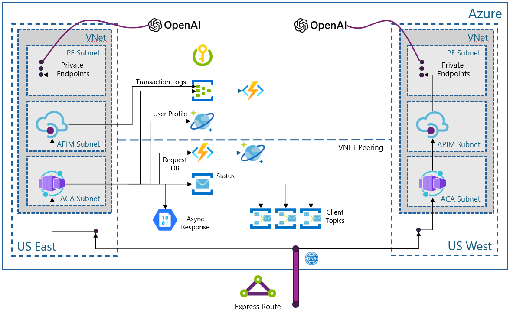

# SimpleL7Proxy

[](LICENSE)
[](https://dotnet.microsoft.com)
[](https://learn.microsoft.com/en-us/azure/container-apps/overview)

An open-source, self-hosted **AI Gateway** for Azure. SimpleL7Proxy is a high-performance Layer 7 router purpose-built for LLM workloads — providing priority queuing, fair-share governance, circuit breaking, async orchestration, and streaming token telemetry, all running inside your own VNET.

→ **[Full overview, architecture, and use-case analysis](docs/OVERVIEW.md)**



## Prerequisites

- [.NET 10 SDK](https://dotnet.microsoft.com/download)
- [Docker](https://docs.docker.com/get-docker/) (for container builds)
- [Azure Developer CLI (azd)](https://learn.microsoft.com/en-us/azure/developer/azure-developer-cli/install-azd) (for cloud deployment)
- An Azure subscription with Container Apps and (optionally) AI Foundry / APIM

## Quick Start

**Local development** (interactive setup wizard):
```bash
git clone https://github.com/your-org/SimpleL7Proxy.git
cd SimpleL7Proxy
dotnet run --project src/SimpleL7Proxy
```

**Deploy to Azure Container Apps:**
```bash
# Windows
./.azure/setup.ps1

# Linux / macOS
chmod +x ./.azure/setup.sh && ./.azure/setup.sh

azd provision
./.azure/deploy.ps1   # or deploy.sh on Linux/macOS
```

See [Development and Testing](docs/DEVELOPMENT.md) for local mock backends and manual configuration.  
See [Container Deployment](docs/CONTAINER_DEPLOYMENT.md) for all deployment scenarios (standard, high-performance, VNET).

## Documentation

| Topic | Document |
|-------|----------|
| Overview & Architecture | [docs/OVERVIEW.md](docs/OVERVIEW.md) |
| Backend Host Configuration | [docs/BACKEND_HOSTS.md](docs/BACKEND_HOSTS.md) |
| Load Balancing | [docs/LOAD_BALANCING.md](docs/LOAD_BALANCING.md) |
| Priority Queuing & User Governance | [docs/ADVANCED_CONFIGURATION.md](docs/ADVANCED_CONFIGURATION.md) |
| Circuit Breaker | [docs/CIRCUIT_BREAKER.md](docs/CIRCUIT_BREAKER.md) |
| Health Checking | [docs/HEALTH_CHECKING.md](docs/HEALTH_CHECKING.md) |
| Async Operations | [docs/AsyncOperation.md](docs/AsyncOperation.md) |
| User Profiles | [docs/USER_PROFILES.md](docs/USER_PROFILES.md) |
| Request Validation | [docs/REQUEST_VALIDATION.md](docs/REQUEST_VALIDATION.md) |
| Observability & Telemetry | [docs/OBSERVABILITY.md](docs/OBSERVABILITY.md) |
| Security | [docs/SECURITY.md](docs/SECURITY.md) |
| Environment Variables | [docs/ENVIRONMENT_VARIABLES.md](docs/ENVIRONMENT_VARIABLES.md) |
| Configuration Settings | [docs/CONFIGURATION_SETTINGS.md](docs/CONFIGURATION_SETTINGS.md) |
| Azure App Configuration | [docs/AZURE_APP_CONFIGURATION.md](docs/AZURE_APP_CONFIGURATION.md) |
| AI Foundry Integration | [docs/AI_FOUNDRY_INTEGRATION.md](docs/AI_FOUNDRY_INTEGRATION.md) |
| APIM Policy | [APIM-Policy/readme.md](APIM-Policy/readme.md) |
| Container Deployment | [docs/CONTAINER_DEPLOYMENT.md](docs/CONTAINER_DEPLOYMENT.md) |
| Development & Testing | [docs/DEVELOPMENT.md](docs/DEVELOPMENT.md) |
| Response Codes | [docs/RESPONSE_CODES.md](docs/RESPONSE_CODES.md) |

## Contributing

Issues and pull requests are welcome. Please open an issue first to discuss significant changes.

## License

MIT — see [LICENSE](LICENSE). Copyright (c) Microsoft Corporation.

