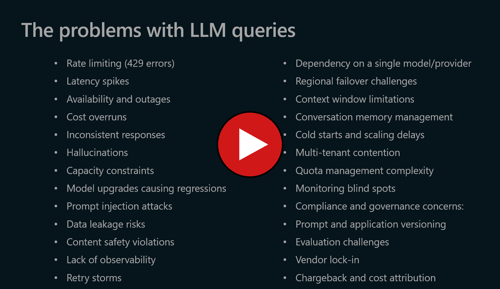

# SimpleL7Proxy

Depending on whether you are serving live users, high-priority business workflows, or low-priority background jobs, you will likely want control over when, where, and how your traffic is fulfilled. AI backends can throttle, regions can become constrained, and models eventually reach the end of their lifecycle. These are some of the reasons teams place a proxy in front of their AI services. The questions below are the ones most teams ask when deciding whether this approach fits their architecture.

## Where do you want to start?

<table>
<tr>
<td width="33%" valign="top">

### [🔍 Understand the proxy](docs/concepts/README.md)
Architecture, components, and how requests flow end to end.

**For:** architects and evaluators deciding whether to adopt.

</td>
<td width="33%" valign="top">

### [🚀 Get it running](docs/getting-started/README.md)
Choose a deployment path for Azure Container Apps, Kubernetes, or local development.

**For:** operators and developers doing a first deployment.

</td>
<td width="33%" valign="top">

### [⚙️ Configure backends and settings](docs/how-to/README.md)
Environment variables, host setup, load balancing, and hot-reload settings.

**For:** operators tuning a running deployment.

</td>
</tr>
<tr>
<td width="33%" valign="top">

### [🧪 Try a proof of concept](docs/pocs/README.md)
Run guided scenarios for failover, priority routing, chargeback, and security.

**For:** engineers validating behavior or preparing a demo.

</td>
<td width="33%" valign="top">

### [🔧 Diagnose a problem](docs/troubleshooting/README.md)
Find your symptom — 429s, 503s, a stuck circuit breaker, async not completing — and fix it fast.

**For:** anyone debugging broken or unexpected behavior.

</td>
<td width="33%" valign="top">

### [💻 Develop and contribute](docs/contributing/README.md)
Run from source, understand the internals, and contribute changes.

**For:** developers building on or contributing to the proxy.

</td>
</tr>
</table>

---

> **Not sure where to start?** Run the [Failover POC](docs/pocs/failover.md) first. It demonstrates the core retry behavior and makes the architecture concrete before you read anything else.

> **Looking for the full documentation index?** See the [Documentation hub](docs/README.md).
