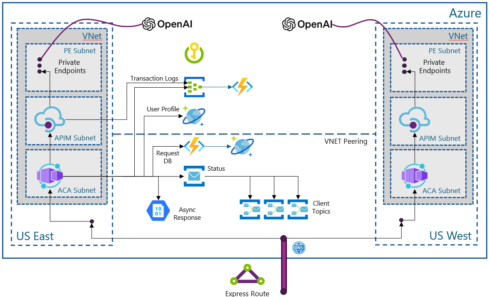

# SimpleL7Proxy — Deployment (interactive)



This is the **interactive deployment path** for SimpleL7Proxy. The deployment script 
lets you create a new installation or update an existing proxy to the latest version.

This guide is intended for platform and infrastructure engineers deploying SimpleL7Proxy on Azure,
as well as application teams consuming the proxy within private VNets. Completing all steps 
results in a private, VNet‑integrated Layer‑7 proxy running on Azure Container Apps, exposed
through a private DNS name that is resolvable within the VNet.

The public installation scenario uses all the same components, except that they are public 
access points locked down with ACLs.

---

## TL;DR

- Configure your environment settings in a config file.
- Run `deploy.sh` and deploy the proxy interactively.

> [!NOTE]
> The install script is idempotent.

---

## What you will observe

The configuration file drives all the scenarios.

---

## Getting started

Create a local copy of the config file. If you have a previous installation, merge your existing environment variables into the new script.

```bash
cd deployment
cp deploy.parameters.example.sh deploy.parameters.sh
vi deploy.parameters.sh        # edit the values listed below
./deploy.sh                    # interactive menu
```

See the sections below for guidance on the edits.


---

## Running the install

After you have edited the `deploy.parameters.sh` file, you can run the install script.

```bash
./deploy.sh
```

You will see a menu. If you answered `no` to either `PRIVATE_NETWORK_DEPLOYMENT` or `ASYNC_DEPLOYMENT`, the related options will be disabled. You can run (and re-run) each step individually:

```
========================================
 SimpleL7Proxy - Deployment Menu
========================================
   1)  Prerequisites              (Prereq/validate.sh)
   2)  Virtual Network            (VNet/deploy.sh)
   3)  Validate/Create ACR        (ContainerImage/validate-acr.sh)
   4)  Build Container Image      (ContainerImage/deploy.sh)
   5)  Azure Container Apps       (proxy/deploy.sh)
   6)  Private DNS                (DNS/deploy.sh)
   7)  App Configuration          (AppConfiguration/deploy.sh)
   8)  Blob Storage  (optional)   (BlobStorage/deploy.sh)
   9)  Create RequestAPI Function (RequestAPI/create.sh)
  10)  Deploy/Update RequestAPI   (RequestAPI/deploy.sh)
  q) Quit

Select an option:
```
If an error occurs, the script displays it before returning to the main menu.

---

## Running through the deployment

Follow these steps in order:

1. Checks that you have the necessary components installed.
2. If you selected private networking, deploys the `VNet` and `subnets`.
3. Ensures that the `ACR` exists, and asks to create it if it does not.
4. Compiles the source code and creates the `proxy images` in the ACR.
5. (Re)deploys the `container app` in either sidecar or internal mode.
6. If you selected private networking, creates a `DNS zone`.
7. Creates or reuses the `App Configuration` instance, copies the proxy settings and defaults, and connects the Container App.
   
   **The options below apply to async mode.**
8. Creates Blob Storage.
9. Creates the RequestAPI Azure Function.
10. Updates the RequestAPI with the latest code.

If you have an older version of the proxy and only need to update it, run steps 4, 5, and 7.

> [!NOTE]
> Step 7 updates the configuration, so back up your configuration by exporting it before you run this step.

---

## Editing the config

The original `deploy.parameters.example.sh` file in the repo contains the starting script.

Copy the example and edit it.

```bash
cp deploy.parameters.example.sh deploy.parameters.sh
vi deploy.parameters.sh
```

<details>
<summary><strong>Deployment mode flags</strong></summary>

Start here. These two flags decide which deployment paths are active and which menu steps appear.

| Variable | Used by | Suggested value | Purpose |
|---|---|---|---|
| `PRIVATE_NETWORK_DEPLOYMENT` | menu logic | `yes` | Enables private networking flow (Step 2 VNet and Step 6 Private DNS). Set to `no` for public networking. |
| `ASYNC_DEPLOYMENT` | menu logic | `yes` | Enables async flow (Step 8 Blob Storage and Steps 9-10 RequestAPI). Set to `no` for sync-only deployments. |

</details>


<details>
<summary><strong>Common</strong></summary>

Set these first because almost every step depends on region and resource groups.

| Variable | Used by | Suggested value | Purpose |
|---|---|---|---|
| `LOCATION` | all | `eastus` | Azure region |
| `NETWORK_RESOURCE_GROUP` | VNet, DNS, ACA env | `rg-myapp-network` | RG that holds VNet, subnets, DNS zone, and the ACA environment |
| `CONTAINER_APP_RESOURCE_GROUP` | ACA, BlobStorage, AppConfiguration | `rg-myapp-prod` | Primary RG used for Container App deployment and updates (can be the same as `NETWORK_RESOURCE_GROUP`) |
| `STORAGE_RESOURCE_GROUP` | BlobStorage | `rg-myapp-storage` | RG where Step 8 creates or updates the storage account (async only) |
| `APPCONFIG_RESOURCE_GROUP` | AppConfiguration | `rg-myapp-appconfig` | RG where Step 7 creates or updates the App Configuration store |

</details>

<details>
<summary><strong>Container Registry and image settings</strong></summary>

Configure image registry, repository names, and build behavior before running image build steps.

| Variable | Used by | Suggested value | Purpose |
|---|---|---|---|
| `ACR_NAME` | ContainerImage, ACA | `acrsimplel7proxy` | Azure Container Registry name (no `.azurecr.io` suffix). **Must be globally unique across Azure.** |
| `PROXY_IMAGE_NAME` | ContainerImage, ACA | `simple-l7-proxy` | Repository name within ACR for the proxy image |
| `HEALTH_IMAGE_NAME` | ContainerImage, proxy-with-sidecar | `healthprobe` | Repository name within ACR for the health-probe image |
| `BUILD_METHOD` | ContainerImage | `remote` | Build strategy: use `remote` for first deployments (no local Docker needed). Use `local` only for dev/test with Docker installed |
| `DOCKERFILE_PATH` | ContainerImage | `SimpleL7Proxy/Dockerfile` | Dockerfile path under `src/` |
| `PROXY_VERSION_OVERRIDE` | ContainerImage | *(empty)* | Override version tag; otherwise auto-extracted from `src/SimpleL7Proxy/Constants.cs` |
| `HEALTHPROBE_VERSION_OVERRIDE` | ContainerImage | *(empty)* | Override health-probe tag; otherwise auto-extracted from `src/HealthProbe/Constants.cs` |
| `ACR_SKU` | ContainerImage | `Basic` | SKU used if Step 3 creates ACR (`Basic` / `Standard` / `Premium`) |

> [!NOTE]
> **ACR validation:** Run Step 3 before building images.
> Step 3 (`ContainerImage/validate-acr.sh`) checks whether `ACR_NAME` exists and asks before creating
> it if missing. ACR names must be **globally unique** across all of Azure. If the default
> `acrsimplel7proxy` is taken, append a unique suffix (for example, `acrsimplel7proxy42`).
> Verify availability with:
> ```bash
> az acr check-name --name <your-acr-name>
> ```

</details>

<details>
<summary><strong>Azure Container Apps</strong></summary>

These values define how the main proxy app runs in Azure Container Apps.

| Variable | Used by | Suggested value | Purpose |
|---|---|---|---|
| `ACA_ENVIRONMENT_NAME` | ACA | `cae-myapp` | Container Apps Environment name (VNet-integrated) |
| `CONTAINER_APP_NAME` | ACA, proxy-with-sidecar, BlobStorage, AppConfiguration | `ca-myapp-proxy` | Name of the Container App |
| `CPU` / `MEMORY` | ACA | `0.5` / `1.0Gi` | ACA single-container resource size |
| `MIN_REPLICAS` / `MAX_REPLICAS` | ACA | `1` / `5` | Autoscale bounds |
| `INGRESS_VISIBILITY` | ACA | `Internal` | `Internal` (VNet only) or `External` |
| `INGRESS_PORT` | ACA | `8000` | Proxy listening port |
| `HOST1` | ACA, proxy-with-sidecar | `host=https://your-api.azure-api.net;mode=apim;path=/;probe=/health` | Primary backend descriptor |
| `ENABLE_MANAGED_IDENTITY` | ACA | `true` | Enables system-assigned identity used for ACR pull and role-based access to App Configuration and Blob Storage |
| `ENABLE_APP_INSIGHTS` | ACA | `true` | Wires ACA env to Log Analytics/Application Insights |
| `LOG_ANALYTICS_WORKSPACE_NAME` | ACA | `log-myapp` | Log Analytics workspace name created or reused when `ENABLE_APP_INSIGHTS=true` |

</details>

<details>
<summary><strong>Proxy-with-sidecar variant</strong></summary>

Use these only when deploying the sidecar variant (`proxy-with-sidecar/deploy.sh`).

| Variable | Used by | Suggested value | Purpose |
|---|---|---|---|
| `ENVIRONMENT_NAME` | proxy-with-sidecar | `myapp-env` | ACA environment for the sidecar variant |
| `WEB_CPU` / `WEB_MEMORY` | proxy-with-sidecar | `0.5` / `1.0` | Proxy container resources |
| `HEALTH_CPU` / `HEALTH_MEMORY` | proxy-with-sidecar | `0.25` / `0.5` | Health-probe sidecar resources |
| `WEB_PORT` | proxy-with-sidecar | `8000` | Proxy port |
| `HEALTH_PORT` | proxy-with-sidecar | `9000` | Health-probe port |
| `INGRESS_TYPE` | proxy-with-sidecar | `external` | `external` or `internal` |
| `ENABLE_HTTPS` | proxy-with-sidecar | `true` | Terminate TLS at ACA ingress |
| `REVISION_MODE` | proxy-with-sidecar | `single` | `single` or `multiple` |
| `TERMINATION_GRACE_PERIOD_SECONDS` | proxy-with-sidecar | `30` | Grace period before container termination |
| `HEALTHPROBE_TYPE` | proxy-with-sidecar | `internal` | Health probe mode (`sidecar` or `internal`) |

</details>

<a id="app-configuration"></a>
<details>
<summary><strong>App Configuration</strong></summary>

These settings identify the App Configuration store, the label applied to the copied settings, and whether step 7 connects the Container App to the store.

| Variable | Used by | Suggested value | Purpose |
|---|---|---|---|
| `APPCONFIG_NAME` | AppConfiguration | `myapp-appcfg` | Store name. **Must be globally unique across Azure.** |
| `APPCONFIG_SKU` | AppConfiguration | `standard` | `standard` or `free` |
| `APPCONFIG_LABEL` | AppConfiguration | `prod` | Label applied to the copied `Warm:*` and `Cold:*` keys |
| `AZURE_APPCONFIG_REFRESH_INTERVAL_SECONDS` | AppConfiguration | `30` | How often each proxy replica checks `Warm:Sentinel`, in seconds |
| `UPDATE_CONTAINER_APP_ENV` | AppConfiguration | `true` | Updates Container App environment variables so the proxy can connect to App Configuration |

**Run step 5 before step 7.** Step 7 reads the deployed Container App's environment variables and managed identity.

When step 7 runs, it:

- Creates or reuses `APPCONFIG_NAME` in `APPCONFIG_RESOURCE_GROUP`.
- Reads the settings declared with `[ConfigOption]` in `ProxyConfig.cs`.
- Uses the current Container App value when one exists. Otherwise, it uses a local deployment value, the code default, or `-` when no value is defined.
- Copies the settings as `Warm:` and `Cold:` keys under `APPCONFIG_LABEL`.
- Adds `Warm:Sentinel` and `Warm:RefreshSeconds` under the same label.
- Grants **App Configuration Data Reader** to the Container App managed identity.
- Sets the App Configuration endpoint and label on the Container App when `UPDATE_CONTAINER_APP_ENV=true`.

> [!WARNING]
> Running step 7 again recopies the settings and gives `Warm:Sentinel` a new value. This can replace values changed directly in App Configuration. Export the existing configuration first, and rerun step 7 only when the values need to be rebuilt from the deployed app and code defaults.

> [!NOTE]
> The store does not need to exist before step 7 runs. If `APPCONFIG_NAME` is already used elsewhere in Azure, choose a globally unique name, such as `myapp-appcfg42`, and rerun step 7.

> [!NOTE]
> Existing `deploy.parameters.sh` files can continue to use `AZURE_APPCONFIG_REFRESH_SECONDS`. Step 7 accepts it as a legacy alias, but new configurations should use `AZURE_APPCONFIG_REFRESH_INTERVAL_SECONDS`.

> [!TIP]
> If step 7 reports `Could not read Container App`, confirm that step 5 completed and that `CONTAINER_APP_NAME`, `CONTAINER_APP_RESOURCE_GROUP`, and the active Azure subscription identify the deployed app.

</details>

<details>
<summary><strong>Private network (only when PRIVATE_NETWORK_DEPLOYMENT=yes)</strong></summary>

Set these only when `PRIVATE_NETWORK_DEPLOYMENT=yes`.

| Variable | Used by | Suggested value | Purpose |
|---|---|---|---|
| `VNET_NAME` | VNet | `vnet-myapp` | Virtual network name |
| `VNET_ADDRESS_PREFIX` | VNet | `10.40.0.0/16` | VNet CIDR |
| `SUBNET_ACA_NAME` / `SUBNET_ACA_PREFIX` | VNet | `snet-aca` / `10.40.0.0/23` | Required by the ACA environment |
| `SUBNET_CLIENTVM_NAME` / `SUBNET_CLIENTVM_PREFIX` | VNet | `snet-clientvm` / `10.40.2.0/24` | Jumpbox/test client subnet |
| `SUBNET_AZUREFUNCTIONS_NAME` / `SUBNET_AZUREFUNCTIONS_PREFIX` | VNet | `snet-azurefunctions` / `10.40.3.0/24` | Optional Azure Functions subnet |
| `SUBNET_APIM_NAME` / `SUBNET_APIM_PREFIX` | VNet | `snet-apim` / `10.40.4.0/24` | Optional APIM subnet |
| `SUBNET_PRIVATEENDPOINTS_NAME` / `SUBNET_PRIVATEENDPOINTS_PREFIX` | VNet | `snet-privateendpoints` / `10.40.5.0/24` | Private endpoints subnet |
| `DISABLE_PRIVATE_ENDPOINT_NETWORK_POLICIES` | VNet | `true` | Required for private endpoints |
| `DNS_ZONE_NAME` | DNS | `internal.contoso.com` | Private DNS zone, linked to VNet |
| `ACA_INTERNAL_FQDN` | DNS | *(empty)* | Internal ACA hostname. Leave empty initially, then set after Step 5 if your DNS step requires it |
| `ACA_RECORD_NAME` | DNS | `ca-myapp-proxy` | Short CNAME for ACA internal FQDN |
| `APIM_PRIVATE_IP` | DNS | *(empty)* | Set if APIM is deployed in `snet-apim` |
| `APIM_RECORD_NAME` | DNS | `apim` | A record name for APIM |

</details>

<details>
<summary><strong>Blob Storage (only when ASYNC_DEPLOYMENT=yes)</strong></summary>

These values are required for async workloads and are consumed by Step 8.

| Variable | Used by | Suggested value | Purpose |
|---|---|---|---|
| `STORAGE_ACCOUNT_NAME` | BlobStorage | `myappstorage` | Storage account name. **Must be globally unique across Azure.** |
| `STORAGE_SKU` | BlobStorage | `Standard_LRS` | `Standard_LRS` / `Standard_GRS` / `Standard_ZRS` / `Standard_RAGRS` |
| `CREATE_CONTAINERS` | BlobStorage | `true` | Automatically creates the container names listed in `BLOB_CONTAINERS` |
| `BLOB_CONTAINERS` | BlobStorage | `templates simplel7proxy` | Space-separated container names |
| `CA_BLOB_ROLE` | BlobStorage | `Storage Blob Data Contributor` | Role granted to Container App managed identity |

> [!NOTE]
> **Blob Storage auto-creation:** You do not need to create the storage account before deploying.
> Step 8 (`BlobStorage/deploy.sh`) checks whether `STORAGE_ACCOUNT_NAME` exists in `STORAGE_RESOURCE_GROUP`
> and creates it automatically if it doesn't. Storage account names must be **globally unique** across Azure
> and can contain only lowercase letters and numbers. If the default `myappstorage` is taken, append a
> unique suffix (for example, `myappstorage42`). Verify availability with:
> ```bash
> az storage account check-name --name <yourstorageaccountname>
> ```

</details>

<details>
<summary><strong>RequestAPI Azure Function (only when ASYNC_DEPLOYMENT=yes)</strong></summary>

These settings are used by Steps 9 and 10 to create and deploy RequestAPI for async processing.

| Variable | Used by | Suggested value | Purpose |
|---|---|---|---|
| `REQUESTAPI_RESOURCE_GROUP` | RequestAPI | `rg-myapp-requestapi` | Target RG where RequestAPI resources are created and updated |
| `REQUESTAPI_FUNCTION_APP` | RequestAPI | `myrequestapi` | Function App name (**must be globally unique**) |
| `REQUESTAPI_LOCATION` | RequestAPI | `${LOCATION}` | Region for RequestAPI resources |
| `REQUESTAPI_STORAGE_ACCOUNT` | RequestAPI | `myrequestapifn` | Storage account for Function App (**globally unique**) |
| `REQUESTAPI_APPINSIGHTS_NAME` | RequestAPI | `myrequestapi-ai` | App Insights resource for RequestAPI |
| `REQUESTAPI_RUNTIME_NAME` | RequestAPI | `dotnet-isolated` | Functions runtime |
| `REQUESTAPI_RUNTIME_VERSION` | RequestAPI | `9.0` | Runtime version |
| `REQUESTAPI_INSTANCE_MEMORY_MB` | RequestAPI | `2048` | Instance memory in MB |
| `REQUESTAPI_MAX_INSTANCE_COUNT` | RequestAPI | `100` | Max scale-out instances |
| `REQUESTAPI_SERVICEBUS_NAMESPACE` | RequestAPI | `myrequestapi` | Existing Service Bus namespace |
| `REQUESTAPI_SERVICEBUS_QUEUE` | RequestAPI | `requestqueue` | Request queue name |
| `REQUESTAPI_SERVICEBUS_FEEDER_QUEUE` | RequestAPI | `feederqueue` | Feeder queue name |
| `REQUESTAPI_COSMOS_ACCOUNT` | RequestAPI | `myrequestapi` | Existing Cosmos DB account |
| `REQUESTAPI_COSMOS_DATABASE` | RequestAPI | `RequestAPI` | Cosmos DB database name |
| `REQUESTAPI_COSMOS_CONTAINER` | RequestAPI | `Documents` | Cosmos DB container name |

</details>

---

## Day-2 operations

| Task | Steps |
|---|---|
| Update backend config without redeploy | menu → `7` |
| Roll a new proxy version | menu → `4`, then `5`, then `7` |
| Add a DNS record | Edit the DNS zone in the portal |
| Tear it all down | `az group delete -n <NETWORK_RESOURCE_GROUP>` (and the others if separate) |

See [DAY2_OPERATIONS.md](DAY2_OPERATIONS.md) for the full day-2 reference.

---

## Troubleshooting

**Check in this order:**

1. `az containerapp logs show -n "${CONTAINER_APP_NAME}" -g "${CONTAINER_APP_RESOURCE_GROUP}"`
2. `az acr repository show-tags -n "${ACR_NAME}" --repository "${PROXY_IMAGE_NAME}"`
3. TCP reachability to backend from inside `snet-aca` (curl/nc from a client VM in `snet-clientvm`)
4. `nslookup "${ACA_RECORD_NAME}.${DNS_ZONE_NAME}"` from inside the VNet

**`deploy.parameters.sh not found`:**
```bash
cp deploy.parameters.example.sh deploy.parameters.sh
```

**Subnet not found:**
```bash
az network vnet subnet list --vnet-name "${VNET_NAME}" -g "${NETWORK_RESOURCE_GROUP}" -o table
```

**Container App stuck pulling image:**
```bash
az containerapp logs show -n "${CONTAINER_APP_NAME}" -g "${CONTAINER_APP_RESOURCE_GROUP}" --type system
az acr repository show-tags -n "${ACR_NAME}" --repository "${PROXY_IMAGE_NAME}"
```

**DNS not resolving:**
```bash
az network private-dns link vnet list -g "${NETWORK_RESOURCE_GROUP}" -z "${DNS_ZONE_NAME}"
az network private-dns record-set list -g "${NETWORK_RESOURCE_GROUP}" -z "${DNS_ZONE_NAME}" -o table
```
---

## References

- [Day-2 Operations](DAY2_OPERATIONS.md)
- [App Configuration keys](../docs/how-to/configure-app-configuration.md)
- [Backend hosts](../docs/reference/backend-hosts.md)
- [Health checking](../docs/reference/health-endpoints.md)
- [Troubleshooting](../docs/troubleshooting/README.md)
- [Configuration reference](../docs/reference/configuration.md)
- [Advanced scenarios](../docs/contributing/development.md)
