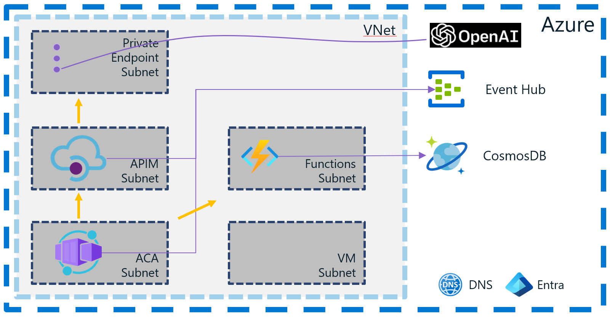

# SimpleL7Proxy — Deployment



---

## Overview

This guide targets platform and infrastructure engineers deploying SimpleL7Proxy on Azure, as well as application teams consuming the proxy within private VNets. Public internet deployments are out of scope.

Completing all steps results in a private, VNet‑integrated Layer‑7 proxy running on Azure Container Apps, exposed via a private DNS name resolvable within the VNet. Deployment is automated using Bash scripts and Bicep and is fully idempotent. Optional extensions include health probing, asynchronous processing, and Azure API Management integration.

---

## Deployment Steps

**Production path:**  Step 1 → Step 2 → Step 3 → Step 4 → Step 5 → Step 6 → [Step 7 if async or APIM]  

> **Dev/test only — do not use in production:** Step 1 → Step 2 → Step 3 → Step [4a](ACA/README.md) (proxy only, no health monitoring)


### Step 1: Prerequisites

```bash
cd Prereq
./validate.sh
```

**Requires:** `az` (authenticated), `jq`, `python3`, Bash

**If this fails:**
- `az: command not found` → https://aka.ms/installazurecli
- `jq: command not found` → `apt install jq` / `brew install jq`
- auth error → `az login && az account set -s <id>`

---

### Step 2: Virtual Network

```bash
cd VNet
cp deploy.parameters.example.sh deploy.parameters.sh
# Set RESOURCE_GROUP, LOCATION; change CIDR only if 10.40.0.0/16 overlaps existing VNets
./deploy.sh
```

**Defaults:**
- `vnet-myapp` / `10.40.0.0/16`
- `snet-aca` `10.40.0.0/23` · `snet-clientvm` `10.40.2.0/24` · `snet-azurefunctions` `10.40.3.0/24` · `snet-apim` `10.40.4.0/24` · `snet-privateendpoints` `10.40.5.0/24`

**Change only if:** CIDR overlaps existing VNets; naming convention differs from `vnet-myapp` / `snet-*`

**If this fails:**
- `Subnet address prefix overlaps` → change CIDR and re-run
- `ResourceGroupNotFound` → `az group create -n <rg> -l <region>`
- ACA subnet delegation missing → `az network vnet subnet show -n snet-aca --vnet-name <vnet> -g <rg> --query delegations`

[→ Details](VNet/README.md)

---

### Step 3: Build Container Image

```bash
cd ContainerImage
cp build.parameters.example.sh build.parameters.sh
# Set ACR_NAME; leave BUILD_METHOD=remote (no Docker needed)
./build.sh
./get-version.sh   # confirm resolved tag
```

**Defaults:**
- `BUILD_METHOD=remote` — build runs in ACR, no local Docker
- Tag: `<ACR_NAME>.azurecr.io/simple-l7-proxy:v<VERSION>` from `src/SimpleL7Proxy/Constants.cs`

**Change only if:** `BUILD_METHOD=local` for local Docker iteration — **dev/test only, do not use in production**

**If this fails:**
- 404 → `ACR_NAME` wrong: `az acr list -o table`
- 403 → `az role assignment create --role AcrPush --assignee <upn> --scope <acr-id>`
- empty tag → set version in `Constants.cs`, re-run `./get-version.sh`

[→ Details](ContainerImage/README.md)

---

### Step 4: Azure Container Apps

Proxy on port 8000 + HealthProbe sidecar on port 9000, VNet-integrated, internal ingress only.

```bash
cd proxy-with-sidecar
cp deploy.parameters.example.sh deploy.parameters.sh
# Set ACR_NAME, RESOURCE_GROUP, APP_NAME, VNET_NAME, SUBNET_ACA_NAME
./deploy.sh
```

**Defaults:**
- `SimpleL7Proxy` port 8000, `HealthProbe` port 9000
- Internal-only ingress, system-assigned managed identity
- Version tags from `src/SimpleL7Proxy/Constants.cs` + `src/HealthProbe/Constants.cs`

**Change only if:** ACR name, resource group, or app name differ from example defaults

**After deploy — record the internal FQDN:**
```
ca-myapp-proxy.internal.eastus.azurecontainerapps.io
```

**If this fails:**
- Stuck in `Waiting` / image pull error → `az containerapp logs show -n <app> -g <rg> --type system`; verify both tags exist in ACR
- `SubnetDelegationRequired` → `az network vnet subnet show -n snet-aca --vnet-name <vnet> -g <rg> --query delegations`
- `AcrPull` denied → `az role assignment create --role AcrPull --assignee <principal-id> --scope <acr-id>`

[→ Details](proxy-with-sidecar/README.md) · [Dev/test proxy-only path](ACA/README.md) (**dev/test only, do not use in production**)

---

### Step 5: DNS

CNAME short name → ACA FQDN; private DNS zone linked to the VNet. Decouples client config from platform-generated FQDNs that change on redeploy.

```bash
cd DNS
cp deploy.parameters.example.sh deploy.parameters.sh
# Set VNET_NAME, DNS_ZONE_NAME (e.g. internal.contoso.com), ACA_FQDN
./deploy.sh
```

**Change only if:** additional A/CNAME records needed; zone name conflicts with an existing private zone in the VNet

**If this fails:**
- Names don't resolve → VNet link missing: `az network private-dns link vnet list -g <rg> -z <zone>`
- `ZoneAlreadyExists` → reuse existing zone or choose a different name
- Wrong CNAME target → `az network private-dns record-set cname show -g <rg> -z <zone> -n <record>`

[→ Details](DNS/README.md)

---

### Step 6: App Configuration

Proxy reads backend URLs, priorities, timeouts, and weights from this store at runtime — no redeploy needed for config changes.

```bash
cd AppConfiguration
cp deploy.parameters.example.sh deploy.parameters.sh
# Set backend URLs, priorities, timeouts
./deploy.sh
```

**Defaults:**
- New App Configuration store
- `App Configuration Data Reader` role on ACA managed identity
- Keys: backend URLs, priorities, timeouts, load-balancing weights

**Change only if:** reusing existing store (set store name, skip creation); values differ from example parameters

**Breaks if misconfigured:**
- Missing required keys → proxy fails fast on startup
- Wrong identity role → proxy cannot read config; container exits on startup
- Config store in wrong region/subscription → managed identity token exchange fails

**If this fails:**
- Container exits on startup → `az containerapp logs show -n <app> -g <rg>` — look for `KeyNotFoundException`
- `Forbidden` at runtime → `az role assignment list --assignee <principal-id> --scope <store-id>`
- Config not picked up → verify `AZURE_APP_CONFIG_ENDPOINT` env var matches store URL

[→ Details](AppConfiguration/README.md)

---

### Step 7a: Blob Storage (async workflows only)

Run before enabling async in App Configuration. Skip for sync-only deployments.

```bash
cd BlobStorage
./deploy.sh
```

**Defaults:**
- New Storage Account (LRS, Standard)
- `Storage Blob Data Contributor` role on ACA managed identity

**Change only if:** reusing existing account; container name differs from default

**If this fails:**
- 500 on async requests → `az role assignment list --assignee <principal-id> --scope <storage-id>`
- `BlobServiceProperties` error → storage account name taken globally; change in `deploy.parameters.sh`
- Blobs not written → container name in App Configuration must match container created here

[→ Details](BlobStorage/README.md)

---

### Step 7b: APIM Policy (API gateway only)

Run after APIM is provisioned in `snet-apim`. Skip if APIM is not in the topology.

**Requires:** APIM instance in `snet-apim`; ACA FQDN reachable from that subnet

**If this fails:**
- 502 from APIM → APIM cannot reach ACA FQDN; check NSG rules and subnet routing
- Policy rejected → validate XML against APIM policy schema

[→ Details](../APIM-Policy/README.md)

---

## Scenarios

| Scenario | Steps | Pattern |
|---|---|---|
| Single proxy with health monitoring | 1 → 2 → 3 → 4 → 5 → 6 | — |
| Multi-tenant with async processing | 1 → 2 → 3 → 4 → 5 → 6 → 7a | [Claim Check](https://learn.microsoft.com/azure/architecture/patterns/claim-check) / [Async Request-Reply](https://learn.microsoft.com/azure/architecture/patterns/async-request-reply) |
| API gateway | 1 → 2 → 3 → 4 → 5 → 6 → 7b | [Gateway Routing](https://learn.microsoft.com/azure/architecture/patterns/gateway-routing) |
| Multi-tenant, isolated config | 1 → 2 → 3 → 4 → 5 → 6 | Shared runtime, per-tenant App Configuration keys |
| Dev/test (**do not use in production**) | 1 → 2 → 3 → [4a](ACA/README.md) | — |

---

## Day-2 Operations

[Full reference →](DAY2_OPERATIONS.md)

### Check status
```bash
az resource list --resource-group "rg-myapp-network" -o table
az containerapp show --resource-group "rg-myapp-network" --name "ca-myapp-proxy"
```

### Update backend config (no redeploy)
```bash
cd AppConfiguration && ./deploy.sh
```

### Roll new proxy version
```bash
cd ContainerImage && ./build.sh
cd ../proxy-with-sidecar && ./deploy.sh
```

### Delete all resources
```bash
az group delete --resource-group "rg-myapp-network"
```

---

## Troubleshooting

**Check in this order:**
1. `az containerapp logs show -n <app> -g <rg>` — container output
2. `az acr repository show-tags -n <acr> --repository simple-l7-proxy` — tag exists
3. TCP reachability to backend from inside `snet-aca` (curl/nc from client VM)
4. `nslookup <dns-name>` from inside the VNet

### `deploy.parameters.sh not found`
```bash
cp deploy.parameters.example.sh deploy.parameters.sh
```

### Subnet not found
```bash
az network vnet subnet list --vnet-name <vnet> -g <rg> -o table
```

### Container App failed to start
```bash
az containerapp logs show -n <app> -g <rg> --type system
az acr repository show-tags -n <acr> --repository simple-l7-proxy
```

### DNS not resolving
```bash
az network private-dns link vnet list -g <rg> -z <zone>
az network private-dns record-set list -g <rg> -z <zone> -o table
```

---

## File layout

```
deployment/
├── Prereq/
├── VNet/
├── ContainerImage/
├── ACA/                   # dev/test only
├── proxy-with-sidecar/    # production
├── DNS/
├── AppConfiguration/
├── BlobStorage/
└── README.md
```

---

## References

- [Day-2 Operations](DAY2_OPERATIONS.md)
- [App Configuration keys](../docs/AZURE_APP_CONFIGURATION.md)
- [Backend hosts](../docs/BACKEND_HOSTS.md)
- [Health checking](../docs/HEALTH_CHECKING.md)
- [Troubleshooting](../docs/TroubleshootTOC.md)
- [Configuration reference](../docs/CONFIGURATION_SETTINGS.md)
- [Advanced scenarios](../docs/ADVANCED_DEVELOPMENT.md)

