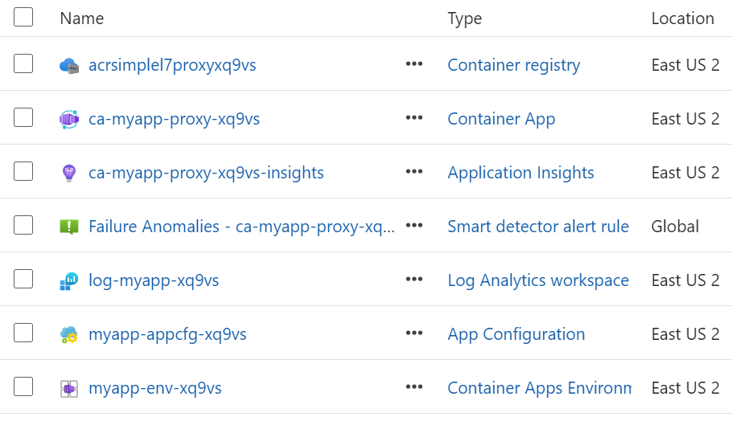

# Deploy SimpleL7Proxy

Deploy the SimpleL7Proxy resources in this bundle to one Azure resource group.

## Before you begin

Make sure you have:

- Azure CLI with Bicep support
- Bash and `jq`
- An Azure sign-in for the target subscription
- Subscription Contributor and permission to assign roles, or subscription Owner
- Permission to create an Azure Container Registry and import images into it

For async mode, create the selected Service Bus and Cosmos DB resources before you deploy. Publish the RequestAPI code separately after the infrastructure deployment.

## Review the deployment

This bundle places every resource it creates in `rg-myapp-prod-<UNIQ>`.

<table>
    <thead>
        <tr>
            <th align="left">Resources created</th>
            <th align="left">Azure resource group</th>
        </tr>
    </thead>
    <tbody>
        <tr>
            <td valign="top">
                <ul>
                    <li>Application Insights</li>
                    <li>Azure App Configuration</li>
                    <li>Azure Container App</li>
                    <li>Azure Container Registry</li>
                    <li>Azure Container Apps environment</li>
                    <li>Log Analytics workspace</li>
                    <li>Resource group</li>
                </ul>
            </td>
            <td valign="top">
                
            </td>
        </tr>
    </tbody>
</table>

| Setting | Default |
| --- | --- |
| Resource group | `rg-myapp-prod-<UNIQ>` |
| Location | `eastus2` |
| Deployment ID | Random five-character lowercase hexadecimal value |
| Operation | `validate` |

## Deploy the proxy

**Run every command from the same extracted directory.** You don't need a repository checkout.

1. Back up `parameters.json`, then update any settings you want to change.
2. Replace `SUBSCRIPTION_ID` with the target subscription ID and validate the deployment.

     ```bash
     bash deploy.sh SUBSCRIPTION_ID validate
     ```

3. Preview the changes.

     ```bash
     bash deploy.sh SUBSCRIPTION_ID what-if
     ```

4. Review the preview, then create the resources.

     ```bash
     bash deploy.sh SUBSCRIPTION_ID create
     ```

> [!NOTE]
> If you omit the operation, `deploy.sh` uses `validate`.

### Choose a deployment ID

To choose the ID instead of generating one, add `--unique-id` to the first command:

```bash
bash deploy.sh SUBSCRIPTION_ID validate --unique-id xq9vs
```

The ID must contain exactly five lowercase letters or digits. It becomes part of every generated resource name.

On its first run, `deploy.sh` replaces each `<UNIQ>` placeholder in `parameters.json` with the specified ID or a generated value. The change is saved in place before the script contacts Azure.

Use the same directory for `validate`, `what-if`, and `create` so each operation uses the same names. You can repeat `--unique-id` with the same ID. After `parameters.json` is resolved, the script rejects a different ID.

### What each operation does

| Operation | Result |
| --- | --- |
| `validate` | Validates the application deployment. It doesn't import images. |
| `what-if` | Previews the application changes. It doesn't import images. |
| `create` | Creates the resource group and registry, imports the pinned images, and deploys the remaining infrastructure. |

During `create`, the script first creates the Container App with the pinned public images. This establishes its system-assigned identity. The script grants that identity its runtime roles, then updates the app to use the images imported into Azure Container Registry.

## Manage App Configuration

Use CompanionApp to manage the proxy settings stored in Azure App Configuration. In **Config > Proxy Configuration**, you can create or duplicate labeled configurations, edit `Warm:` and `Cold:` settings, review draft changes, and publish them to the store. Changes remain drafts until you publish them.

**The deployment creates the store, but it doesn't publish proxy settings.** It grants the proxy managed identity App Configuration Data Reader so the proxy can load published settings. CompanionApp uses a separate identity with App Configuration Data Owner to manage them.

After the deployment succeeds:

1. Follow [Set up CompanionApp](../src/CompanionApp/readme.md#set-up-companionapp) to configure, sign in, and start the app.
2. Grant the identity running CompanionApp the App Configuration Data Owner role on the new store.
3. Follow [Update Azure App Configuration](../src/CompanionApp/configuration.md#configuration-prerequisites).
4. In CompanionApp, open **Config > Proxy Configuration** (`/admin/configuration`).
5. Connect to the new store, then create or duplicate a configuration for the selected label.
6. Publish the configuration.

## Verify the deployment

- [ ] The deployment state is `Succeeded`.
- [ ] The `proxyUrl` output is available. For a private deployment, verify it from a network that can reach the proxy.
- [ ] The active Container App revision uses the expected proxy and optional HealthProbe images.
- [ ] The selected App Configuration label contains the expected proxy settings.
- [ ] Readiness returns HTTP 200 after you add a backend in Proxy Configuration.
- [ ] A request reaches the configured backend.

## Check a deployment after disconnecting

**Check the existing deployment before you run `create` again.** Azure continues the deployment after Cloud Shell or your terminal disconnects.

Open a new terminal, sign in to the same tenant, and select the original subscription. Set the shell variables again. Replace `<UNIQ>` with the ID saved in `parameters.json`:

```bash
subscription='SUBSCRIPTION_ID'
deployment='ca-myapp-proxy-<UNIQ>-bicep'
az deployment sub show --subscription "$subscription" --name "$deployment" \
        --query '{State:properties.provisioningState,Timestamp:properties.timestamp}' --output table
```

These read-only commands work from any directory. You don't need the bundle, Bicep, or a repository checkout.

| State | Next step |
| --- | --- |
| `Accepted`, `Running`, or another nonterminal state | Wait, then check again. Don't submit another `create` operation. |
| `Succeeded` | Retrieve `proxyUrl`, then verify readiness and a backend request. |
| `Failed` or `Canceled` | Inspect the error and resolve it before you retry. Azure doesn't automatically remove resources from a failed deployment. |

### Inspect a failure

Include nested deployment errors in the output:

```bash
az deployment sub show --subscription "$subscription" --name "$deployment" \
        --query properties.error --output json
```

### Retrieve the proxy URL

After the deployment succeeds, run:

```bash
az deployment sub show --subscription "$subscription" --name "$deployment" \
        --query properties.outputs.proxyUrl.value --output tsv
```

### Find the deployment

If Azure returns `DeploymentNotFound`, confirm the tenant and subscription. Then list deployments by name and timestamp:

```bash
az deployment sub list --subscription "$subscription" \
        --query '[].{Name:name,State:properties.provisioningState,Timestamp:properties.timestamp}' --output table
```

A missing deployment record doesn't prove that no resources were created. In the Azure portal, open **Subscriptions > your subscription > Deployments** and inspect the original deployment. Open failed nested deployments in their resource groups for more detail.

### Retry a failed deployment

> [!WARNING]
> Retry only after the deployment reaches a terminal failure and you resolve its cause.

Return to the original extracted directory. Use the same subscription, resource names, and bundle:

```bash
bash deploy.sh "$subscription" what-if
bash deploy.sh "$subscription" create
```

Review the preview before you create. Don't regenerate the setup or delete partially created resources to check status or reconnect. A retry reapplies the template; it doesn't resume the original shell process.

## Bundle contents

- `bootstrap.bicep` creates the selected resource groups and Azure Container Registry before image import.
- `main.bicep` creates or updates the infrastructure, enables the Container App's system-assigned identity, grants AcrPull and App Configuration Data Reader, and deploys the imported image tags.
- `modules/*.bicep` contains the resource templates used by both entry points.
- `parameters.json` contains the selected deployment settings. On first use, `deploy.sh` replaces its `<UNIQ>` placeholders in place. Both Bicep entry points use the resolved file.
- `deploy.sh` resolves the ID, imports the pinned proxy and optional HealthProbe releases from `publicnvmacr`, and runs the selected operation. It doesn't build local source code.

Regenerate the bundle to change resource names, image repository names, topology, or other setup values consistently.

## Troubleshooting

| Symptom | What to check |
| --- | --- |
| Image import fails | Confirm the deploying identity can import into the selected registry and reach the pinned public source image. |
| The Container App can't pull an image | Confirm the imported tag exists and the proxy managed identity has AcrPull on the registry. |
| A role assignment fails | Confirm the deploying identity can assign roles and meets any applicable conditions. |
| CompanionApp returns App Configuration `403` | Grant its signed-in identity App Configuration Data Owner on the store, then allow time for the assignment to take effect. |
| An async resource is missing | Confirm the existing Service Bus and Cosmos DB resource groups, names, and data resources. |

> [!NOTE]
> Bundle generation doesn't verify Azure permissions, quota, resource-name availability, or backend connectivity.
