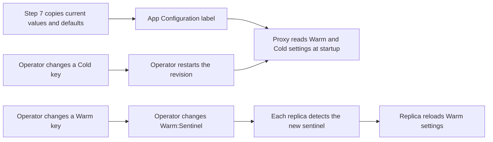

# Using Azure App Configuration with SimpleL7Proxy

SimpleL7Proxy can read settings from **Container App environment variables** or **Azure App Configuration**. Both sources configure the same proxy behavior. The difference is how changes take effect: **environment variables** are read when a replica starts, while settings that support runtime updates can be reloaded from App Configuration **without restarting** the replica.

App Configuration is a dedicated service for managing configurations and keeps a labeled copy of the settings in a central store. Operators can view and change values, maintain separate values for each environment, and review the history of each key.

To set up App Configuration, run `deployment/deploy.sh` and select **7) App Configuration**. Step 7 creates or reuses the store, copies the proxy's current and default values under the selected label, grants the Container App managed identity read access, and adds the store endpoint and label to the Container App.

The deployment script connects the proxy through its managed identity and `AZURE_APPCONFIG_ENDPOINT`, so the Container App does not need to store a connection string. The proxy also supports `AZURE_APPCONFIG_CONNECTION_STRING` when a managed identity setup is not available.

> **TL;DR**
> - Deploy the proxy, then run `deployment/deploy.sh` to connect the App Configuration resource.
> - Use Configuration explorer to view and change the copied settings under the label for the environment.
> - Some changes can be loaded by running replicas. Other changes take effect after the proxy restarts. The key prefix identifies which behavior applies.

## How Dynamic Settings Work

**The prefix on each key tells the operator how the proxy receives a changed value.**

A `Warm:` setting can be reloaded while the proxy is running. Each replica checks `Warm:Sentinel` at a configured interval. When the sentinel value changes, that replica downloads the current `Warm:` settings under the selected label and applies them to subsequent work.

A `Cold:` setting is loaded when the proxy starts. Changing the value in App Configuration does not alter a running process; the Container App revision must be restarted before the proxy reads the new value.

```text
Warm:<setting path>   Changes after Warm:Sentinel changes
Cold:<setting path>   Changes after the proxy restarts
Warm:Sentinel         Tells running replicas to reload Warm settings
```

The label keeps settings for different environments separate. A key and `Warm:Sentinel` must use the same label selected by the proxy through `AZURE_APPCONFIG_LABEL`.



> [!TIP]
> If App Configuration shows a new value but the proxy still uses the old value, check the key prefix first. A Warm change needs a sentinel change; a Cold change needs a restart.

## Configuration Reference

Units used in this document: refresh intervals are in seconds.

| Name | Required/default | What it controls |
|---|---|---|
| `LOCATION` | Required | Azure region for the App Configuration store |
| `CONTAINER_APP_NAME` | Required | Existing proxy Container App read by step 7 |
| `CONTAINER_APP_RESOURCE_GROUP` | Required | Resource group containing the proxy |
| `APPCONFIG_RESOURCE_GROUP` | Required | Resource group that contains App Configuration |
| `APPCONFIG_NAME` | Required; globally unique | App Configuration store name |
| `APPCONFIG_SKU` | `standard` | App Configuration SKU |
| `APPCONFIG_LABEL` | `prod` | Label copied onto the keys and selected by the proxy |
| `UPDATE_CONTAINER_APP_ENV` | `true` | Whether step 7 connects the Container App to the store |
| `AZURE_APPCONFIG_ENDPOINT` | Set by step 7 | Store endpoint used by the proxy with its managed identity |
| `AZURE_APPCONFIG_LABEL` | Value of `APPCONFIG_LABEL` | Label read by the proxy |
| `AZURE_APPCONFIG_REFRESH_SECONDS` | `30` | Value written by step 7 to `Warm:RefreshSeconds` and to a Container App environment variable |
| `AZURE_APPCONFIG_REFRESH_INTERVAL_SECONDS` | `30` | Interval the proxy uses when checking `Warm:Sentinel` |

> [!NOTE]
> The deployment script and the proxy currently use different environment variable names for the refresh interval. Step 7 sets `AZURE_APPCONFIG_REFRESH_SECONDS`, while the proxy reads `AZURE_APPCONFIG_REFRESH_INTERVAL_SECONDS`. The proxy therefore uses its 30-second default unless `AZURE_APPCONFIG_REFRESH_INTERVAL_SECONDS` is set on the Container App.

## Set Up App Configuration

**The Container App must exist before step 7 runs because the script reads its current settings and managed identity.**

From the repository root, create the shared deployment parameter file:

```bash
cd deployment
cp deploy.parameters.example.sh deploy.parameters.sh
${EDITOR:-vi} deploy.parameters.sh
```

Set the Container App and App Configuration values for the environment:

```bash
export LOCATION="eastus"
export CONTAINER_APP_NAME="ca-myapp-proxy"
export CONTAINER_APP_RESOURCE_GROUP="rg-myapp-prod"
export APPCONFIG_RESOURCE_GROUP="rg-myapp-appconfig"
export APPCONFIG_NAME="myapp-appcfg"
export APPCONFIG_LABEL="prod"
export UPDATE_CONTAINER_APP_ENV="true"
```

Run the deployment menu and select step 7:

```bash
./deploy.sh
# Select 7) App Configuration
# Wait for: App Configuration deployment complete
```

After the script finishes, Configuration explorer contains the proxy settings that operators can inspect and change. There is no separate key creation or seeding task.

- Creates or reuses the App Configuration store.
- Reads the settings declared with `[ConfigOption]` in [`ProxyConfig.cs`](../src/SimpleL7Proxy/Config/ProxyConfig.cs).
- Uses the current Container App value when one exists. Otherwise, it uses a local deployment value, the code default, or `-` when no value is defined.
- Copies the settings as `Warm:` and `Cold:` keys under `APPCONFIG_LABEL`.
- Adds `Warm:Sentinel` and `Warm:RefreshSeconds` under the same label.
- Grants **App Configuration Data Reader** to the Container App managed identity.
- Sets the App Configuration endpoint and label on the Container App.

> [!WARNING]
> Running step 7 again recopies the settings and gives `Warm:Sentinel` a new value. This can replace values changed directly in App Configuration. Rerun step 7 only when the App Configuration values need to be rebuilt from the deployed app and code defaults.

> [!TIP]
> If the script reports `Could not read Container App`, confirm that step 5 completed and that `CONTAINER_APP_NAME`, `CONTAINER_APP_RESOURCE_GROUP`, and the active Azure subscription identify the deployed app.

## Change a Warm Setting

**Change the existing `Warm:` key first, then give `Warm:Sentinel` a new value under the same label.**

Changing the setting updates the value stored in App Configuration. Changing the sentinel tells each running replica that it needs to read the Warm settings again.

In the Azure portal:

1. Open the App Configuration store.
2. Open **Configuration explorer** and filter by the label in `APPCONFIG_LABEL`.
3. Find the required `Warm:` key, edit its value, and save it.
4. Find `Warm:Sentinel`, give it any new value, and save it with the same label.
5. Allow one refresh interval for each proxy replica to apply the change.

From the repository root, the same change can be made with Azure CLI:

```bash
source deployment/deploy.parameters.sh
az appconfig kv set --name "$APPCONFIG_NAME" --auth-mode login \
    --label "$APPCONFIG_LABEL" --key "Warm:LoadBalancing:MultiPass:MaxAttempts" \
    --value "5" --yes
az appconfig kv set --name "$APPCONFIG_NAME" --auth-mode login \
    --label "$APPCONFIG_LABEL" --key "Warm:Sentinel" \
    --value "$(date -u +%Y-%m-%dT%H:%M:%S.%NZ)" --yes
```

With the default polling interval, each replica checks the sentinel every 30 seconds. Replicas check independently, so they may not all receive the change at the same moment.

> [!TIP]
> If the value does not change in the proxy, confirm that the key starts with `Warm:`, that the sentinel value is different from its previous value, and that both keys use the label in `AZURE_APPCONFIG_LABEL`.

### Worked Example

**This example starts with a maximum-attempts value of 10 and changes it to 5 while the proxy remains online.**

| Step | Operator action | What you observe |
|---|---|---|
| 1 | Confirm `Warm:LoadBalancing:MultiPass:MaxAttempts=10` with label `prod` | Configuration explorer shows the value currently available to the proxy |
| 2 | Change the value to `5` with label `prod` | App Configuration stores `5`; running replicas have not been told to reload yet |
| 3 | Give `Warm:Sentinel` a new value with label `prod` | Each replica can detect the change on its next poll |
| 4 | Wait one polling interval | The viewed replica logs `[APP-CONFIG] Sentinel changed` |
| 5 | Send new requests through the proxy | New requests use the updated maximum-attempts value |

> [!TIP]
> If Configuration explorer shows `5` but the proxy continues to use `10`, compare the labels on the setting and sentinel, then confirm that the sentinel value changed.

## Verify a Warm Update

**Check the stored values, the replica log, and the behavior of a new request.**

From the repository root, load the deployment values and inspect the setting and sentinel:

```bash
source deployment/deploy.parameters.sh
az appconfig kv show --name "$APPCONFIG_NAME" --auth-mode login --label "$APPCONFIG_LABEL" --key "Warm:LoadBalancing:MultiPass:MaxAttempts" -o table
az appconfig kv show --name "$APPCONFIG_NAME" --auth-mode login --label "$APPCONFIG_LABEL" --key "Warm:Sentinel" -o table
az containerapp logs show --name "$CONTAINER_APP_NAME" --resource-group "$CONTAINER_APP_RESOURCE_GROUP" --follow
```

Verification checklist:

- [ ] The setting shows the expected value and label.
- [ ] `Warm:Sentinel` shows a new value with the same label.
- [ ] The replica whose logs are being viewed reports `[APP-CONFIG] Sentinel changed`.
- [ ] New requests show the expected behavior.
- [ ] No restart or new Container App revision was needed.

When a replica starts, `[BOOTSTRAP] App Configuration- Warm: <count>, Cold: <count> Refresh: <seconds> secs` records how many settings it read and which polling interval it uses.

> [!TIP]
> If the store contains keys but the bootstrap counts are zero, compare the key labels with the Container App's `AZURE_APPCONFIG_LABEL` value. Labels are exact and case-sensitive. Check the logs for each replica when more than one replica is active.

## Change a Cold Setting

**Save the `Cold:` value in App Configuration, then restart each active revision that needs to read it.**

The following example changes the worker count and restarts the first active revision returned by Azure CLI:

```bash
az appconfig kv set --name "$APPCONFIG_NAME" --auth-mode login --label "$APPCONFIG_LABEL" --key "Cold:Server:Workers" --value "12" --yes
REVISION=$(az containerapp revision list --name "$CONTAINER_APP_NAME" --resource-group "$CONTAINER_APP_RESOURCE_GROUP" --query "[?properties.active].name | [0]" -o tsv)
az containerapp revision restart --name "$CONTAINER_APP_NAME" --resource-group "$CONTAINER_APP_RESOURCE_GROUP" --revision "$REVISION"
```

Changing `Warm:Sentinel` is not required for a Cold setting because the proxy reads Cold values during startup.

> [!WARNING]
> The command above restarts one active revision. When traffic is split across multiple active revisions, restart each revision or deploy a replacement revision and move traffic to it.

## Troubleshoot Setting Changes

**Start with the key prefix and label, then check the sentinel, managed identity access, and replica logs.**

These commands show the App Configuration connection values, the keys under the selected label, and recent proxy logs:

```bash
source deployment/deploy.parameters.sh
az containerapp show --name "$CONTAINER_APP_NAME" --resource-group "$CONTAINER_APP_RESOURCE_GROUP" --query "properties.template.containers[0].env[?starts_with(name, 'AZURE_APPCONFIG_')]" -o table
az appconfig kv list --name "$APPCONFIG_NAME" --auth-mode login --label "$APPCONFIG_LABEL" -o table
az containerapp logs show --name "$CONTAINER_APP_NAME" --resource-group "$CONTAINER_APP_RESOURCE_GROUP" --tail 100
```

| Symptom | Likely cause | Check |
|---|---|---|
| `NameUnavailable` during step 7 | Store name is already used in Azure | Set a globally unique `APPCONFIG_NAME` and rerun step 7 |
| `Could not read Container App` | Wrong deployment order, app name, resource group, or subscription | Confirm step 5 completed and run `az account show` |
| `[APP-CONFIG] Sentinel missing` | Sentinel is absent under the selected label | Restore `Warm:Sentinel` under that label; rerun step 7 only if replacing the other stored values is acceptable |
| No `Sentinel changed` log | Sentinel value did not change, label differs, or the poll interval has not elapsed | Query the sentinel by key and label, then wait one interval |
| `[CONFIGS] App Configuration download failed` | Endpoint, managed identity access, role propagation, or network access failed | Check `AZURE_APPCONFIG_ENDPOINT` and **App Configuration Data Reader** on the store |
| Refresh log appears but behavior does not change | Key is Cold, unknown, or invalid | Check the prefix and compare the path with [`ProxyConfig.cs`](../src/SimpleL7Proxy/Config/ProxyConfig.cs) |
| Update reaches only some replicas | Replicas are on different polling cycles | Wait one complete interval and check logs from each replica |

> [!NOTE]
> If the initial App Configuration download fails, the proxy logs the failure and starts with its Container App environment values. This allows requests to continue, but the App Configuration values are not in effect.

## Related Documents

| Document | What it covers |
|---|---|
| [Configuration Settings](CONFIGURATION_SETTINGS.md) | Proxy setting names, defaults, and reload behavior |
| [Container Deployment](CONTAINER_DEPLOYMENT.md) | Container App deployment and runtime configuration |
| [Deployment Guide](../deployment/README.md) | Deployment script prerequisites and steps |
