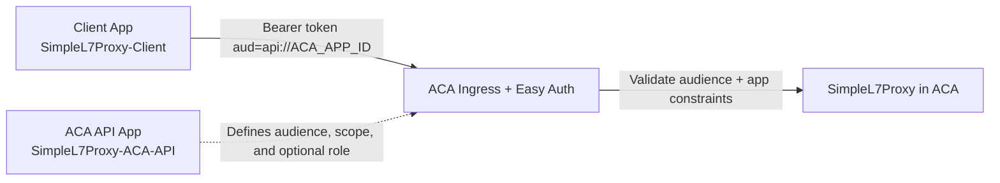

# POC: ACA Proxy Security and Authorization

**Purpose:** Validate inbound OAuth 2.0 authentication and authorization for the SimpleL7Proxy Container App (ACA), including Entra app registration setup, ACA auth configuration, and caller validation.

## TL;DR (< 5 minutes)

1. **Most important rule: tokens sent to ACA must have `aud = api://<ACA_APP_ID>`.**
2. Create two Entra apps for this hop: ACA API app and client caller app.
3. Enable ACA authentication and test both success and failure paths.

## What you will observe

- A token minted for `api://<ACA_APP_ID>` is accepted by ACA.
- Requests without a token or with the wrong audience are rejected.
- The client identity can be restricted through allowed applications and app role assignment.

## Reference

| Setting | Value in this POC | Unit | Set in | Takes effect |
| :--- | :--- | :--- | :--- | :--- |
| ACA API app registration | `SimpleL7Proxy-ACA-API` | name | Entra App registrations | immediate |
| Client app registration | `SimpleL7Proxy-Client` | name | Entra App registrations | immediate |
| ACA audience | `api://<ACA_APP_ID>` | URI | ACA auth config | config save |
| ACA scope | `api.access` | scope value | ACA API app | token issuance |
| App role value | `API.Caller` | claim value | ACA API app | token issuance |
| Client secret requirement | ACA API app: `Yes` when used in ACA auth config; Client app: `Yes` for client credentials flow | flag | Entra App registrations | immediate |

> [!NOTE]
> Units used in this doc: IDs are GUIDs, audience values are URI strings, and roles/scopes are string claims.

## Setup

### 1) Create ACA API app registration in Entra

**Rule: the ACA proxy must expose its own audience and scope for inbound client tokens.**

```text
Name: SimpleL7Proxy-ACA-API
Application ID URI: api://<ACA_APP_ID>
Scope: api.access
App role: API.Caller
```

Portal steps (repo-aligned):

1. Entra ID -> App registrations -> New registration.
2. Name: `SimpleL7Proxy-ACA-API`.
3. Expose an API -> Set Application ID URI -> `api://<ACA_APP_ID>`.
4. Expose an API -> Add scope:
   - Scope value: `api.access`
   - Who can consent: `Admins only`
   - Admin consent display name: `Admin Access`
   - Admin consent description: `Access the API`
   - State: `Enabled`
5. App roles -> Create app role:
   - Display name: `Caller`
   - Allowed member types: `Users/Groups` and `Applications`
   - Value: `API.Caller`
   - Enable app role: `Yes`
6. Enterprise applications -> corresponding service principal -> set assignment required to `Yes`.
7. Save IDs:
   - `ACA_APP_ID`
   - `ACA_API_SERVICE_PRINCIPAL_OBJECT_ID`
   - `ACA_API_CALLER_ROLE_ID`

### 2) Create client app registration in Entra

**Rule: the caller must be able to request a token for ACA scope and present it to ACA.**

```text
Name: SimpleL7Proxy-Client
Permission: ACA API delegated permission api.access
Credential: client secret (or certificate)
```

Portal steps:

1. Entra ID -> App registrations -> New registration.
2. Name: `SimpleL7Proxy-Client`.
3. API permissions -> Add permission -> My APIs -> `SimpleL7Proxy-ACA-API`.
4. Add delegated permission `api.access`.
5. Grant admin consent if required by tenant policy.
6. Certificates and secrets -> New client secret.
7. Save IDs/secrets:
   - `CLIENT_APP_ID`
   - `CLIENT_SERVICE_PRINCIPAL_OBJECT_ID`
   - `CLIENT_SECRET`

### 3) Configure ACA authentication

**Rule: ACA auth must validate the ACA audience and only allow authorized caller applications.**

Script-aligned configuration using repo flow:

```bash
./scripts/enableContainerAppAuth.sh \
  -g <resource_group> \
  -n <container_app_name> \
  -t <tenant_id> \
  -c <ACA_APP_ID> \
  -s <ACA_APP_CLIENT_SECRET> \
  -a <CLIENT_APP_ID>
```

Equivalent portal checks:

1. Container Apps -> your app -> Authentication.
2. Identity provider: Microsoft.
3. Tenant: `<tenant_id>`.
4. Client ID: `<ACA_APP_ID>`.
5. Client secret: ACA app secret.
6. Allowed token audiences includes `api://<ACA_APP_ID>`.
7. Allowed applications includes `<CLIENT_APP_ID>`.
8. Unauthenticated requests set to `401`/reject.

> [!WARNING]
> Use tenant ID for `-t`; do not use a service principal object ID in this field.

### 4) Optional app-role assignment for client service principal

**Rule: if you enforce role-based app auth, assign `API.Caller` to the client service principal on ACA API.**

```powershell
Connect-MgGraph -TenantId "<tenant_id>" -Scopes "Application.ReadWrite.All", "AppRoleAssignment.ReadWrite.All"
$clientSpId = "<CLIENT_SERVICE_PRINCIPAL_OBJECT_ID>"
$acaResourceSpId = "<ACA_API_SERVICE_PRINCIPAL_OBJECT_ID>"
$acaRoleId = "<ACA_API_CALLER_ROLE_ID>"
New-MgServicePrincipalAppRoleAssignment -ServicePrincipalId $clientSpId -PrincipalId $clientSpId -ResourceId $acaResourceSpId -AppRoleId $acaRoleId
```

## Full flow



## Worked example

| Step | Example value | Result |
| :--- | :--- | :--- |
| Create ACA API app | `appId = 22222222-2222-2222-2222-222222222222` | ACA audience is `api://22222222-2222-2222-2222-222222222222` |
| Create client app | `appId = 33333333-3333-3333-3333-333333333333` | Client can request ACA token |
| Enable ACA auth | Allowed audience set to ACA URI | ACA validates incoming bearer tokens |
| Send valid token | `aud` matches ACA URI | Request succeeds |
| Send token with wrong audience | `aud` is APIM URI | Request fails with `401` |

## Test ACA authorization

**Rule: run one success test and two failure tests to validate auth controls.**

Set variables:

```bash
ACA_FQDN="https://<container-app-fqdn>"
ACA_RESOURCE="api://<ACA_APP_ID>"
```

Positive test:

```bash
TOKEN="$(az account get-access-token --resource "$ACA_RESOURCE" --query accessToken -o tsv)"
curl -i "$ACA_FQDN/health" -H "Authorization: Bearer $TOKEN"
```

Expected: success response from ACA.

Negative test (no token):

```bash
curl -i "$ACA_FQDN/health"
```

Expected: `401 Unauthorized`.

Negative test (wrong audience token):

```bash
BAD_TOKEN="$(az account get-access-token --resource api://<APIM_APP_ID> --query accessToken -o tsv)"
curl -i "$ACA_FQDN/health" -H "Authorization: Bearer $BAD_TOKEN"
```

Expected: `401 Unauthorized` due to audience mismatch.

## Verify

- [ ] ACA API app exists with `api://<ACA_APP_ID>` identifier URI.
- [ ] ACA API app exposes scope `api.access`.
- [ ] Client app has delegated permission to `api.access`.
- [ ] ACA auth is enabled and allowed audience includes ACA URI.
- [ ] Allowed applications includes client app ID.
- [ ] Valid ACA token succeeds; missing/wrong-audience token fails.

## Related docs

- [scripts/README.md](../scripts/README.md)
- [scripts/console2caSetup.sh](../scripts/console2caSetup.sh)
- [scripts/enableContainerAppAuth.sh](../scripts/enableContainerAppAuth.sh)
- [POC-APIM-Security-Authorization.md](POC-APIM-Security-Authorization.md)
