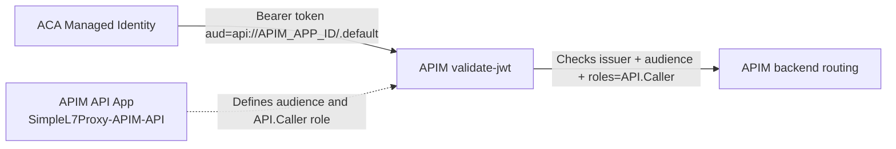

# POC: APIM Security and Authorization

**Purpose:** Validate OAuth 2.0 authentication and authorization at APIM for calls coming from ACA, including Entra app registration, app-role assignment, APIM OAuth interface setup, and `validate-jwt` enforcement.

## TL;DR (< 5 minutes)

1. **Most important rule: APIM must only accept tokens with `aud = api://<APIM_APP_ID>` and `roles = API.Caller`.**
2. Create an APIM API app registration and assign `API.Caller` to ACA managed identity.
3. Configure APIM `validate-jwt` and test both success and failure paths.

## What you will observe

- APIM accepts calls with valid bearer tokens minted for APIM audience and role.
- APIM rejects calls with no token, wrong audience, or missing role.
- OAuth server config in APIM enables interactive authorizing, while policy still enforces acceptance.

## Reference

| Setting | Value in this POC | Unit | Set in | Takes effect |
| :--- | :--- | :--- | :--- | :--- |
| APIM API app registration | `SimpleL7Proxy-APIM-API` | name | Entra App registrations | immediate |
| App role value | `API.Caller` | claim value | APIM API app | token issuance |
| APIM audience | `api://<APIM_APP_ID>` | URI | APIM `validate-jwt` policy | policy save |
| ACA caller identity | ACA managed identity service principal | principal | ACA + Entra | immediate |
| OAuth server client secret | secret from client app used in APIM OAuth server UI | secret | Entra + APIM | save |

> [!NOTE]
> Units used in this doc: IDs are GUIDs and audience values are URI strings.

## Setup

### 1) Create APIM API app registration in Entra

**Rule: APIM policy audience must match this app's identifier URI.**

```text
Name: SimpleL7Proxy-APIM-API
Application ID URI: api://<APIM_APP_ID>
App role: API.Caller
```

Portal steps (repo-aligned):

1. Entra ID -> App registrations -> New registration.
2. Name: `SimpleL7Proxy-APIM-API`.
3. Expose an API -> Set Application ID URI -> `api://<APIM_APP_ID>`.
4. App roles -> Create app role:
   - Display name: `Caller`
   - Allowed member types: `Users/Groups` and `Applications`
   - Value: `API.Caller`
   - Enable app role: `Yes`
5. Enterprise applications -> corresponding service principal -> set assignment required to `Yes`.
6. Save IDs:
   - `APIM_APP_ID`
   - `APIM_API_SERVICE_PRINCIPAL_OBJECT_ID`
   - `APIM_API_CALLER_ROLE_ID`

### 2) Assign ACA managed identity to APIM role

**Rule: ACA managed identity must have `API.Caller` role on APIM API enterprise app.**

```powershell
Connect-MgGraph -TenantId "<tenant_id>" -Scopes "Application.ReadWrite.All", "AppRoleAssignment.ReadWrite.All"
$acaSpId = "<ACA_MANAGED_IDENTITY_OBJECT_ID>"
$apimResourceSpId = "<APIM_API_SERVICE_PRINCIPAL_OBJECT_ID>"
$apimRoleId = "<APIM_API_CALLER_ROLE_ID>"
New-MgServicePrincipalAppRoleAssignment -ServicePrincipalId $acaSpId -PrincipalId $acaSpId -ResourceId $apimResourceSpId -AppRoleId $apimRoleId
```

> [!WARNING]
> Use service principal object IDs from Enterprise applications, not app registration app IDs.

### 3) Configure APIM inbound `validate-jwt` policy

**Rule: APIM must validate issuer, audience, and role before backend routing.**

```xml
<inbound>
    <base />
    <validate-jwt
        header-name="Authorization"
        require-scheme="Bearer"
        failed-validation-httpcode="401"
        failed-validation-error-message="Unauthorized. Missing or invalid token.">
        <openid-config url="https://login.microsoftonline.com/<TENANT_ID>/v2.0/.well-known/openid-configuration" />
        <audiences>
            <audience>api://<APIM_APP_ID></audience>
        </audiences>
        <issuers>
            <issuer>https://login.microsoftonline.com/<TENANT_ID>/v2.0</issuer>
        </issuers>
        <required-claims>
            <claim name="roles" match="any">
                <value>API.Caller</value>
            </claim>
        </required-claims>
    </validate-jwt>
</inbound>
```

> [!TIP]
> If your APIM endpoint accepts delegated user tokens, validate `scp` instead of `roles`.

### 4) Configure OAuth 2.0 in APIM interface

**Rule: OAuth server settings support authorize/testing UX, while `validate-jwt` policy remains the true gate.**

1. Azure portal -> APIM instance.
2. Security -> OAuth 2.0 + OpenID Connect -> Add OAuth 2.0 server.
3. Configure:
   - Display name: `EntraOAuth`
   - Grant types: `Authorization code` and optionally `Client credentials`
   - Client ID: `<CLIENT_APP_ID_USED_FOR_INTERACTIVE_FLOW>`
   - Client secret: `<CLIENT_SECRET_FROM_CLIENT_APP_REGISTRATION>`
   - Authorization endpoint: `https://login.microsoftonline.com/<TENANT_ID>/oauth2/v2.0/authorize`
   - Token endpoint: `https://login.microsoftonline.com/<TENANT_ID>/oauth2/v2.0/token`
   - Default scope: `api://<APIM_APP_ID>/.default` (or your API scope)
4. Save.
5. API -> Settings -> attach OAuth server if Developer Portal Authorize is needed.
6. API -> Design -> verify `validate-jwt` is present in inbound policy.

## Full flow



## Worked example

| Step | Example value | Result |
| :--- | :--- | :--- |
| Create APIM API app | `appId = 11111111-1111-1111-1111-111111111111` | APIM audience is `api://11111111-1111-1111-1111-111111111111` |
| Assign ACA managed identity role | `API.Caller` granted | ACA token can satisfy APIM role check |
| Apply validate-jwt policy | audience + role checks active | Unauthorized tokens are blocked |
| Send valid APIM token | `aud` and `roles` match | Request succeeds |
| Send ACA audience token | `aud` mismatch | Request fails with `401` |

## Test APIM authorization policy

**Rule: run one positive and three negative tests to confirm policy enforcement.**

Set variables:

```bash
APIM_BASE="https://<apim-name>.azure-api.net/<api-suffix>"
APIM_SUB_KEY="<apim-subscription-key>"
```

Positive test:

```bash
TOKEN="<valid-bearer-token-with-aud-api://APIM_APP_ID-and-role-API.Caller>"
curl -i "$APIM_BASE/health" \
  -H "Ocp-Apim-Subscription-Key: $APIM_SUB_KEY" \
  -H "Authorization: Bearer $TOKEN"
```

Expected: success response.

Negative test (no token):

```bash
curl -i "$APIM_BASE/health" -H "Ocp-Apim-Subscription-Key: $APIM_SUB_KEY"
```

Expected: `401 Unauthorized`.

Negative test (wrong audience):

```bash
BAD_TOKEN="<token-with-aud-api://ACA_APP_ID>"
curl -i "$APIM_BASE/health" \
  -H "Ocp-Apim-Subscription-Key: $APIM_SUB_KEY" \
  -H "Authorization: Bearer $BAD_TOKEN"
```

Expected: `401 Unauthorized` due to audience mismatch.

Negative test (missing role):

```bash
NO_ROLE_TOKEN="<token-with-correct-audience-but-no-API.Caller-role>"
curl -i "$APIM_BASE/health" \
  -H "Ocp-Apim-Subscription-Key: $APIM_SUB_KEY" \
  -H "Authorization: Bearer $NO_ROLE_TOKEN"
```

Expected: `401 Unauthorized` due to missing required claim.

## Verify

- [ ] APIM API app registration exists with identifier URI `api://<APIM_APP_ID>`.
- [ ] App role `API.Caller` exists and allows `Applications`.
- [ ] ACA managed identity is assigned `API.Caller` on APIM API enterprise app.
- [ ] APIM inbound policy validates issuer, audience, and role.
- [ ] Valid APIM token succeeds.
- [ ] Missing token, wrong audience, and missing role all fail with `401`.

## Related docs

- [scripts/README.md](../scripts/README.md)
- [scripts/ca2apimSetup.sh](../scripts/ca2apimSetup.sh)
- [APIM-Policy/readme.md](../APIM-Policy/readme.md)
- [POC-ACA-Proxy-Security-Authorization.md](POC-ACA-Proxy-Security-Authorization.md)
