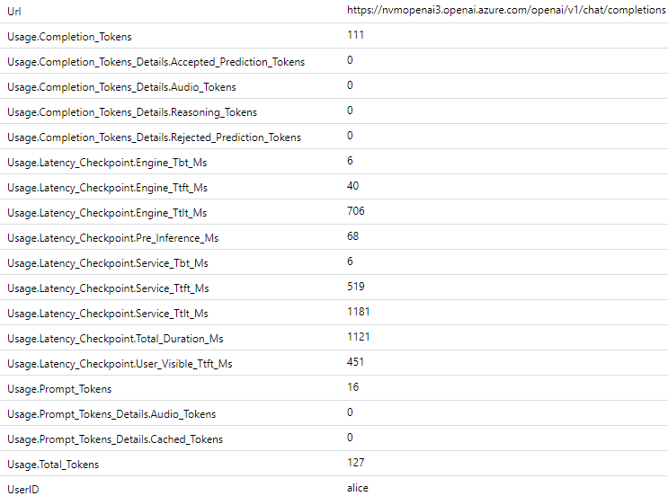

# POC: LLM Chargeback

**Purpose:** Show how token consumption across a shared LLM deployment can be tracked and attributed to each caller.

> [!CONCEPT] > **Chargeback works by tagging each request with a user ID, letting the proxy extract token usage from the response, and sending that data to telemetry so it can be queried per user.**

## TL;DR (< 5 minutes)

1. Send a request through the proxy with an `X-UserID` header. 
2. The proxy captures token usage from the model response and logs it to Application Insights.
3. Run the KQL query and confirm token usage is attributed per `X-UserID`.

**Expected outcome:** Token metrics appear in Application Insights, attributed to each caller by `X-UserID`, with one `requests` entry per completed call and usage token fields present in `customDimensions`.

## What you will observe

The proxy can seamlessly intercept LLM queries and log metrics in real-time to Application Insights. You easily generate chargebacks to departmens based on the data from data in log monitor or an alternate data sink via Event Hub.

## How it works

Each request includes a `X-UserID`. ( or other header )

The proxy forwards the request to the model, reads token usage from the response, and logs that data to telemetry. 

Each completed call produces a `requests` entry in Application Insights with: 
- User ID 
- Token counts 
- Routing metadata 

This data can then be queried and aggregated per user to calculate model usage.

---

## Minimal Prerequisites (Fast Path)

- SimpleL7Proxy running (local or ACA)
- OpenAI endpoint with gpt-4o deployed
- Application Insights connection string configured:
  export APPINSIGHTS_CONNECTIONSTRING="..."
- Logging enabled:
  export LogToAI="*" ( this is the default value )

Required behavior:
- Each request MUST include a unique `X-UserID` header
- The backend MUST return token usage (simulator already does)

Nothing else is required for this POC.

**Optional (alternate setup paths):**

1. Use APIM routing instead of direct backend routing.
2. Use the LLM Simulator instead of the Azure OpenAI endpoint [`test/LLMSimulator/Readme.md`](../test/LLMSimulator/Readme.md).

See [CONFIGURATION_SETTINGS.md](CONFIGURATION_SETTINGS.md) for all environment variable options covering endpoints, logging, workers, and timeouts.


---

## Step 1. Validate connectivity

Check that the proxy and backend are reachable before we begin.

**Set the hostname for where the proxy is running:**
```bash
# proxy running on localhost port 8000
export PROXYHOST="http://localhost:8000"

# proxy running on ACA with ingress enabled on 443
export PROXYHOST="https://<ACA Name>.<environment>.eastus.azurecontainerapps.io"
```

Call the proxy to test it:
```bash
curl -i $PROXYHOST/health
# → 200 OK
```

Confirm that your backend is reachable. If you deployed the proxy in a vnet, run this test from inside that vnet.

We'll send a request to it in Step 4.  Skip to step 2.

**Optional connectivity checks:**
<details><summary>If you choose to use the LLM Simulator or the APIM do these:</summary>

**LLM Simulator:**
```bash
curl -i https://<funcapp>.azurewebsites.net/api/v1/chat/completions
# → 200 OK
```

**APIM:**
```bash
# Health probe - APIM's built-in health probe
curl -i https://<apim-name>.azure-api.net/status-0123456789abcdef
# → 200 OK
```

</details>

---

## Step 2. Configure a backend in the proxy

The `Host1` environment variable points the proxy to a backend.  The proxy can route to the LLM endpoint directly.

```bash
# Azure OpenAI - runs real queries to /openai/...
export Host1="host=https://<endpoint>.openai.azure.com;mode=direct;path=/openai; processor=MultiLineAllUsage"
```

**Optional backend options:**
<details><summary>If you choose to use the LLM Simulator:</summary>


Direct backends do not have probes, so the proxy assumes they are always available. Pick one of the scenarios below that matches your environment.

```bash
# Simulated Azure OpenAI — handles requests to /openai/...
export Host1="host=https://<funcapp>.azurewebsites.net;mode=direct;path=/openai; processor=MultiLineAllUsage"

# Simulated Anthropic — handles requests to /anthropic/...
export Host1="host=https://<funcapp>.azurewebsites.net;mode=direct;path=/anthropic; processor=AllUsage-2"

# Simulated Google Gemini — handles requests to /v1beta/...
export Host1="host=https://<funcapp>.azurewebsites.net;mode=direct;path=/v1beta; processor=MultiLineAllUsage"
```

</details>

<details>
<summary>APIM — routing through Azure API Management</summary>

APIM lets you implement capabilities such as governance, security, and compliance across your LLM backends. Connect the proxy to it using `mode=apim` with a probe path so the proxy can health-check the gateway. If auth is needed, see [POC-APIM-Security-Authorization.md](POC-APIM-Security-Authorization.md).

```bash
export Host1="host=https://<apim>.azure-api.net;mode=apim;probe=/status-0123456789abcdef"
```

APIM can specify the correct processor per route by returning a header to the proxy. Set the `TOKENPROCESSOR` response header in the APIM policy `<outbound>` block based on the model response. Change the value to match the model family your policy routes to (`OpenAI`, `AllUsage-2`, or `MultiLineAllUsage`).

```xml
<outbound>
    <set-header name="TOKENPROCESSOR" exists-action="override">
        <value><!-- OpenAI | AllUsage-2 | MultiLineAllUsage --></value>
    </set-header>
    ...
</outbound>
```
</details>

---

## Step 3. Configure Application Insights

Set `APPINSIGHTS_CONNECTIONSTRING` to your Application Insights connection string. Data sent to App Insights is typically queryable within 3-5 minutes.

If you modified `LogToAI` changed it back to `'*'`

---

## Step 4. Send a request to confirm the pipeline is working.

Depending on your scenario, the URL and body will differ. Define `URL` and `BODY` for your test endpoint.

```bash
# OpenAI - gpt-4o
export URL="openai/v1/chat/completions"
export BODY='{"model":"gpt-4o","messages":[{"role":"user","content":"hello"}],"stream":true}'
```

**Optional backend options:**
<details><summary>If you choose to use the LLM Simulator or APIM:</summary>

```bash
# Optional alternative - OpenAI - gpt-5.4-mini
export URL="openai/v1/chat/completions"
export BODY='{"model":"gpt-5.4-mini","messages":[{"role":"user","content":"hello"}],"stream":true}'

# Optional alternative - LLMSimulator - OpenAI
export URL="api/v1/chat/completions"
export BODY='{"model":"gpt-4o-mini","messages":[{"role":"user","content":"hello"}],"stream":true}'

# Optional alternative - LLMSimulator - Gemini
export URL="v1beta/models/gemini-2.5-pro:generateContent"
export BODY='{"contents":[{"role":"user","parts":[{"text":"hello"}]}]}'

# Optional alternative - LLMSimulator - Anthropic
export URL="anthropic/v1/messages"
export BODY='{"model":"claude-sonnet-3-5","messages":[{"role":"user","content":"hello"}]}'
```
</details>

Now that `$PROXYHOST`, `URL`, and `BODY` are defined, run the following command to get a response.

```bash
# Make the call
curl -i -H "X-UserID: alice" \
  -H "Content-Type: application/json" -d "$BODY" "$PROXYHOST/$URL"
```

---

## Verifying the first pass

The proxy writes a `requests` entry to Application Insights for every completed request, with token counts in `customDimensions`. The simulator returns fixed counts (58 prompt / 1000 completion / 1058 total).

The queries below use OpenAI field names. For Anthropic or Gemini, substitute the field names from the [provider table](#reference).


Open the Log Analytics workspace linked to your Application Insights resource, then run:

```kusto
requests
| where timestamp > ago(1h)
| where customDimensions contains "Usage.Total_Tokens"
| project
    timestamp,
  UserId       = tostring(coalesce(customDimensions["UserID"], customDimensions["userID"])),
  Priority     = tostring(coalesce(customDimensions["S7P-Priority"], customDimensions["S7P_Priority"])),
  Backend      = tostring(coalesce(customDimensions["BackendHost"], customDimensions["Backend-Host"])),
  PromptTokens = toint(coalesce(customDimensions["Usage.Prompt_Tokens"], customDimensions["Usage.Input_Tokens"])),
  CompTokens   = toint(coalesce(customDimensions["Usage.Completion_Tokens"], customDimensions["Usage.Output_Tokens"])),
    TotalTokens  = toint(customDimensions["Usage.Total_Tokens"])
| summarize
    Requests     = count(),
    TotalTokens  = sum(TotalTokens),
    PromptTokens = sum(PromptTokens),
    CompTokens   = sum(CompTokens)
    by UserId, Priority
| order by TotalTokens desc
```

You should see a response similar to the screenshot. If the query shows a `UserId` and counts for the usage fields, the full pipeline is working.


Depending on the model, there may be additional usage fields worth reporting.

For example, for `gpt-5.4-mini`, these are available in custom dimensions:



---

### Send more data

For a chargeback test across multiple users, send the batch below before running the queries:

```bash
for i in {1..3}; do
  curl -s -o /dev/null \
    -H "X-UserID: bob" \
    -H "Content-Type: application/json" -d "$BODY" "$PROXYHOST/$URL" &
done
```
After a few minutes, rerun the query above. Expected result (1 request for `alice` from Step 4 and 3 for `bob` from the batch above):

| UserId | Priority | Requests | TotalTokens | PromptTokens | CompTokens |
|--------|----------|----------|-------------|--------------|------------|
| bob    | 1        | 3        | 3174        | 174          | 3000       |
| alice  | 1        | 1        | 1058        | 58           | 1000       |

To break down by backend (useful when multiple deployments serve different tiers):

```kusto
requests
| where timestamp > ago(1h)
| where customDimensions contains "Usage.Total_Tokens"
| summarize
    TotalTokens = sum(toint(customDimensions["Usage.Total_Tokens"])),
    Requests    = count()
  by UserId = tostring(coalesce(customDimensions["UserID"], customDimensions["userID"])),
     Backend = tostring(coalesce(customDimensions["BackendHost"], customDimensions["Backend-Host"]))
| order by TotalTokens desc
```

---

## Send data to additional sinks

Set `EVENT_LOGGERS` to one or more of `appinsights`, `eventhub`, or `file` (comma-separated). See [CONFIGURATION_SETTINGS.md](CONFIGURATION_SETTINGS.md) for all options.

<details>
<summary>Event Hubs</summary>

Set `EVENT_LOGGERS=eventhub` and `EVENTHUB_CONNECTIONSTRING` to enable the Event Hubs sink. The proxy emits the same JSON envelope it writes to the file log, so every token field is present in the event body.

**Capture to a storage account:** Enable the Event Hubs Capture feature on the hub to land events as Avro files in Azure Blob Storage automatically. This gives you a durable, queryable archive without building a consumer.

**Query with ADX (Azure Data Explorer):** Connect ADX to the hub or to the captured Blob Storage container using an external table or continuous ingestion. Once the data is in ADX you can run the equivalent chargeback query:

```kusto
ProxyEvents
| where UsageTotalTokens > 0
| summarize
    Requests    = count(),
    TotalTokens = sum(UsageTotalTokens),
    PromptTokens = sum(UsagePromptTokens),
    CompTokens  = sum(UsageCompletionTokens)
    by UserId, Priority
| order by TotalTokens desc
```

Other tools that work directly with Event Hubs or Blob-captured data include Fabric Real-Time Intelligence, Stream Analytics, and Azure Synapse.

</details>

<details>
<summary>Local File</summary>

If `EVENT_LOGGERS=file` (the default), token data appears in `eventslog.json` immediately, with no ingestion delay. This is useful for a quick sanity check before querying Application Insights.

If the proxy is deployed to Azure Container Apps, the file is written inside the container. Use the ACA console to inspect it: in the Azure portal, open the container app → **Containers** → **Console**, then run the `jq` command below. For a more durable setup, ACA supports mounting an Azure Files share as a volume — configure a storage mount in the container app and set the proxy's working directory to that path so `eventslog.json` persists across container restarts.

```bash
cat eventslog.json | jq 'select(."Usage.Total_Tokens" != null) | {"user": .userId, "total": ."Usage.Total_Tokens", "backend": .BackendHost}'
```

Expected output per OpenAI request:
```json
{
  "user": "alice",
  "total": "1058",
  "backend": "https://<funcapp>.azurewebsites.net"
}
```

</details>

<details>
<summary>None</summary>

If `EVENT_LOGGERS` is not set or is set to an empty value, telemetry is turned off and nothing is captured. Requests are still proxied normally, but no token data, request events, or usage metrics are written anywhere. Set at least one logger before running this POC.

</details>

---

## Tuning and Further Exploration

Once the basic data is confirmed, these variations are worth trying:

<details>
<summary>Stream Analytics + Power BI dashboard</summary>

With `EVENT_LOGGERS=eventhub`, every request event lands in the hub in real time. Connect an Azure Stream Analytics job to the hub and project the token fields into an output — a Power BI streaming dataset works well here. You can build a live dashboard showing token consumption by user, priority tier, and backend, updating as requests arrive. This is the closest thing to a real-time chargeback view without any custom code.

For a batch approach, use the Event Hubs Capture output (Avro files in Blob Storage) as a Power BI dataflow source, or import it into a Fabric lakehouse for scheduled reporting.

</details>

<details>
<summary>Add a second backend by tier</summary>

Use `acceptablePriorities` to route priority-1 to a "premium" backend and priority-3 to a "standard" one. The `BackendHost` dimension in telemetry then lets you split cost by tier automatically in any of the queries above.

</details>

<details>
<summary>Increase concurrency</summary>

Raise `Workers` and send a larger burst. Watch `eventslog.json` — every line should have a `Usage.Total_Tokens` entry. Missing entries indicate the stream was closed before the final usage chunk arrived (rare with the simulator; common if a real backend is configured without `processor=OpenAI`).

</details>

---

## Reference

<details>
<summary>Settings, values, units, and when each takes effect</summary>

| Setting | Value in this POC | Unit | Set in | Takes effect |
| :--- | :--- | :--- | :--- | :--- |
| `processor=` | `OpenAI`, `AllUsage-2`, or `MultiLineAllUsage` | — | `Host1` env var | proxy restart |
| `X-UserID` header | caller-supplied string | — | request header | per request |
| `APPINSIGHTS_CONNECTIONSTRING` | App Insights connection string | — | env var | proxy restart |
| `EVENT_LOGGERS` | `appinsights`, `eventhub`, `file` (comma-separated) | — | env var | proxy restart |

> [!NOTE]
> For APIM topology, `processor=` is set via the `TOKENPROCESSOR` response header in the APIM policy `<outbound>` block — not in the `Host1` string.

</details>

<details>
<summary>Custom dimensions by provider</summary>

The `processor=` value on the backend host determines which usage fields are extracted:

| Provider | `processor=` value | Usage fields logged |
|----------|--------------------|---------------------|
| Azure OpenAI / OpenAI | `OpenAI` | `Usage.Prompt_Tokens`, `Usage.Completion_Tokens`, `Usage.Total_Tokens` |
| Anthropic | `AllUsage-2` | `Usage.Input_Tokens`, `Usage.Output_Tokens` |
| Google Gemini | `MultiLineAllUsage` | `Usage.PromptTokenCount`, `Usage.CandidatesTokenCount`, `Usage.TotalTokenCount` |

Every request also includes: `S7P_RequestId` (correlation ID), `S7P_Priority` (queue assigned), `BackendHost` (URL that served the request).

</details>

## Related Documentation

- [BEGINNER_DEVELOPMENT.md](BEGINNER_DEVELOPMENT.md) — Running the proxy locally for the first time
- [CONTAINER_DEPLOYMENT.md](CONTAINER_DEPLOYMENT.md) — Deploying to Azure Container Apps
- [CONFIGURATION_SETTINGS.md](CONFIGURATION_SETTINGS.md) — Full reference for all environment variables
- [POC-Priority-configuration.md](POC-Priority-configuration.md) — Routing requests across backends by priority tier
- [POC-Failover-configuration.md](POC-Failover-configuration.md) — Automatic failover and retry behaviour when a backend is slow or unavailable
- [OBSERVABILITY.md](OBSERVABILITY.md) — Token metrics, telemetry channels, and event logger configuration
- [BACKEND_HOSTS.md](BACKEND_HOSTS.md) — `processor=` and other host connection string options
