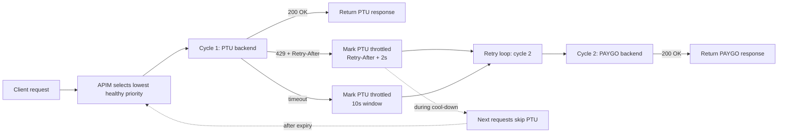
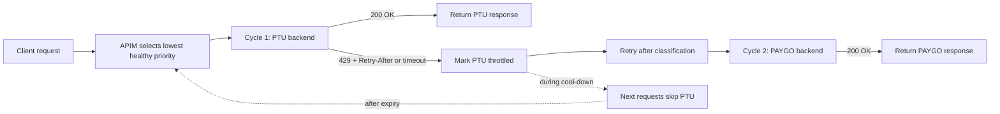

# POC: Azure OpenAI Failover via APIM

**Purpose:** Show that when a PTU Azure OpenAI backend returns `429`, the `Priority-with-retry-enhancedLog.xml` policy marks it throttled, retries the same request against a PAYGO backend, and the client still sees `200 OK`.

> [!IMPORTANT]
> **The rule: PTU at `priorityGroup: 1` wins when healthy; when it returns `429`, APIM throttles it for `Retry-After + 2s` and the same request retries against PAYGO at `priorityGroup: 2`. The client never sees the `429`.**

## TL;DR (< 5 minutes)

1. Apply [`APIM-Policy/v2.1.0/Priority-with-retry-enhancedLog.xml`](../APIM-Policy/v2.1.0/Priority-with-retry-enhancedLog.xml) to your APIM API with two backends: PTU at `priorityGroup: 1` and PAYGO at `priorityGroup: 2`, both using the same deployment name.
2. Send one healthy request, then a burst to exhaust PTU quota, then one more request while PTU is throttled.
3. Read `x-Backend-Attempts`, `x-backend-affinity`, and `backendLog` to confirm PTU → PAYGO failover.

**Expected outcomes:** healthy = `x-Backend-Attempts: 1`, PTU affinity; failover = `x-Backend-Attempts: 2`, PAYGO affinity; cool-down = `x-Backend-Attempts: 1`, PAYGO affinity (PTU skipped).

## What you will observe

- A healthy PTU request returns `200 OK` with `x-Backend-Attempts: 1` and the PTU affinity hash.
- When PTU is throttled, the same request still returns `200 OK` but with `x-Backend-Attempts: 2` and the PAYGO affinity hash.
- Requests sent during the `Retry-After + 2s` cool-down return `200 OK` with `x-Backend-Attempts: 1` and PAYGO affinity — PTU is skipped without being tried.
- After the cool-down expires, the next request returns `x-Backend-Attempts: 1` with PTU affinity again.
- If PTU is unreachable instead of throttled, `backendLog` shows `likely timeout` and a `10s` cool-down instead of a `Retry-After`-based window.

## Reference

<details>
<summary>Settings, values, units, and when each takes effect</summary>

| Setting | Value in this POC | Unit | Set in | Takes effect |
| :--- | :--- | :--- | :--- | :--- |
| Policy file | [`APIM-Policy/v2.1.0/Priority-with-retry-enhancedLog.xml`](../APIM-Policy/v2.1.0/Priority-with-retry-enhancedLog.xml) | — | APIM API | after policy save |
| `priorityGroup` (PTU) | `1` | group | `listBackends` | after policy save |
| `priorityGroup` (PAYGO) | `2` | group | `listBackends` | after policy save |
| `timeout` | `30` | seconds | `listBackends` | after policy save |
| `retryCount` | `2` | attempts | `priorityCfg` | after policy save |
| `defaultRetryAfter` | `10` | seconds | `listBackends` per-backend | after policy save |
| `429` cool-down | `Retry-After + 2` | seconds | parsed from Azure OpenAI response | per request |
| Timeout cool-down | `10` (hard-coded) | seconds | policy logic | per request |
| `auth` | `"MI"` | — | `listBackends` | after policy save |
| `bufferResponse` | `true` | boolean | `listBackends` | after policy save |
| `limitConcurrency` | `off` | mode | `listBackends` | after policy save |
| Deployment name | same on both resources | — | Azure OpenAI | at resource creation |
| Reload behavior | policy save | — | APIM | after policy save |

> [!NOTE]
> **Units used in this doc:** `timeout` and `defaultRetryAfter` are in seconds. `Retry-After` is in seconds as returned by Azure OpenAI. The policy adds `2s` to `Retry-After` before applying the cool-down window.

</details>

## Setup

### Minimal prerequisites

**What matters:** you need two Azure OpenAI resources with the same deployment name. The PTU resource needs low enough quota to trigger real `429` responses under load.

- An APIM instance with [`APIM-Policy/v2.1.0/Priority-with-retry-enhancedLog.xml`](../APIM-Policy/v2.1.0/Priority-with-retry-enhancedLog.xml) applied at the API level.
- Two Azure OpenAI resources with the same deployment name, for example `gpt-4o-mini`.
- A PTU primary with capacity low enough to trigger `429` responses under the burst in step 2.
- A PAYGO secondary in a separate Azure OpenAI resource.
- One auth path (choose one):
  - **Managed Identity:** APIM system-assigned identity has `Cognitive Services OpenAI User` on both AOAI resources.
  - **API key:** keys from each Azure OpenAI resource.
- An APIM subscription key for the target API.

> [!NOTE]
> Older policy versions used `api-key` instead of `auth`. The v2.1.0 policy reads `auth`; `api-key` is silently ignored.

### Apply the policy

**What matters:** apply the policy at the API level on **All operations**, not at product or global scope.

#### Azure portal (recommended)

1. Open your APIM instance in the [Azure portal](https://portal.azure.com).
2. Select **APIs** and open the target API.
3. Select **All operations**.
4. Open the **Inbound processing** policy editor (`</>` icon).
5. Replace the editor contents with [`APIM-Policy/v2.1.0/Priority-with-retry-enhancedLog.xml`](../APIM-Policy/v2.1.0/Priority-with-retry-enhancedLog.xml).
6. Select **Save**.

If you are using Managed Identity:

1. In APIM, open **Identity** and enable the system-assigned identity.
2. Open each Azure OpenAI resource.
3. Go to **Access control (IAM)**.
4. Add the `Cognitive Services OpenAI User` role assignment for the APIM managed identity.

> [!NOTE]
> Role propagation can take a few minutes. If the first request returns `401 PermissionDenied`, wait and retry.

<details>
<summary>Azure CLI alternative</summary>

```bash
az apim api policy create \
  --resource-group <rg> \
  --service-name <apim-name> \
  --api-id <api-id> \
  --value "$(cat APIM-Policy/v2.1.0/Priority-with-retry-enhancedLog.xml)" \
  --format xml
```

Enable Managed Identity and assign AOAI access:

```bash
PRINCIPAL_ID=$(az apim update --resource-group <rg> --name <apim-name> \
  --set identity.type=SystemAssigned --query identity.principalId -o tsv)

for AOAI in <ptu-resource> <paygo-resource>; do
  SCOPE=$(az cognitiveservices account show -g <aoai-rg> -n "$AOAI" --query id -o tsv)
  az role assignment create --assignee "$PRINCIPAL_ID" \
    --role "Cognitive Services OpenAI User" --scope "$SCOPE"
done
```

</details>

### Configure `listBackends`

**What matters:** PTU must have a lower `priorityGroup` than PAYGO. Both backends must use the same deployment name so APIM can forward the same operation path to either one.

```xml
<set-variable name="listBackends" value="@{
    JArray backends = new JArray();
    string salt = "0123456789";

    backends.Add(new JObject()
    {
        { "url", "https://<ptu-resource>.openai.azure.com/" },
        { "path", "" },
        { "priorityGroup", 1 },
        { "label", "PTU" },
        { "acceptablePriorities", new JArray(1,2,3) },
        { "limitConcurrency", "off" },
        { "bufferResponse", true },
        { "timeout", 30 },
        { "auth", "MI" }
    });

    backends.Add(new JObject()
    {
        { "url", "https://<paygo-resource>.openai.azure.com/" },
        { "path", "" },
        { "priorityGroup", 2 },
        { "label", "PAYGO" },
        { "acceptablePriorities", new JArray(1,2,3) },
        { "limitConcurrency", "off" },
        { "bufferResponse", true },
        { "timeout", 30 },
        { "auth", "MI" }
    });

    foreach (JObject backend in backends) {
        string saltedUrl = salt + backend["url"].ToString();
        backend["affinity"] = string.Concat(
            System.Security.Cryptography.SHA256.Create()
            .ComputeHash(System.Text.Encoding.UTF8.GetBytes(saltedUrl))
            .Take(10)
            .Select(b => b.ToString("x2"))
        );
        backend["isThrottling"]      = false;
        backend["retryAfter"]        = DateTime.MinValue;
        backend["defaultRetryAfter"] = 10;
    }

    return backends;
}" />
```

> [!TIP]
> For API key auth, replace `"MI"` with a key value or a Named Value reference such as `{{aoai-ptu-key}}`.

### Configure `priorityCfg`

**What matters:** `retryCount: 2` gives the policy one cycle on PTU and one cycle on PAYGO for the same request.

```xml
<set-variable name="priorityCfg" value="@{
    JObject cfg = new JObject();
    cfg["1"] = new JObject { { "retryCount", 2 }, { "requeue", false } };
    cfg["2"] = new JObject { { "retryCount", 2 }, { "requeue", false } };
    cfg["3"] = new JObject { { "retryCount", 2 }, { "requeue", false } };
    return cfg;
}" />
```

> [!WARNING]
> If `retryCount` is too low, the client receives the PTU `429` instead of a PAYGO recovery.

## Run

**What matters:** run the four requests in order. Replace the placeholders once and reuse them for every step.

```bash
BASE="https://<your-apim>.azure-api.net/<your-api>"
KEY="<your-subscription-key>"
DEP="<deployment-name>"
VER="<api-version>"
```

> [!TIP]
> Use `2024-02-01` as the `api-version` if you are unsure which one your resources support.

### 1. Healthy PTU request

```bash
curl -i \
  -H "Ocp-Apim-Subscription-Key: $KEY" \
  -H "Content-Type: application/json" \
  -d '{"messages":[{"role":"user","content":"Say hi in five words."}],"max_tokens":40}' \
  "$BASE/openai/deployments/$DEP/chat/completions?api-version=$VER"
```

Expected: `200 OK`, `x-Backend-Attempts: 1`, `x-backend-affinity` = PTU hash, `backendLog` ends with `CALL SUCCESSFUL` for PTU URL.

### 2. Force PTU throttle and fail over to PAYGO

Send a burst to exhaust PTU quota:

```bash
for i in {1..20}; do
  curl -s -o /dev/null -w "%{http_code} %{header_x-backend-affinity}\n" \
    -H "Ocp-Apim-Subscription-Key: $KEY" \
    -H "Content-Type: application/json" \
    -d "{\"messages\":[{\"role\":\"user\",\"content\":\"$(yes word | head -n 500 | tr '\n' ' ')\"}],\"max_tokens\":200}" \
    "$BASE/openai/deployments/$DEP/chat/completions?api-version=$VER" &
done
wait
```

Then send one request with headers visible:

```bash
curl -i \
  -H "Ocp-Apim-Subscription-Key: $KEY" \
  -H "Content-Type: application/json" \
  -d '{"messages":[{"role":"user","content":"Hi"}],"max_tokens":20}' \
  "$BASE/openai/deployments/$DEP/chat/completions?api-version=$VER"
```

Expected: `200 OK`, `x-Backend-Attempts: 2`, `x-PolicyCycleCounter: 2`, `x-backend-affinity` = PAYGO hash, `backendLog` shows `THROTTLED: PTU Retry-After: <mm:ss>` then `CALL SUCCESSFUL` for PAYGO.

### 3. Confirm cool-down behavior

Immediately send one more request while PTU is inside the cool-down window:

```bash
curl -i \
  -H "Ocp-Apim-Subscription-Key: $KEY" \
  -H "Content-Type: application/json" \
  -d '{"messages":[{"role":"user","content":"Hi again"}],"max_tokens":20}' \
  "$BASE/openai/deployments/$DEP/chat/completions?api-version=$VER"
```

Expected: `200 OK`, `x-Backend-Attempts: 1`, `x-backend-affinity` = PAYGO hash, `backendLog` shows `THROTTLED: (PTU - <mm:ss>)` and a single-cycle PAYGO call.

### 4. Confirm recovery to PTU

Wait for the `Retry-After` value plus `2s`, then repeat step 1.

Expected: `200 OK`, `x-Backend-Attempts: 1`, `x-backend-affinity` switches back to PTU hash, `backendLog` shows PTU URL and `CALL SUCCESSFUL`.

### 5. Optional — simulate PTU unreachable

Point the PTU `url` at a non-routable host, then repeat step 1:

```bash
curl -i \
  -H "Ocp-Apim-Subscription-Key: $KEY" \
  -H "Content-Type: application/json" \
  -d '{"messages":[{"role":"user","content":"Hi"}],"max_tokens":20}' \
  "$BASE/openai/deployments/$DEP/chat/completions?api-version=$VER"
```

Expected: `200 OK`, `x-Backend-Attempts: 2`, `backendLog` includes `likely timeout` and a `10s` cool-down, PAYGO serves the response.

## Verify

**What matters:** `x-Backend-Attempts`, `x-backend-affinity`, and `backendLog` together tell you exactly which backend was selected and why.

- [ ] Step 1: `200 OK`, `x-Backend-Attempts: 1`, affinity = PTU hash.
- [ ] Step 1: `backendLog` contains `Using PTU URL:` and ends with `CALL SUCCESSFUL`. No PAYGO entry.
- [ ] Step 2: `200 OK`, `x-Backend-Attempts: 2`, `x-PolicyCycleCounter: 2`, affinity = PAYGO hash.
- [ ] Step 2: `backendLog` contains `THROTTLED: PTU Retry-After:` followed by `Using PAYGO URL:` and `CALL SUCCESSFUL`.
- [ ] Step 3: `200 OK`, `x-Backend-Attempts: 1`, affinity = PAYGO hash. `backendLog` shows `THROTTLED: (PTU - <mm:ss>)` and a single PAYGO cycle.
- [ ] Step 4: `200 OK`, `x-Backend-Attempts: 1`, affinity returns to PTU hash after cool-down expires.
- [ ] Step 5 (optional): `backendLog` shows `likely timeout` and a `10s` window instead of `Retry-After`.

> [!TIP]
> If you cannot explain a result using all three signals together, the test is not complete yet.

## Deep dive

**What matters:** the policy is a two-cycle loop — pick PTU, classify the failure, mark PTU throttled, retry against PAYGO — and the cool-down state persists across requests until the window expires.

### Full request flow



### Worked example

| Step | Time | Observable signal | What it shows |
| :--- | :--- | :--- | :--- |
| 1 | `t=0s` | `x-Backend-Attempts: 1`, PTU affinity | PTU is healthy; wins on cycle 1. |
| 2 | `t=4s` | PTU returns `429` with `Retry-After: 5` | PTU is overloaded. |
| 3 | `t=4s` | `backendLog`: `THROTTLED: PTU Retry-After: 00:07` | Policy applied `5 + 2 = 7s` cool-down. |
| 4 | `t=4s` | `x-Backend-Attempts: 2`, PAYGO affinity | Same client request succeeded on cycle 2. |
| 5 | `t=8s` | `x-Backend-Attempts: 1`, PAYGO affinity | PTU still in cool-down; skipped entirely. |
| 6 | `t=12s` | `x-Backend-Attempts: 1`, PTU affinity | Cool-down expired; PTU re-entered selection. |

### How to read `backendLog`

**What matters:** each `|`-separated entry is `<elapsed-seconds> <event>`. The effective backend URL is the normalized `url + path` after policy processing.

Healthy PTU path:

```text
0.001s Begin
0.001s THROTTLED: (none)
0.001s RETRIES LEFT: 2 CYCLE: 1 INDEX: 0
0.001s Using PTU URL: https://<ptu>.openai.azure.com/openai/deployments/<deployment>/chat/completions LIMIT: off
0.320s StatusCode: 200 - Success
0.320s CALL SUCCESSFUL
```

Failover after a real Azure OpenAI `429`:

```text
0.001s Begin
0.001s THROTTLED: (none)
0.001s RETRIES LEFT: 2 CYCLE: 1 INDEX: 0
0.001s Using PTU URL: https://<ptu>.openai.azure.com/... LIMIT: off
0.312s StatusCode: 429 - Temp Error
0.313s THROTTLED: PTU Retry-After: 00:07
0.313s CALL INCOMPLETE, Unthrottled Backends: 1
1.313s RETRIES LEFT: 1 CYCLE: 2 INDEX: 1
1.313s Using PAYGO URL: https://<paygo>.openai.azure.com/... LIMIT: off
1.630s StatusCode: 200 - Success
1.630s CALL SUCCESSFUL
```

Cool-down request (PTU skipped from the start):

```text
0.001s Begin
0.001s THROTTLED: (PTU - 00:04)
0.001s RETRIES LEFT: 2 CYCLE: 1 INDEX: 1
0.001s Using PAYGO URL: https://<paygo>.openai.azure.com/... LIMIT: off
0.085s StatusCode: 200 - Success
0.085s CALL SUCCESSFUL
```

### Auth modes

| Mode | Header sent | When to use |
| :--- | :--- | :--- |
| Managed Identity (`"MI"`) | `Authorization: Bearer <token>` | Preferred for all deployments. |
| API key | `api-key: <key>` | Use only when MI is not available. |

> [!WARNING]
> Do not hard-code production keys in the policy. Use APIM Named Values or Key Vault references.

## Optional variants

### Three-region active/active/active

**What matters:** add a third backend at `priorityGroup: 3` and raise `retryCount` to `3` so the retry loop can walk all three regions.

```xml
backends.Add(new JObject() {
    { "url", "https://<eus2>.openai.azure.com/" }, { "path", "" },
    { "priorityGroup", 3 }, { "label", "EUS2" },
    { "acceptablePriorities", new JArray(1,2,3) },
    { "limitConcurrency", "off" }, { "bufferResponse", true },
    { "timeout", 30 }, { "auth", "MI" }
});
```

### Streaming chat completions

**What matters:** set `bufferResponse: false` on each backend. Failover behavior is identical because the `429` or timeout is classified before the stream starts.

```xml
{ "bufferResponse", false },
```

Confirm the APIM gateway does not override the backend setting with global response buffering.

### Tuning knobs

- Lower PTU `timeout` to abandon slow PTU responses faster and reach PAYGO sooner.
- Set `limitConcurrency` on PTU to pre-empt hard throttling by capping in-flight requests.
- Restrict PTU to premium callers with `acceptablePriorities: [1]` and PAYGO to all callers with `acceptablePriorities: [1,2,3]`. See [POC-Priority-configuration.md](POC-Priority-configuration.md).
- Use `requeue: true` only when you want exhausted retries to return `429 + S7PREQUEUE: true` to SimpleL7Proxy instead of surfacing an error.

## Troubleshooting

**What matters:** each symptom maps to one concrete cause and one concrete check.

| Symptom | Likely cause | Check |
| :--- | :--- | :--- |
| First request returns `401` | Managed Identity or API key is invalid | Confirm APIM identity has `Cognitive Services OpenAI User` on both AOAI resources; or confirm the `auth` value is correct |
| First request returns `404` | Deployment name differs between PTU and PAYGO | Verify both resources expose the same `/openai/deployments/<deployment>/...` path |
| Failover request returns `429` to client | `retryCount` is too low, or PAYGO is also unhealthy | Confirm `priorityCfg[*].retryCount >= 2` and test PAYGO directly |
| Every request goes to PAYGO even after waiting | PTU still throttled, or PTU keeps returning `429` | Compare the last `Retry-After` in `backendLog` with the elapsed wait; send a low-token test request |
| `backendLog` shows only PTU, no retry | PTU call succeeded or PAYGO is filtered out | Confirm the burst is large enough to trigger throttling and that PAYGO has `acceptablePriorities` covering the request |
| Streaming response does not stream | `bufferResponse` is still `true` or gateway-level buffering is active | Set `bufferResponse: false` and check APIM gateway buffering settings |
| `api-key` field silently ignored | Using old v2.0.1 field name | Rename `api-key` to `auth` in `listBackends` |

> [!WARNING]
> Do not change multiple knobs at once while debugging. Check auth first, then deployment name, then retry settings, then load pattern.

## Related documentation

- [POC-Failover-configuration.md](POC-Failover-configuration.md) — Same failover policy using the LLM Simulator instead of real Azure OpenAI endpoints
- [POC-Priority-configuration.md](POC-Priority-configuration.md) — Priority-based backend selection by caller tier
- [POC-Chargeback.md](POC-Chargeback.md) — Token usage tracking and per-user cost attribution
- [AI_FOUNDRY_INTEGRATION.md](AI_FOUNDRY_INTEGRATION.md) — Wiring Azure OpenAI and AI Foundry endpoints into SimpleL7Proxy
- [BACKEND_HOSTS.md](BACKEND_HOSTS.md) — Host configuration options including `timeout`, `retryCount`, and `acceptablePriorities`
- [SECURITY.md](SECURITY.md) — Managed Identity, Key Vault, and secret rotation guidance


## TL;DR

- Put the PTU backend at `priorityGroup: 1`, the PAYGO backend at `priorityGroup: 2`, and keep the same deployment name on both Azure OpenAI resources.
- Run one normal request, then a short burst that exhausts PTU quota; the client should keep getting `200 OK` while APIM retries from PTU to PAYGO.
- Verify with `x-Backend-Attempts`, `x-backend-affinity`, and `backendLog`: first PTU wins, then PAYGO takes over during cool-down, then traffic returns to PTU after cool-down expires.

## What You Will Observe

- A healthy request returns `200 OK` with `x-Backend-Attempts: 1` and the PTU affinity hash.
- A throttled PTU request still returns `200 OK`, but now with `x-Backend-Attempts: 2` and the PAYGO affinity hash.
- Requests sent during the `Retry-After + 2s` cool-down skip PTU entirely.
- After cool-down expires, the next request returns to PTU.

[!NOTE]
Units used in this doc: `timeout` and `defaultRetryAfter` are seconds, Azure OpenAI `Retry-After` is seconds.

## Reference

<details>
<summary>Reference: defaults, units, and policy knobs used in this POC</summary>

Use this reference when you are configuring the policy, checking whether the test is set up correctly, or explaining why APIM selected, skipped, or retried a backend.

| Item | Value or default | What matters |
| :--- | :--- | :--- |
| Policy file | `APIM-Policy/Priority-with-retry-enhancedLog.xml` | Apply it at the API level on the API you are testing. |
| `priorityGroup` | PTU `1`, PAYGO `2` | Lower number wins when both backends are healthy. |
| `timeout` | `30` seconds in this POC | Long enough for real chat completions, short enough to surface a bad backend. |
| `retryCount` | `2` for priorities `1`, `2`, and `3` | Gives the policy one more backend to try after the first failure. |
| `defaultRetryAfter` | `10` seconds | Used for timeout-style failures when no backend `Retry-After` exists. |
| `Retry-After` handling | backend value plus `2` seconds | The policy adds a safety buffer before reusing a throttled backend. |
| `auth` | `"MI"` or a literal key | Use `"MI"` when possible; use `auth`, not `api-key`. |
| `bufferResponse` | `true` | Keep `true` for non-streaming chat completions; set `false` only for SSE streaming. |
| Deployment name | Same on both AOAI resources | APIM forwards the same `/openai/deployments/<deployment>/...` path to whichever backend wins. |
| Reload behavior | Policy save on APIM | Policy changes take effect after save; backend throttle state is runtime state inside the gateway. |

</details>

## Setup

**Use two Azure OpenAI resources with the same deployment name, then put PTU first and PAYGO second in `listBackends`.**

```xml
{ "priorityGroup", 1 },
{ "label", "PTU" },
{ "auth", "MI" }
```

[!NOTE]
Older versions of the policy use `api-key` rather than `auth`.

### Minimal prerequisites

- An APIM instance with [../APIM-Policy/Priority-with-retry-enhancedLog.xml](../APIM-Policy/Priority-with-retry-enhancedLog.xml) applied at the API level.
- Two Azure OpenAI resources with the same deployment name, for example `gpt-4o-mini`.
- A PTU primary with low enough capacity to trigger real `429` responses under load.
- A PAYGO secondary in a separate Azure OpenAI resource.
- One auth path:
  - Managed Identity: APIM system-assigned identity has `Cognitive Services OpenAI User` on both resources.
  - API key: keys from each Azure OpenAI resource.
- An APIM subscription key for the target API.

### Apply the policy

**Apply the policy to the target API, not globally, so the test surface is small and observable.**

Portal steps:

1. Open APIM in the Azure portal.
2. Go to `APIs` and select the target API.
3. Select `All operations` so the policy applies across the API.
4. In `Inbound processing`, open the policy editor.
5. Paste the contents of `APIM-Policy/Priority-with-retry-enhancedLog.xml`.
6. Save the policy.

If you are using Managed Identity:

1. In APIM, open `Identity` and enable the system-assigned identity.
2. Open each Azure OpenAI resource.
3. Go to `Access control (IAM)`.
4. Add the `Cognitive Services OpenAI User` role assignment for the APIM managed identity.

<details>
<summary>If you prefer to use the CLI</summary>

Use the Azure CLI to apply the policy and, if needed, enable Managed Identity and grant Azure OpenAI access.

```bash
az apim api policy create \
  --resource-group <rg> \
  --service-name <apim-name> \
  --api-id <api-id> \
  --value "$(cat APIM-Policy/Priority-with-retry-enhancedLog.xml)" \
  --format xml
```

```bash
PRINCIPAL_ID=$(az apim update --resource-group <rg> --name <apim-name> \
  --set identity.type=SystemAssigned --query identity.principalId -o tsv)

for AOAI in <ptu-resource> <paygo-resource>; do
  SCOPE=$(az cognitiveservices account show -g <aoai-rg> -n "$AOAI" --query id -o tsv)
  az role assignment create --assignee "$PRINCIPAL_ID" \
    --role "Cognitive Services OpenAI User" --scope "$SCOPE"
done
```

</details>

[!NOTE]
Role propagation can take a few minutes. If the first request returns `401 PermissionDenied`, wait and retry.

### Backend configuration

What matters: We want to try the PTU first, so make sure that it has a lower `priorityGroup` than the PAYGO endpoint. OpenAI requres authentication so both entries must expose a valid `auth` mode ( either MI or key ).

```xml
<set-variable name="listBackends" value="@{
    JArray backends = new JArray();
    string salt = "0123456789";

    backends.Add(new JObject()
    {
        { "url", "https://<ptu-resource>.openai.azure.com/" },
        { "path", "" },
        { "priorityGroup", 1 },
        { "label", "PTU" },
        { "acceptablePriorities", new JArray(1,2,3) },
        { "limitConcurrency", "off" },
        { "bufferResponse", true },
        { "timeout", 30 },
        { "auth", "MI" }
    });

    backends.Add(new JObject()
    {
        { "url", "https://<paygo-resource>.openai.azure.com/" },
        { "path", "" },
        { "priorityGroup", 2 },
        { "label", "PAYGO" },
        { "acceptablePriorities", new JArray(1,2,3) },
        { "limitConcurrency", "off" },
        { "bufferResponse", true },
        { "timeout", 30 },
        { "auth", "MI" }
    });

    foreach (JObject backend in backends) {
        string saltedUrl = salt + backend["url"].ToString();
        backend["affinity"] = string.Concat(
            System.Security.Cryptography.SHA256.Create()
            .ComputeHash(System.Text.Encoding.UTF8.GetBytes(saltedUrl))
            .Take(10)
            .Select(b => b.ToString("x2"))
        );
        backend["isThrottling"] = false;
        backend["retryAfter"] = DateTime.MinValue;
        backend["defaultRetryAfter"] = 10;
    }

    return backends;
}" />
```

[!TIP]
For API key auth, replace `"MI"` with a key value or a Named Value reference such as `{{aoai-ptu-key}}`.

### Retry configuration

What matters: set `retryCount` high enough for the policy to try the next backend in the list.

```xml
<set-variable name="priorityCfg" value="@{
    JObject cfg = new JObject();
    cfg["1"] = new JObject { { "retryCount", 2 }, { "requeue", false } };
    cfg["2"] = new JObject { { "retryCount", 2 }, { "requeue", false } };
    cfg["3"] = new JObject { { "retryCount", 2 }, { "requeue", false } };
    return cfg;
}" />
```

[!WARNING]
If `retryCount` is too low, the client will see the PTU failure instead of a PAYGO recovery.

## Run

**Run the four requests in order: healthy PTU, forced PTU throttle, immediate follow-up during cool-down, and post-cool-down recovery.**

```bash
curl -i \
  -H "Ocp-Apim-Subscription-Key: <your-subscription-key>" \
  -H "Content-Type: application/json" \
  -d '{"messages":[{"role":"user","content":"Say hi in five words."}],"max_tokens":40}' \
  "https://<your-apim>.azure-api.net/<your-api>/openai/deployments/<deployment>/chat/completions?api-version=<api-version>"
```

[!TIP]
Replace `<your-apim>`, `<your-api>`, `<deployment>`, `<api-version>`, and `<your-subscription-key>` once, then reuse the same values for every step.

### 1. Healthy PTU request

Send one normal chat request:

```bash
curl -i \
  -H "Ocp-Apim-Subscription-Key: <your-subscription-key>" \
  -H "Content-Type: application/json" \
  -d '{"messages":[{"role":"user","content":"Say hi in five words."}],"max_tokens":40}' \
  "https://<your-apim>.azure-api.net/<your-api>/openai/deployments/<deployment>/chat/completions?api-version=<api-version>"
```

Expected outcome:

- `200 OK`
- `x-Backend-Attempts: 1`
- `x-backend-affinity` equals the PTU backend hash
- `backendLog` contains `Using PTU backend` and `CALL SUCCESSFUL`

### 2. Force PTU throttling and fail over to PAYGO

Send a short burst that exceeds PTU TPM or RPM quota:

```bash
for i in {1..20}; do
  curl -s -o /dev/null -w "%{http_code} %{header_x-backend-affinity}\n" \
    -H "Ocp-Apim-Subscription-Key: <your-subscription-key>" \
    -H "Content-Type: application/json" \
    -d "{\"messages\":[{\"role\":\"user\",\"content\":\"$(yes word | head -n 500 | tr '\n' ' ')\"}],\"max_tokens\":200}" \
    "https://<your-apim>.azure-api.net/<your-api>/openai/deployments/<deployment>/chat/completions?api-version=<api-version>" &
done
wait
```

Then send one request with headers visible:

```bash
curl -i \
  -H "Ocp-Apim-Subscription-Key: <your-subscription-key>" \
  -H "Content-Type: application/json" \
  -d '{"messages":[{"role":"user","content":"Hi"}],"max_tokens":20}' \
  "https://<your-apim>.azure-api.net/<your-api>/openai/deployments/<deployment>/chat/completions?api-version=<api-version>"
```

Expected outcome:

- `200 OK`
- `x-Backend-Attempts: 2`
- `x-PolicyCycleCounter: 2`
- `x-backend-affinity` now equals the PAYGO backend hash
- `backendLog` shows `Throttling [0] by <N>s, isTempError=true, retry-after=<N>` followed by `Using PAYGO backend` and `CALL SUCCESSFUL`

### 3. Confirm cool-down behavior

Immediately send one more request while PTU is still inside the `Retry-After + 2s` window:

```bash
curl -i \
  -H "Ocp-Apim-Subscription-Key: <your-subscription-key>" \
  -H "Content-Type: application/json" \
  -d '{"messages":[{"role":"user","content":"Hi again"}],"max_tokens":20}' \
  "https://<your-apim>.azure-api.net/<your-api>/openai/deployments/<deployment>/chat/completions?api-version=<api-version>"
```

Expected outcome:

- `200 OK`
- `x-Backend-Attempts: 1`
- `x-backend-affinity` still equals the PAYGO backend hash
- `backendLog` shows PAYGO only; there is no new PTU throttle event for this request

### 4. Confirm recovery to PTU

Wait for the backend `Retry-After` value plus the policy's `2` second buffer, then repeat the healthy request from step 1.

Expected outcome:

- `200 OK`
- `x-Backend-Attempts: 1`
- `x-backend-affinity` switches back to the PTU backend hash
- `backendLog` shows `Using PTU backend` and `CALL SUCCESSFUL`

### 5. Optional: simulate PTU unreachable instead of throttled

Point the PTU backend URL at a non-routable host such as `https://nonexistent-host-xyz.openai.azure.com/`, then run the same single request again.

```bash
curl -i \
  -H "Ocp-Apim-Subscription-Key: <your-subscription-key>" \
  -H "Content-Type: application/json" \
  -d '{"messages":[{"role":"user","content":"Hi"}],"max_tokens":20}' \
  "https://<your-apim>.azure-api.net/<your-api>/openai/deployments/<deployment>/chat/completions?api-version=<api-version>"
```

Expected outcome:

- `200 OK`
- `x-Backend-Attempts: 2`
- `backendLog` includes `likely timeout` and a `10s` throttle window
- PAYGO serves the final response

## Verify

**Verification is a checklist: every signal below maps directly to one step in the failover state machine.**

```text
select -> fail -> throttle -> retry -> recover
```

[!TIP]
If you cannot explain a result with `x-Backend-Attempts`, `x-backend-affinity`, and `backendLog`, the test is not complete yet.

Checklist:

- [ ] Healthy request: `200 OK` with `x-Backend-Attempts: 1` means PTU answered on cycle 1.
- [ ] Failover request: `200 OK` with `x-Backend-Attempts: 2` means PTU failed on cycle 1 and PAYGO answered on cycle 2.
- [ ] Failover request: `backendLog` contains `Throttling [0] by <N>s` and then `Using PAYGO backend`.
- [ ] Cool-down request: `x-Backend-Attempts: 1` with PAYGO affinity means PTU was skipped because it was still throttled.
- [ ] Recovery request: PTU affinity returns after `Retry-After + 2s`, which proves the policy exited cool-down.
- [ ] Timeout variant: `backendLog` shows `likely timeout` and a `10s` cooldown instead of a backend-supplied `Retry-After`.

## Deep Dive

**The policy behavior is a two-cycle loop: pick PTU, classify the PTU failure, mark PTU throttled, then retry against PAYGO.**

```xml
{ "priorityGroup", 1 },
{ "priorityGroup", 2 },
{ "retryCount", 2 }
```

[!NOTE]
This POC uses real Azure OpenAI `429` responses, so the same control path is exercised as production overload handling.

### End-to-end flow



### Worked example with concrete numbers

| Step | Time | Observable signal | Meaning |
| :--- | :--- | :--- | :--- |
| 1 | `t=0s` | `x-Backend-Attempts: 1`, PTU affinity | PTU is healthy and wins selection. |
| 2 | `t=4s` | PTU returns `429` with `Retry-After: 5` | PTU is overloaded. |
| 3 | `t=4s` | `backendLog` shows `Throttling [0] by 7s` | APIM adds the `2s` safety buffer. |
| 4 | `t=4s` | `x-Backend-Attempts: 2`, PAYGO affinity | The same client request succeeded on cycle 2. |
| 5 | `t=8s` | Next request has `x-Backend-Attempts: 1`, PAYGO affinity | PTU is still in cool-down and is skipped. |
| 6 | `t=12s` | Next request returns PTU affinity again | Cool-down expired and PTU re-entered selection. |

### How to read `backendLog`

Successful PTU path:

```text
Using PTU backend: https://<ptu>.openai.azure.com/openai/deployments/<deployment>/chat/completions ... CALL SUCCESSFUL
```

Failover path after a real Azure OpenAI `429`:

```text
Throttling [0] by 7s, isTempError=true, retry-after=5
Using PAYGO backend: https://<paygo>.openai.azure.com/openai/deployments/<deployment>/chat/completions ... CALL SUCCESSFUL
```

What the fields mean:

- `[0]` is the zero-based index of the PTU backend inside `listBackends`.
- `retry-after=5` is the Azure OpenAI response.
- `by 7s` is the policy's throttle window after the `2` second safety buffer is added.

### Auth modes

| Mode | Header sent | Recommendation |
| :--- | :--- | :--- |
| Managed Identity | `Authorization: Bearer <token>` | Preferred for real deployments. |
| API key | `api-key: <key>` | Acceptable for POCs or when MI is unavailable. |

[!WARNING]
Do not hard-code production keys in the policy. Use APIM Named Values or Key Vault references.

## Optional Variants

**Once the two-backend POC works, only add one variable at a time: more regions, streaming, or tuning.**

```xml
{ "bufferResponse", false },
{ "limitConcurrency", "<n>" },
{ "acceptablePriorities", new JArray(1,2,3) }
```

[!TIP]
Keep the first pass to two backends only. It makes the retry path obvious in `backendLog`.

### Three-region active/active/active

- Add a third backend with `priorityGroup: 3`.
- Keep `acceptablePriorities: [1,2,3]` on all three.
- Raise `priorityCfg[*].retryCount` to `3` so the loop can walk all regions.

```xml
backends.Add(new JObject() {
    { "url", "https://<eus2>.openai.azure.com/" }, { "path", "" },
    { "priorityGroup", 1 }, { "label", "EUS2" },
    { "acceptablePriorities", new JArray(1,2,3) },
    { "limitConcurrency", "off" }, { "bufferResponse", true },
    { "timeout", 30 }, { "auth", "MI" }
});
```

### Streaming chat completions

- Set `bufferResponse: false` on each streaming backend.
- Failover behavior is unchanged because the `429` or timeout is classified before streaming begins.
- Confirm the gateway does not override streaming with global response buffering.

```xml
{ "bufferResponse", false },
```

### Tuning knobs that matter

- Lower PTU `timeout` only if you want to abandon slow PTU responses faster.
- Set `limitConcurrency` on PTU if you want excess traffic to skip PTU before it hard-throttles.
- Reserve PTU for premium traffic by setting PTU `acceptablePriorities: [1]` and PAYGO `acceptablePriorities: [2,3]`.
- Use `requeue: true` only if you intentionally want to return `429 + S7PREQUEUE: true` to SimpleL7Proxy.

## Troubleshooting

**Every failure here should be explainable as symptom -> cause -> check.**

```text
symptom -> cause -> check
```

[!WARNING]
Do not change multiple knobs at once while debugging. Check auth first, then deployment name, then retry settings, then load pattern.

- Symptom: First request returns `401`.
  Cause: Managed Identity or API key is invalid.
  Check: Confirm APIM identity has `Cognitive Services OpenAI User` on both AOAI resources, or confirm the `auth` value is correct.

- Symptom: First request returns `404`.
  Cause: Deployment name differs between PTU and PAYGO or the forwarded path is wrong.
  Check: Verify both AOAI resources expose the same `/openai/deployments/<deployment>/...` path.

- Symptom: Failover request returns `429` to the client instead of `200`.
  Cause: `retryCount` is too low, only one backend is eligible, or PAYGO is also unhealthy.
  Check: Verify `priorityCfg[*].retryCount >= 2`, `acceptablePriorities` includes the current request, and PAYGO works directly.

- Symptom: Every request keeps going to PAYGO even after waiting.
  Cause: PTU is still throttled, the gateway clock has not passed the throttle window, or PTU keeps returning `429`.
  Check: Compare the last `Retry-After` value in `backendLog` with the wait time and send a low-token test request.

- Symptom: `backendLog` shows only PTU and no retry.
  Cause: The PTU call succeeded, or the second backend was filtered out.
  Check: Confirm the burst is large enough to trigger PTU throttling and that PAYGO shares the same `acceptablePriorities`.

- Symptom: Streaming response does not stream.
  Cause: `bufferResponse` is still `true` or APIM response buffering overrides the backend setting.
  Check: Set `bufferResponse: false` and verify gateway-level buffering behavior.

## Related Documentation

- [POC-Failover-configuration.md](POC-Failover-configuration.md) - Same failover policy against the LLM Simulator instead of real Azure OpenAI backends.
- [POC-Priority-configuration.md](POC-Priority-configuration.md) - Priority-based backend selection by caller tier.
- [POC-Chargeback.md](POC-Chargeback.md) - Token usage tracking and per-user cost attribution.
- [AI_FOUNDRY_INTEGRATION.md](AI_FOUNDRY_INTEGRATION.md) - Wiring Azure OpenAI and AI Foundry endpoints into SimpleL7Proxy.
- [BACKEND_HOSTS.md](BACKEND_HOSTS.md) - Host configuration options such as `Timeout`, `retryCount`, and `acceptablePriorities`.
- [SECURITY.md](SECURITY.md) - Managed Identity, Key Vault, and secret rotation guidance.
