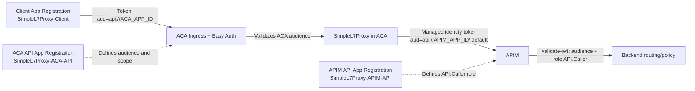

# POC: Security and OAuth 2.0 Configuration

**Purpose:** Validate the repo-aligned OAuth 2.0 trust chain across client -> Container App -> APIM, including the three Entra app registrations and Graph-based app role assignments.

## TL;DR (< 5 minutes)

1. **Most important rule: each hop must use its own token audience (`aud`) and role check; do not pass the same token end-to-end.**
2. Create three app registrations: APIM protected API, ACA protected API, and client caller app.
3. Assign app roles with Microsoft Graph PowerShell when portal UI cannot target managed identities.

## What you will observe

- Client obtains a token for ACA (`aud = api://<ACA_APP_ID>`) and can call ACA when ACA auth is enabled.
- ACA uses managed identity to obtain a separate token for APIM (`aud = api://<APIM_APP_ID>`) and APIM accepts `roles = API.Caller`.
- App role assignment succeeds for identities not selectable in portal UI by using Graph PowerShell cmdlets.

## Reference

| Setting | Value in this POC | Unit | Set in | Takes effect |
| :--- | :--- | :--- | :--- | :--- |
| APIM API app registration | `SimpleL7Proxy-APIM-API` | name | Entra App registrations | immediate |
| ACA API app registration | `SimpleL7Proxy-ACA-API` | name | Entra App registrations | immediate |
| Client app registration | `SimpleL7Proxy-Client` | name | Entra App registrations | immediate |
| App role value | `API.Caller` | claim value | APIM API + ACA API app registrations | token issuance |
| ACA scope value | `api.access` | scope value | ACA API app registration | token issuance |
| APIM audience | `api://<APIM_APP_ID>` | URI | APIM `validate-jwt` policy | policy save |
| ACA audience | `api://<ACA_APP_ID>` | URI | ACA auth config | config save |
| Client secret requirement by app | APIM API app: `No`; ACA API app: `Yes` (when used by ACA auth config); Client app: `Yes` (client credentials) | flag | Entra App registrations | immediate |
| Client -> ACA token resource | `api://<ACA_APP_ID>` | URI | token request | per request |
| ACA -> APIM token resource | `api://<APIM_APP_ID>/.default` | URI | managed identity token request | per request |
| Graph module permission | `AppRoleAssignment.ReadWrite.All` | Graph scope | `Connect-MgGraph` | login session |

> [!NOTE]
> Units used in this doc: all IDs are GUIDs; audiences are URI strings; role/scope values are string claims.

## Setup

### 1) Create an App Registration for APIM in Entra

**Rule: APIM must validate tokens issued for the APIM API audience, not the ACA audience.**

```text
Name: SimpleL7Proxy-APIM-API
Application ID URI: api://<APIM_APP_ID>
App role: API.Caller (Allowed member types: Applications)
```

Portal steps (repo-aligned):

1. Go to Entra ID -> App registrations -> New registration.
2. Name it `SimpleL7Proxy-APIM-API` (or your environment naming standard), then create.
3. Open Expose an API -> Set Application ID URI -> `api://<APIM_APP_ID>`.
4. Open App roles -> Create app role with:
    - Display name: `Caller`
    - Allowed member types: `Users/Groups` and `Applications`
    - Value: `API.Caller`
    - Description: `Caller`
    - Enable app role: `Yes`
5. Open Enterprise applications -> find this app's service principal -> set assignment required to `Yes` (repo script equivalent: `appRoleAssignmentRequired=true`).
6. Capture and save these IDs for later steps:
    - App (client) ID (`APIM_APP_ID`)
    - Service principal object ID (`APIM_API_SERVICE_PRINCIPAL_OBJECT_ID`)
    - App role ID for `API.Caller` (`APIM_API_CALLER_ROLE_ID`)

> [!WARNING]
> If `Allowed member types` excludes `Applications`, app-to-app role assignment fails.

### 2) Create an App Registration for ACA in Entra

**Rule: ACA must expose its own audience and scope for inbound client tokens.**

```text
Name: SimpleL7Proxy-ACA-API
Application ID URI: api://<ACA_APP_ID>
Scope: api.access
```

Portal steps (repo-aligned):

1. Go to Entra ID -> App registrations -> New registration.
2. Name it `SimpleL7Proxy-ACA-API`, then create.
3. Open Expose an API -> Set Application ID URI -> `api://<ACA_APP_ID>`.
4. In Expose an API -> Add a scope with:
    - Scope name/value: `api.access`
    - Who can consent: `Admins only` (repo script sets scope type `Admin`)
    - Admin consent display name: `Admin Access`
    - Admin consent description: `Access the API`
    - State: `Enabled`
5. Open App roles -> Create app role with:
    - Display name: `Caller`
    - Allowed member types: `Users/Groups` and `Applications`
    - Value: `API.Caller`
    - Enable app role: `Yes`
6. Open Enterprise applications -> find this app's service principal -> set assignment required to `Yes`.
7. Capture and save these IDs for later steps:
    - App (client) ID (`ACA_APP_ID`)
    - Service principal object ID (`ACA_API_SERVICE_PRINCIPAL_OBJECT_ID`)
    - App role ID for `API.Caller` (`ACA_API_CALLER_ROLE_ID`)

> [!TIP]
> Keep this audience distinct from APIM to avoid token confusion between hops.

### 3) Create an App Registration for client app in Entra

**Rule: the client app needs permission to ACA scope and must be allowed by ACA auth policy.**

```text
Name: SimpleL7Proxy-Client
API permission: ACA API -> Delegated -> api.access
Credential: client secret (or cert)
```

Portal steps (repo-aligned):

1. Go to Entra ID -> App registrations -> New registration.
2. Name it `SimpleL7Proxy-Client`, then create.
3. Open API permissions -> Add a permission -> My APIs -> select `SimpleL7Proxy-ACA-API`.
4. Add delegated permission `api.access`.
5. If required by tenant policy, select Grant admin consent.
6. Open Certificates & secrets -> create a client secret (or configure a certificate).
7. Ensure a service principal exists for this app in Enterprise applications (repo script equivalent creates one explicitly).
8. Capture and save:
    - App (client) ID (`CLIENT_APP_ID`)
    - Service principal object ID (`CLIENT_SERVICE_PRINCIPAL_OBJECT_ID`)
    - Client secret value (`CLIENT_SECRET`)

> [!NOTE]
> The repo scripts use this client identity as the caller to ACA and then assign app roles to its service principal as needed.

> [!NOTE]
> For service-to-service calls, use client credentials and validate `roles` where applicable.

### 3a) Client secret requirements by app registration

**Rule: only apps that actively request tokens as confidential clients need a client secret.**

1. APIM protected API app (`SimpleL7Proxy-APIM-API`): no client secret required for this POC.
2. ACA protected API app (`SimpleL7Proxy-ACA-API`): create a client secret if you configure ACA Easy Auth with Entra app credentials (`-c` and `-s` values in `enableContainerAppAuth.sh`).
3. Client app (`SimpleL7Proxy-Client`): create a client secret (or certificate) when using client credentials flow.

Portal steps to create a secret:

1. Entra ID -> App registrations -> select the app.
2. Go to Certificates & secrets -> New client secret.
3. Add description + expiry, then create.
4. Copy the secret Value immediately and store it securely.

> [!WARNING]
> Secret values are shown only once. If lost, create a new secret and update ACA/APIM config that depends on it.

### 4) Assign app roles with PowerShell (Graph)

**Rule: use Graph PowerShell for app role assignments when managed identities do not appear in portal options.**

```powershell
Install-Module Microsoft.Graph.Applications -Scope CurrentUser -Repository PSGallery -Force
Import-Module Microsoft.Graph.Applications
Connect-MgGraph -TenantId "<tenant_id>" -Scopes "Application.ReadWrite.All", "AppRoleAssignment.ReadWrite.All"
```

> [!TIP]
> If `Connect-MgGraph` fails on permissions, sign in with an Entra admin account and consent the requested scopes.

#### 4a) Assign ACA managed identity -> APIM API role (`API.Caller`)

```powershell
$acaSpId = "<YOUR_ACA_MANAGED_IDENTITY_OBJECT_ID>"
$apimResourceSpId = "<APIM_API_SERVICE_PRINCIPAL_OBJECT_ID>"
$apimRoleId = "<APIM_API_CALLER_ROLE_ID>"
New-MgServicePrincipalAppRoleAssignment -ServicePrincipalId $acaSpId -PrincipalId $acaSpId -ResourceId $apimResourceSpId -AppRoleId $apimRoleId
```

> [!WARNING]
> Use object IDs, not app IDs, for `ServicePrincipalId`, `PrincipalId`, and `ResourceId`. The managed identity object ID can be found on the ACA resource itself. For, the APIM Service Principal, you must use the object ID found under Enterprise Apps in Entra, NOT under the corresponding App Registrations.

#### 4b) Assign client service principal -> ACA API role (`API.Caller`)

```powershell
$clientSpId = "<CLIENT_SERVICE_PRINCIPAL_OBJECT_ID>"
$acaResourceSpId = "<ACA_API_SERVICE_PRINCIPAL_OBJECT_ID>"
$acaRoleId = "<ACA_API_CALLER_ROLE_ID>"
New-MgServicePrincipalAppRoleAssignment -ServicePrincipalId $clientSpId -PrincipalId $clientSpId -ResourceId $acaResourceSpId -AppRoleId $acaRoleId
```

> [!NOTE]
> If you use delegated-only access to ACA (`api.access`), keep this step optional; for app-role based enforcement, keep it required. For, the Service Principal object IDs, you must use the object ID found under Enterprise Apps in Entra, NOT under the corresponding App Registrations.

### 5) Configure ACA auth and APIM JWT validation

**Rule: ACA validates client token audience; APIM validates ACA managed identity token audience and role.**

```text
ACA allowed audience: api://<ACA_APP_ID>
APIM validate-jwt audience: api://<APIM_APP_ID>
APIM required claim: roles contains API.Caller
```

> [!WARNING]
> Passing ACA audience to APIM `validate-jwt` is a common misconfiguration and causes authorization failures.

#### 5a) APIM inbound `validate-jwt` policy (example)

**Rule: APIM must validate issuer + audience + role on the token ACA presents to APIM.**

```xml
<inbound>
    <base />
    <validate-jwt
        header-name="Authorization"
        require-scheme="Bearer"
        failed-validation-httpcode="401"
        failed-validation-error-message="Unauthorized. Missing or invalid token.">
        <openid-config url="https://login.microsoftonline.com/<TENANT_ID>/v2.0/.well-known/openid-configuration" />
        <audiences>
            <audience>api://<APIM_APP_ID></audience>
        </audiences>
        <issuers>
            <issuer>https://login.microsoftonline.com/<TENANT_ID>/v2.0</issuer>
        </issuers>
        <required-claims>
            <claim name="roles" match="any">
                <value>API.Caller</value>
            </claim>
        </required-claims>
    </validate-jwt>
</inbound>
```

> [!TIP]
> If your API uses delegated user tokens instead of app roles, validate `scp` instead of `roles`.

#### 5b) Configure OAuth 2.0 in APIM interface (portal)

**Rule: configure an APIM OAuth 2.0 authorization server for interactive auth/testing; keep `validate-jwt` as the enforcement control on APIs.**

1. In Azure portal, open your APIM instance.
2. Go to Security -> OAuth 2.0 + OpenID Connect -> Add OAuth 2.0 server.
3. Set these fields:
   - Display name: `EntraOAuth` (or your standard name)
   - Grant types: `Authorization code` (and `Client credentials` if needed)
    - Client ID: `<CLIENT_APP_ID_USED_FOR_INTERACTIVE_FLOW>` (typically the client app registration)
    - Client secret: `<CLIENT_SECRET_FROM_CLIENT_APP_REGISTRATION>`
   - Authorization endpoint URL: `https://login.microsoftonline.com/<TENANT_ID>/oauth2/v2.0/authorize`
   - Token endpoint URL: `https://login.microsoftonline.com/<TENANT_ID>/oauth2/v2.0/token`
   - Default scope: `api://<ACA_APP_ID>/api.access` (or your API scope)
4. Save the OAuth 2.0 server.
5. Open your API in APIM -> Settings and attach this OAuth 2.0 server under Security if you want Developer Portal Authorize support.
6. Open your API -> Design -> Inbound processing and ensure the `validate-jwt` policy above is present.

> [!NOTE]
> APIM OAuth server configuration enables the Authorize experience; token acceptance is still controlled by the API policy (`validate-jwt`).

### 6) Test APIM policy after configuration

**Rule: validate both positive and negative paths to confirm `validate-jwt` is enforcing audience and role correctly.**

Set your test variables first:

```bash
APIM_BASE="https://<apim-name>.azure-api.net/<api-suffix>"
APIM_SUB_KEY="<apim-subscription-key>"
TENANT_ID="<tenant-id>"
APIM_APP_ID="<apim-app-id-guid>"
```

#### 6a) Positive test: ACA managed identity (or equivalent caller) succeeds

```bash
# This token should be requested for APIM audience: api://<APIM_APP_ID>/.default
TOKEN="<valid-bearer-token-with-roles-API.Caller>"

curl -i "$APIM_BASE/health" \
    -H "Ocp-Apim-Subscription-Key: $APIM_SUB_KEY" \
    -H "Authorization: Bearer $TOKEN"
```

Expected result:

- `200` (or your API's expected success code)
- No `Unauthorized. Missing or invalid token.` message

#### 6b) Negative test: no token should fail

```bash
curl -i "$APIM_BASE/health" \
    -H "Ocp-Apim-Subscription-Key: $APIM_SUB_KEY"
```

Expected result:

- `401 Unauthorized`
- Error from `validate-jwt` policy

#### 6c) Negative test: wrong audience should fail

```bash
# Use a token for ACA audience instead of APIM audience.
BAD_TOKEN="<token-with-aud-api://ACA_APP_ID>"

curl -i "$APIM_BASE/health" \
    -H "Ocp-Apim-Subscription-Key: $APIM_SUB_KEY" \
    -H "Authorization: Bearer $BAD_TOKEN"
```

Expected result:

- `401 Unauthorized`
- Audience validation failure

#### 6d) Negative test: missing role should fail

```bash
# Use a token that has APIM audience but lacks roles: API.Caller.
NO_ROLE_TOKEN="<token-without-API.Caller-role>"

curl -i "$APIM_BASE/health" \
    -H "Ocp-Apim-Subscription-Key: $APIM_SUB_KEY" \
    -H "Authorization: Bearer $NO_ROLE_TOKEN"
```

Expected result:

- `401 Unauthorized`
- Required claim (`roles=API.Caller`) validation failure

> [!TIP]
> For fast diagnosis, temporarily project token claims in APIM trace and verify `aud`, `iss`, and `roles` match your `validate-jwt` policy.

## Full flow



## Worked example

| Step | Example value | Result |
| :--- | :--- | :--- |
| Create APIM API app registration | `appId = 11111111-1111-1111-1111-111111111111` | APIM audience becomes `api://11111111-1111-1111-1111-111111111111` |
| Create ACA API app registration | `appId = 22222222-2222-2222-2222-222222222222` | ACA audience becomes `api://22222222-2222-2222-2222-222222222222` |
| Create client app registration | `appId = 33333333-3333-3333-3333-333333333333` | Client can request token for ACA audience |
| Assign ACA MI role on APIM API | `New-MgServicePrincipalAppRoleAssignment ...` | APIM accepts ACA token with `roles: API.Caller` |
| Request token in ACA for APIM | `resource = api://111.../.default` | ACA -> APIM call authorized |

## Verify

- [ ] APIM API app registration exists with app role `API.Caller`.
- [ ] ACA API app registration exists with scope `api.access` and identifier URI.
- [ ] Client app registration has permission to call ACA API.
- [ ] ACA managed identity is assigned to APIM API app role.
- [ ] ACA auth is enabled and configured with ACA audience.
- [ ] APIM `validate-jwt` checks APIM audience and `roles=API.Caller`.
- [ ] Client can call ACA with token for ACA audience.
- [ ] ACA can call APIM with managed identity token for APIM audience.

## Related docs

- [scripts/README.md](../scripts/README.md)
- [scripts/ca2apimSetup.sh](../scripts/ca2apimSetup.sh)
- [scripts/console2caSetup.sh](../scripts/console2caSetup.sh)
- [scripts/enableContainerAppAuth.sh](../scripts/enableContainerAppAuth.sh)
- [APIM-Policy/readme.md](../APIM-Policy/readme.md)
