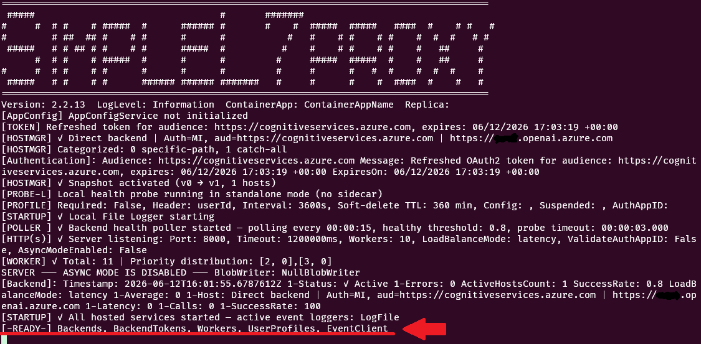
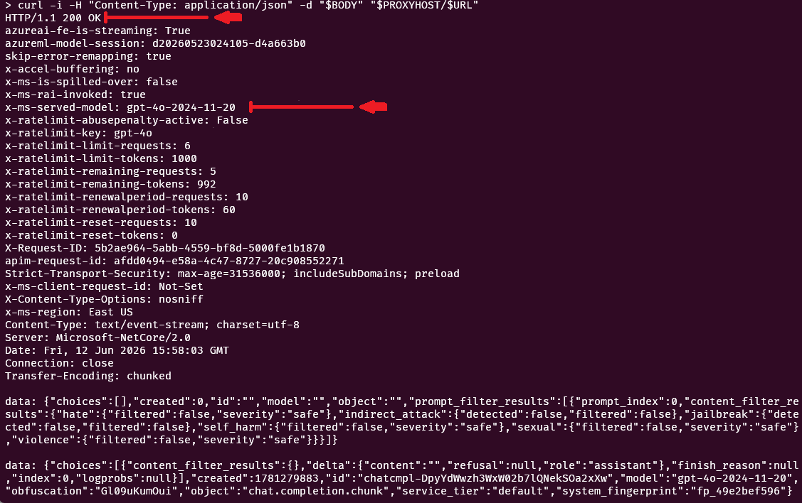

# Quick Start

This guide gets the proxy running and talking to a backend in minutes. You can run it as a container in Azure Container Apps or directly from source. Point it at a backend with a `Host` setting, then verify it with the health probe. Everything else (scaling, telemetry, async, APIM) builds on this same starting point.

If you already have .NET 10 installed, then follow the **run as code** path. If not, the **container** option is pretty quick as well. You can alternatively run locally as a **container** if you're good with docker.

## TL;DR

- Clone the repo
- Deploy to Azure Container Apps or run it locally

---

# Prerequisites
<details>
<summary><strong>Expand to see the details</strong></summary>
The proxy needs a backend to talk to. It supports the following:
- LLM endpoint(s)
- Azure API Management

With the backends in hand, you have two options for running it:

## Container

- [Azure CLI](https://docs.microsoft.com/en-us/cli/azure/install-azure-cli) — Interacts with Azure
- [Azure subscription with Container Apps enabled](https://learn.microsoft.com/en-us/azure/container-apps/overview) — Owner RBAC of a resource group
- [Azure Container Apps](https://learn.microsoft.com/en-us/azure/container-apps/overview) — Easiest way to run a container in Azure.
- [Azure Container Registry](https://learn.microsoft.com/en-us/azure/container-registry/container-registry-intro) — Bring your own if you have it.
- ( **Optional** ) [Docker](https://docs.docker.com/get-docker/) — If you want to build the container yourself.

## Run as code

- [.NET 10 SDK](https://dotnet.microsoft.com/download)

<details>
<summary><strong>Optional Scenarios</strong></summary>

| Item | Notes |
|------|-------|
| [Application Insights](https://learn.microsoft.com/en-us/azure/azure-monitor/app/app-insights-overview) | Tracks telemetry and activity |
| [Azure API Management](https://learn.microsoft.com/en-us/azure/api-management/api-management-key-concepts) | For Governance and Compliance scenarios |
| [Azure CosmosDB](https://learn.microsoft.com/en-us/azure/cosmos-db/introduction) | User Profiles |
| [Azure Event Hub](https://learn.microsoft.com/en-us/azure/event-hubs/event-hubs-about) | If you want to connect to Stream Analytics, DataDog, Splunk, ...  |
| [Azure Functions](https://learn.microsoft.com/en-us/azure/azure-functions/functions-overview) | Async mode, LLM Simulator, User Profiles |
| [Azure Service Bus](https://learn.microsoft.com/en-us/azure/service-bus-messaging/service-bus-messaging-overview) | Async mode |
| [Azure Storage Account](https://learn.microsoft.com/en-us/azure/storage/common/storage-account-overview) | Async mode |
</details>

</details>

---
# Clone The Repo

```bash
git clone https://github.com/microsoft/SimpleL7Proxy.git
```

## Deploy to Azure Container Apps

The deployment to Container Apps is driven by an interactive install script.
- [Deploy Script](../deployment/README.md) — You'll specify the details of your installation in a configuration file and then follow the steps.

---

## Run as Code

### Pick a backend host:

```bash
# LLM endpoint
export Host1="host=https://<endpoint>.openai.azure.com;mode=direct;path=/; processor=MultiLineAllUsage"

# LLM endpoint with API key
export Host1="host=https://<endpoint>.openai.azure.com;mode=direct;path=/; processor=MultiLineAllUsage; api-key=<your-api-key>"

# LLM endpoint with MI
export Host1="host=https://<endpoint>.openai.azure.com;mode=direct;path=/; processor=MultiLineAllUsage; usemi=true;audience=https://cognitiveservices.azure.com;"

# APIM 
export Host1=""
```

### Set the listening port

```bash
# Port the proxy listens on
export Port=8000
```

### Run the Proxy

```bash
cd SimpleL7Proxy/src/SimpleL7Proxy
dotnet run 
```

If you see this line on the console, it means it started up:


> [!TIP]
> 🎉 **You're up and running!** The proxy is live and ready to take traffic.

The proxy starts on port 8000. It generates logs in the current folder as `eventslog.json`.  


### Check the log file

```bash
tail -f eventslog.json
```

> [!Note] 
> If you are using Managed Identity for tokens, the initial startup can take a few seconds while the tokens are downloaded.
> 
> The console is going to be noisy, and you can [tune down](CONFIGURATION_SETTINGS.md#logging) the logging by setting `LogToConsole` to something other than `*`.

---

# Check the health probe

Replace the `http://localhost:8000` with your URL if running in container apps:

```bash
curl -i http://localhost:8000/health
```


# Query the proxy

Now that the proxy is setup we can query the LLM using curl.  You should also be able to use any SDK you're comfortable with. 

Set your hostname:
```bash
export PROXYHOST="http://localhost:8000"
```

Set the URL and Body for the test: ( this is using gpt-4o):
```bash
export URL="openai/v1/chat/completions"
export BODY='{"model":"gpt-4o","messages":[{"role":"user","content":"hello"}],"stream":true}'
```

Run the query:
```bash
curl -i -H "Content-Type: application/json" -d "$BODY" "$PROXYHOST/$URL"
```

You should see a status code of 200 with a response similar to:



# Configure Azure App Configuration

Environment variables are a tedious way to configure the proxy. Alternatively, you can use Azure App Configuration, where the proxy pulls changes every 30 seconds.

> [!NOTE]
> Follow the [deploy script](../deployment/README.md) to create the App Configuration ( Step 7 ).

```bash
export AZURE_APPCONFIG_ENDPOINT=https://your-appconfig.azconfig.io
export AZURE_APPCONFIG_LABEL=dev
```


