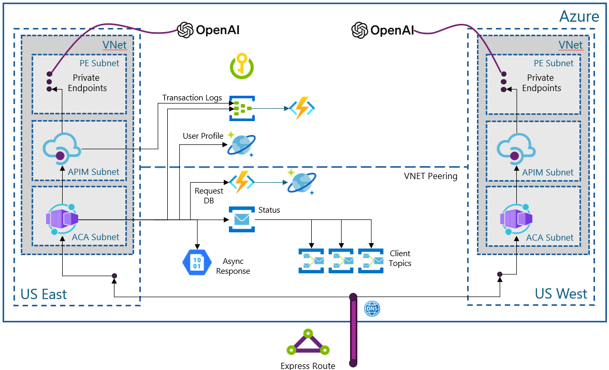

# SimpleL7Proxy

SimpleL7Proxy is a lightweight yet powerful proxy service designed to direct network traffic between clients and servers at the application layer (Layer 7). It manages HTTP(s) requests with intelligent routing capabilities, automatically selecting the fastest available backend host based on continuous latency monitoring. The service excels as a regional internal proxy, ensuring traffic is routed to the optimal region for minimal latency.

One of SimpleL7Proxy's key strengths is its priority-based request handling system, which implements a sophisticated queue that allows higher priority tasks to interrupt and preempt lower priority ones. This makes it particularly valuable for environments where business-critical requests need guaranteed faster processing times.

As an example, SimpleL7Proxy can serve as an intelligent router to Azure API Management service that has been configured with large language model endpoints.  In thes scenario, the proxy will add routing and scheduling capabilities while providing cross-regional load balancing and failover capability. The logs can be configured to send to event hub or application insights.

**Note:** If you are looking for the high performance APIM policy, see **[High perf APIM policy](../APIM-Policy/readme.md)**.

# Arch Diagram

## Getting Started Quickly

Want to try SimpleL7Proxy right now? You can have it running in under 5 minutes with dummy backends:

1. **Prerequisites**: .NET SDK 9.0 installed
2. **Clone and run**: Set up two simple mock backends and start the proxy
3. **Test**: Send requests and see intelligent load balancing in action

For detailed step-by-step instructions including setting up mock backends, see **[Development & Testing Guide](DEVELOPMENT.md#local-development-setup)**.

## Features

SimpleL7Proxy is built for reliability and performance with these key capabilities:

### Core Proxy Functionality
- **HTTP/HTTPS Traffic Handling**: Processes all standard web traffic with full SSL/TLS support and optional SSL termination
- **Intelligent Load Balancing**: Automatically routes requests to the most responsive backend by continuously measuring server response times.  Can also be configured for round-robin and random.
- **Automatic Failover**: Instantly switches to healthy servers when backends become unresponsive or start failing

### Smart Request Management
- **Priority-Based Queuing**: Route urgent requests ahead of regular traffic using configurable priority levels
- **Request Expiration**: Automatically drop old requests using TTL (time-to-live) to prevent processing stale data
- **Dedicated Worker Threads**: Assign specific workers to handle different priority levels for guaranteed performance
- **User Profile-Based Control**: Validate incoming requests and apply per-user configurations including access control, custom priority assignment, and anti-starvation protection to prevent resource monopolization

### Enterprise Operations
- **Comprehensive Monitoring**: Track every request with detailed metrics including processing time, queue duration, and worker assignments
- **Azure Integration**: Native support for Application Insights logging and EventHub streaming for real-time analytics
- **Flexible Configuration**: Manage all settings through environment variables for easy deployment across environments

### Advanced Capabilities
- **Async Processing**: Handle long-running requests with Service Bus notifications when complete (available in Streaming Branch)
- **Cross-Platform Support**: Runs on Windows, Linux, and macOS without modification
- **High Concurrency**: Efficiently processes concurrent requests and can be configured with auto-scale when deployed to Azure.

This design ensures your applications stay responsive even under heavy load while providing the observability needed for production environments.

## Usage Scenarios

- **Data Center Failover**: In an environment where multiple datacenters exist, SimpleL7Proxy can quickly fail over to a healthy host if one datacenter experiences service interruptions.
- **Internal Regional Proxy**: Companies with multiple internal services across various geographic regions can route traffic locally using this proxy, ensuring low latency for internal applications.
- **Priority Routing**: Financial or mission-critical requests can be given a higher priority to reduce processing delays in busy environments.
- **Testing & Development**: Quickly spin up local or containerized instances to experiment with backend changes or new features, adjusting environment variables for test configurations.

---

In the diagram below, a client connected to the proxy which has 3 backend hosts. The proxy identified the host with the lowest latency (Host 2) to make the request to.

## Configuration

SimpleL7Proxy supports various deployment scenarios through environment variable configuration:

- **[Configuration Examples](SCENARIOS.md)** - Detailed examples for high availability, security-focused, performance-optimized, and async processing configurations
- **[Development & Testing](DEVELOPMENT.md)** - Local development setup, testing scenarios, debugging tips, and container development
- **[Container Deployment](CONTAINER_DEPLOYMENT.md)** - Docker and Azure Container Apps deployment instructions

### Environment Variables

The proxy is configured through environment variables organized into functional categories:

- **[Core Configuration](ENVIRONMENT_VARIABLES.md#core-configuration-variables)** - Essential settings for basic proxy operation (port, workers, queue length)
- **[Request Processing](ENVIRONMENT_VARIABLES.md#request-processing-variables)** - Controls how incoming requests are handled, prioritized, and validated
- **[Logging & Monitoring](ENVIRONMENT_VARIABLES.md#logging--monitoring-variables)** - Options for logging to Application Insights, EventHub, or files
- **[Async Processing](ENVIRONMENT_VARIABLES.md#async-processing-variables)** - Configuration for asynchronous request handling with Azure storage
- **[Connection Management](ENVIRONMENT_VARIABLES.md#connection-management-variables)** - Controls for HTTP connections, keep-alive settings, and SSL
- **[Backend Configuration](ENVIRONMENT_VARIABLES.md#backend-configuration-variables)** - Settings for backend servers, health checks, and failover behavior
- **[User Profiles](USER_PROFILES.md)** - Configure per-user settings, request validation, and access control

For complete details, see the **[Environment Variables Reference](ENVIRONMENT_VARIABLES.md)**.

## Request Validation

For information about request validation and user profiles, see the **[Request Validation Guide](REQUEST_VALIDATION.md)**.

## Response Codes and Headers

For details about proxy response codes and headers, see the **[Response Codes and Headers Reference](RESPONSE_CODES.md)**.

