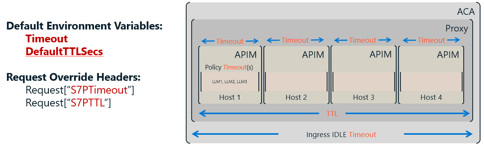
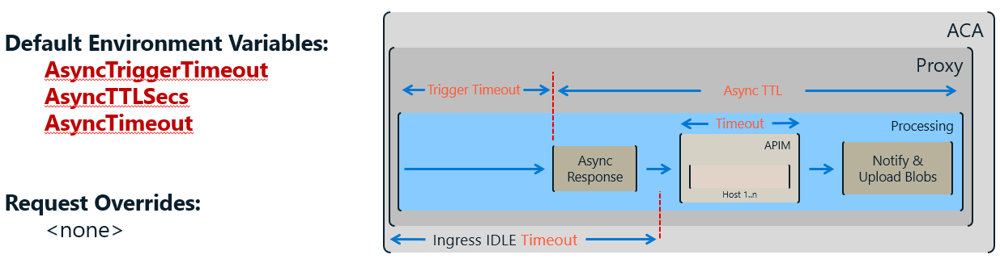

# Timeouts

SimpleL7Proxy enforces deadline-based limits at three layers — TTL, per-host Timeout, and AsyncTimeout — so that no request runs indefinitely.

> **TL;DR**
> - **Earliest expiration wins** — when TTL and Timeout both apply, whichever deadline arrives first is enforced.
> - **TTL** (seconds) is the hard wall-clock budget for the entire request life: queue wait + all retry attempts.
> - **Timeout** (milliseconds) is the per-host-attempt window; it resets on every retry.
> - **AsyncTimeout** (milliseconds) replaces Timeout once a request switches to async mode.

---

> **Units used in this doc:** TTL values are in **seconds**; all Timeout values are in **milliseconds**.

## Reference — All Settings

| Setting | Default | Unit | Override Header | Config Key | Reload |
|---|---|---|---|---|---|
| **DefaultTTLSecs** | 300 (5 min) | s | `S7PTTL` | `Priority:DefaultTTLSecs` | WARM |
| **Timeout** | 1,200,000 (20 min) | ms | `S7PTimeout` | `Server:Timeout` | COLD |
| **AsyncTriggerTimeout** | 10,000 (10 s) | ms | — | `Async:TriggerTimeout` | WARM |
| **AsyncTimeout** | 1,800,000 (30 min) | ms | — | `Async:Timeout` | WARM |
| **AsyncTTLSecs** | 86,400 (24 h) | s | — | `Async:TTLSecs` | WARM |

---

## Request Flow

The diagram below covers both synchronous and async paths. All clocks start at **enqueue time**.

```
Client
  │
  ▼  enqueue  ◄─── TTL clock starts (DefaultTTLSecs or S7PTTL)
  │
  ├── AsyncTriggerTimeout elapsed? ──Yes──► Return async response (blob URIs) to client
  │                                         Continue in background under AsyncTimeout
  │                                         Result retained for AsyncTTLSecs
  No (synchronous path)
  │
  ▼
  ┌──────────────┐  fail / timeout   ┌──────────────┐  fail / timeout   ┌──────────────┐
  │   Host 1     │ ─────────────────►│   Host 2     │ ─────────────────►│   Host n     │
  │ [Timeout ms] │                   │ [Timeout ms] │                   │ [Timeout ms] │
  └──────────────┘                   └──────────────┘                   └──────────────┘
       ▲                                                                       │
       └───────── TTL expired anywhere along this chain → 503, no retry ───────┘
  │
  ▼
Response to client
```

**On every host attempt, the effective deadline = min(remaining TTL, Timeout).**

---

## Synchronous Requests

**Rule: Each host attempt gets a fresh Timeout window, but the total request life is capped by TTL.**



```
DefaultTTLSecs: 60     → ExpiresAt = enqueue + 60 s
Timeout:        45000  → per-host window = 45 s
First attempt:  min(60 s, 45 s) = 45 s effective
```

> [!NOTE]
> **Default:** `DefaultTTLSecs = 300 s`, `Timeout = 1,200,000 ms`. Both are used when no override headers are present.

> [!TIP]
> **Troubleshooting:** If requests expire faster than expected, verify that the client is not sending a short `S7PTTL` header — it silently overrides `DefaultTTLSecs`.

---

## Async Requests

**Rule: After `AsyncTriggerTimeout` elapses the client is unblocked immediately; the proxy finishes processing under `AsyncTimeout`.**



```
AsyncTriggerTimeout: 10000    → client receives blob URIs after 10 s
AsyncTimeout:        1800000  → backend has up to 30 min to complete
AsyncTTLSecs:        86400    → result blob retained for 24 h
```

> [!NOTE]
> **No header overrides exist for async settings.** Configure them via environment variables only.

> [!TIP]
> **Troubleshooting:** If async results disappear sooner than expected, `AsyncTTLSecs` may be set too low.

---

## Per-Request Overrides

**Rule: Send `S7PTTL` (seconds) or `S7PTimeout` (milliseconds) headers to replace the global defaults for one request.**

```http
S7PTimeout: 60000   # per-host timeout → 60 s for this request
S7PTTL: 120         # TTL → 120 s for this request
```

> [!NOTE]
> **Defaults:** If a header is absent or unparseable, the corresponding global config value is used with no error.

> [!WARNING]
> **Error:** An unparseable `S7PTTL` value returns **400 Bad Request** with error code `InvalidTTL`.

Supported `S7PTTL` formats:

| Format | Example | Meaning |
|---|---|---|
| Relative integer | `300` | Expires 300 s from enqueue |
| Relative decimal | `2.5` | Expires 2,500 ms from enqueue |
| Absolute Unix timestamp | `+1735689600` | Expires at the given epoch second |
| ISO 8601 datetime | `2024-12-31T23:59:59Z` | Expires at the given UTC time |

---

## Worked Example

> **Scenario:** `DefaultTTLSecs = 60`, `Timeout = 45000`. No override headers. Request queues for 5 s, then needs two host attempts.

| Event | Wall clock | TTL remaining | Host window | Effective deadline | Outcome |
|---|---|---|---|---|---|
| Enqueue | 0 s | 60 s | — | — | TTL clock starts |
| Dequeue | 5 s | 55 s | 45 s | **min(55 s, 45 s) = 45 s** | Attempt Host 1 |
| Host 1 timeout | 50 s | 10 s | 45 s elapsed | — | Retry |
| Host 2 attempt | 50 s | 10 s | 45 s window | **min(10 s, 45 s) = 10 s** | Attempt Host 2 |
| TTL expires | 60 s | 0 s | — | — | 503 — no more retries |

**The TTL (not the per-host Timeout) determined the final deadline on the second attempt.**
