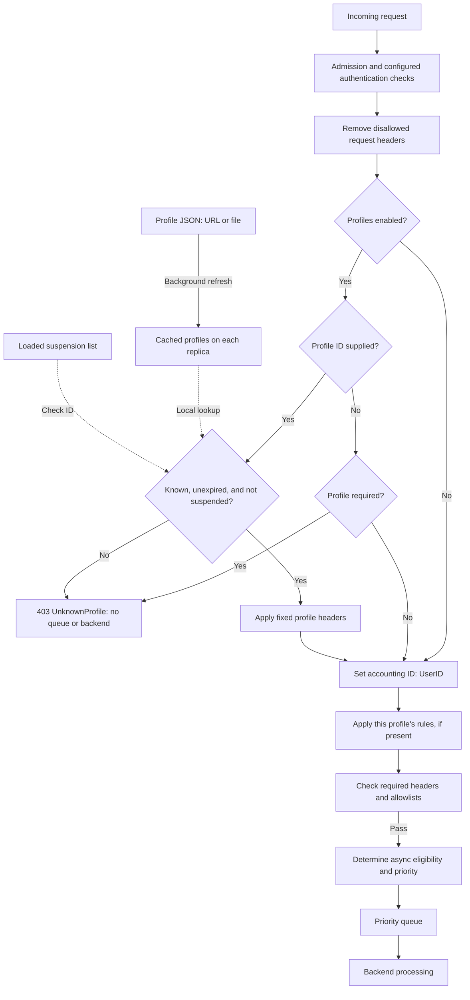

# User Profiles

Use user profiles to align AI capacity with governance priorities and apply policy consistently across teams, applications, and workloads.

## TL;DR

- A request carries a profile ID; the proxy uses that ID to select a cached profile.
- Profile fields act as the default request state for that caller; rule branches refine those defaults per request.
- Profiles refresh in the background without a restart. When profiles are enabled, requests with missing, unknown, or suspended profile IDs receive `403`.

A profile is the single place to define a caller's priority, validation values, reporting metadata, and async permissions. The proxy applies that profile whenever the request matches it. A profile can represent a person, an application, or a shared workload.

## At a glance

| Setting | Default | Unit or format | Reload | Purpose |
| --- | --- | --- | --- | --- |
| `UseProfiles` | `false` | Boolean | Warm | Enables profile loading and profile-driven request enrichment. |
| `UserConfigUrl` | `""` | URL or `file:` location | Warm | Source for the profile JSON array. |
| `UserConfigRequired` | `false` | Boolean | Warm | Rejects a request when a profile header is missing and required checks are enabled. |
| `UserIDFieldName` | `userId` | JSON property name | Warm | Names the field that identifies a profile record. |
| `UserProfileHeader` | `X-UserProfile` | Header name | Warm | Incoming header that selects the profile. |
| `UniqueUserHeaders` | `["X-UserID"]` | Ordered header list | Warm | Builds the queue-accounting identity. |
| `UserConfigRefreshIntervalSecs` | `3600` | Seconds | Cold | Normal refresh interval for profile source polling. |
| `UserSoftDeleteTTLMinutes` | `360` | Minutes | Cold | Grace period for removed profiles and failure threshold. |
| `SuspendedUserConfigUrl` | `""` | URL or `file:` location | Warm | Separate JSON array of suspended IDs. |

Units used in this doc: seconds for refresh intervals, minutes for retention, and unitless priority levels.

> [!TIP]
> If profiles do not load, verify that the proxy can reach the configured source. For a local file, use a `.json` path and ensure the root JSON value is an array. Review the `[PROFILE]` logs for the load result.

## 1. Choose a profile source

**Store profiles as a JSON array at a URL or a `file:` location that the proxy can read.**

The proxy loads the source into memory and refreshes it in the background. Incoming requests use the cached profiles, so the proxy does not fetch the source for every request.

For a local source, make the JSON file available to the proxy, then configure:

```dotenv
UseProfiles=true
UserConfigRequired=true
UserConfigUrl=file:/etc/simplel7proxy/users.json
```

The settings above follow the [configuration catalog](../../taxonomy/concepts.json). Warm settings support runtime reload; cold settings require a restart. Profile records refresh independently of configuration changes.

## 2. Identify the caller

**The profile ID selects the profile; the accounting ID groups requests for queue fairness and reporting.**

Three settings connect a request to its profile and accounting identity:

- `UserIDFieldName` names the ID field in the profile JSON.
- `UserProfileHeader` names the request header used to select that ID.
- `UniqueUserHeaders` names the headers used to calculate the accounting ID stored as `UserID`.

The proxy calculates the accounting ID after applying the profile's fixed header values. For example:

```text
Profile: { "userId": "alice", "X-UserID": "alice" }
Request: X-UserProfile: alice
Result: UserID=alice
```

Selecting a profile does not automatically create a separate accounting identity. Set the accounting headers to distinguish individual callers or group a shared workload. If you use multiple headers, the values are joined in order without separators, so choose combinations that remain distinct when joined.

> [!TIP]
> If a request returns `403`, compare the profile ID with the exact ID in the source and confirm the loaded suspension list. Changing `UserIDFieldName` changes the JSON field name, not the incoming header name.

## 3. Set request behavior

**Profile fields become request headers that the proxy and downstream services can use to apply policy.**

This profile assigns Alice an accounting ID, a priority key, and a department:

```json
[
  {
    "userId": "alice",
    "X-UserID": "alice",
    "S7PPriorityKey": "standard",
    "Department": "Finance"
  }
]
```

### What profile fields do

- **Priority.** With the default priority header, `S7PPriorityKey` selects an entry in the configured priority mapping. Its value is a key, not a numeric queue level.
- **Validation.** Profile fields can provide allowed values for configured header checks.
- **Models and routing.** Downstream policies can use profile headers to make model or routing decisions. A header alone does not rewrite the model in a JSON body or define a backend path.
- **Reporting.** Include fields such as `Department` in telemetry to associate requests with a team or workload.
- **Async processing.** `async-config` provides per-user permission and delivery destinations. The proxy-level feature and per-request opt-in must also be enabled. See [Async Processing](async-processing.md).

Some fields have a separate purpose. The profile ID selects the record, and `rules` defines conditional behavior. Neither becomes a header from the profile by itself. The proxy also excludes names that start with `internal-` and uses internal soft-delete markers.

> [!WARNING]
> Treat profile fields as request data. They replace same-named client headers and may be forwarded or logged. Keep unrelated secrets out of profiles, and review forwarding and logging configuration before adding sensitive values.

## 4. Add conditional rules

**Rules let you apply different policies to different work within the same profile.**

Use fixed profile fields for settings shared by a caller's requests, such as department and accounting identity. Use rules when priority, validation values, or reporting labels vary by request. For example, one profile can give `POST` requests a different priority key while leaving other methods at the fixed setting.

```text
Fixed profile setting: S7PPriorityKey=standard
POST request: use S7PPriorityKey=interactive
Other methods: keep S7PPriorityKey=standard
```

Rules produce header values, not independent routing or access decisions. A priority key still needs a priority mapping, and a custom policy header needs a configured consumer.

### Define a decision

**Each rule tests an input and applies the header values from the selected branch.**

Add this array as the profile's `rules` property. The `interactive-post` rule is also used in the worked example below.

```json
[
  {
    "name": "interactive-post",
    "if": {
      "name": "post",
      "field": "Method",
      "match": "equals",
      "value": "POST"
    },
    "then": {
      "name": "priority",
      "set": { "S7PPriorityKey": "interactive" }
    }
  }
]
```

- `name` identifies a rule, condition, or branch in diagnostics. Each node needs a nonempty name.
- `if` selects a `field`, a comparison operator in `match`, and an expected `value`.
- `then` defines the branch to evaluate when the condition matches.
- `set` assigns one or more header values. Write values as JSON strings, including numeric values such as `"10"`.
- `elseif` is an optional array of named alternatives, each with its own `if` and `then`.
- `else` is an optional fallback when neither the main condition nor an `elseif` condition matches.

To explicitly restore the standard priority for unmatched requests, add this object as the rule's `else` property:

```json
{
  "name": "standard-priority",
  "set": { "S7PPriorityKey": "standard" }
}
```

> [!TIP]
> If a rule definition is rejected, check its structure as well as its JSON syntax. Each node must contain either `set` or `if`, not both. A conditional node needs a `then` branch; a `set` node cannot also contain branches.

### Choose what to match

**Conditions read the request after fixed profile headers have been applied, but before any rule output changes those headers.**

Available inputs include:

- **Headers**, such as `Department` or a workload label supplied by the profile.
- **Request details:** `Path` and `Method`.
- **Identity:** `UserID` for queue accounting and `ProfileUserID` for the selected profile.
- **Hash values:** `S7PHash`, supplied by the proxy, or `Hash:UserID`, calculated from the accounting ID.

For text, use `equals`, `notEquals`, `contains`, `notContains`, `startsWith`, `endsWith`, or `regex`. Text comparisons ignore case unless you set `ignoreCase` to `false`. Field lookup is case-insensitive.

For numbers, use `greaterThan`, `greaterThanOrEqual`, `lessThan`, `lessThanOrEqual`, or `between`. A `between` condition uses `value` and `value2` as the lower and upper bounds. Both bounds are included unless you select a different `mode`.

For example, this condition selects hash values from `10` up to, but not including, `20`:

```json
{
  "name": "trial-band",
  "field": "S7PHash",
  "match": "between",
  "value": "10",
  "value2": "20",
  "mode": "inClosedOpenRange"
}
```

The range modes are `inClosedRange` (both bounds included), `inOpenRange` (neither included), `inClosedOpenRange` (lower included), and `inOpenClosedRange` (upper included). For adjacent bands, a lower-inclusive, upper-exclusive range assigns a boundary value to just one band.

> [!WARNING]
> A missing field matches `notEquals` and `notContains`. Other operators do not match a missing field, and numeric comparisons do not match invalid numeric input. Use required-header validation to enforce presence; a negative comparison is not a presence check.

## 5. Control order and precedence

**Every top-level rule runs in array order; if several outputs set the same header, the last value wins.**

The proxy first applies fixed profile headers and calculates the accounting ID. It then captures the values used by rule conditions and evaluates the rules. All conditions use that same captured view: a later rule cannot test a header value produced by an earlier rule.

```text
Client sends S7PPriorityKey=client-requested; the profile replaces it with standard.
Rule 1 sets interactive; rule 2 still sees standard.
If rule 2 also sets S7PPriorityKey, its output becomes the final header value.
```

Use `elseif` for first-match alternatives within a single rule. To require two conditions, place a second conditional node inside the first condition's `then` branch. For example, check `Path` first, then check `Method` only when the path matches. Two separate top-level rules are independent decisions, not a combined condition.

A selected branch can contain another condition or a final `set`. If a nested condition produces no output, evaluation does not return to the parent's `elseif` or `else` branches. Put the fallback where that decision is made.

> [!NOTE]
> If changing `X-UserID` in a rule does not change queue accounting, that is expected. The accounting ID is calculated before rules run. Keep accounting values in fixed profile fields; rule outputs update headers, not the already assigned identity.

## 6. Verify the outcome

**Check both matching and nonmatching requests before relying on a rule for policy.**

For `interactive-post`, with Alice's fixed priority set to `standard`, send a `POST` request and confirm the resulting key is `interactive`. Send a `GET` request and confirm the key remains `standard`. If several rules write the same header, check the final value after all rules run.

Enable request diagnostics to follow the named decision:

```http
POST /v1/chat/completions HTTP/1.1
X-UserProfile: alice
S7PDEBUG: true
```

Look for `Add Rule Header` in proxy logs and `interactive-post/post/priority` in the request's `S7P-MatchedRules` telemetry. Fallback branches report their own names. Rule outputs then pass through required-header checks, allowlist checks, async eligibility, and priority selection; a matching rule does not bypass those checks.

> [!TIP]
> If fixed settings load but rules have no effect, check the profile-load warnings first. An invalid rule definition can cause the profile to load without its rules, leaving the fixed fields active. Then check the condition inputs and whether a later rule replaced the expected output.

## 7. Follow a request

**The proxy applies the profile and its rules before the request enters the queue.**

This request selects Alice's profile and supplies its own priority key:

```http
POST /v1/chat/completions HTTP/1.1
X-UserProfile: alice
S7PPriorityKey: client-requested
```



For this example, add the rule from the previous section to Alice's profile. Map `standard` to priority `2` and `interactive` to priority `1`. These are example mappings, not defaults.

Profiles are enabled and required. Assume other validation passes, no fairness adjustment applies, and async is not requested.

| Step | What happens | Result |
| --- | --- | --- |
| 1 | A background refresh reads the profile record with `userId=alice`. | The replica caches Alice's fields and parsed rules. |
| 2 | The request carries `X-UserProfile: alice`, and Alice is not suspended. | The proxy selects the cached profile without fetching the source. |
| 3 | The client supplied `S7PPriorityKey: client-requested`. | The profile replaces it with `standard` and adds `X-UserID: alice` and `Department: Finance`. |
| 4 | The proxy reads the configured accounting header, `X-UserID`. | The request's `UserID` becomes `alice`. |
| 5 | `Method=POST` matches `interactive-post`. | The rule replaces `standard` with `interactive`. |
| 6 | Required-header and allowlist checks run. | The request continues only if all checks pass. |
| 7 | Priority selection uses the final header value. | The request enters the queue at the `interactive` lane. |

## Summary

User profiles are a policy layer that sits in front of queue admission. They provide a stable caller identity, a local cached profile record, a set of default headers, and optional conditional rule logic that changes a request only after the fixed profile values are applied. That separation keeps queue accounting stable while allowing per-request policy decisions to vary without rewriting the caller's identity.

- [User Profile Reference](../reference/user-profiles.md): profile fields and async settings
- [Request Lifecycle](request-lifecycle.md): where profile enrichment occurs in the request flow
- [Async Processing](async-processing.md): per-user async enablement and routing
