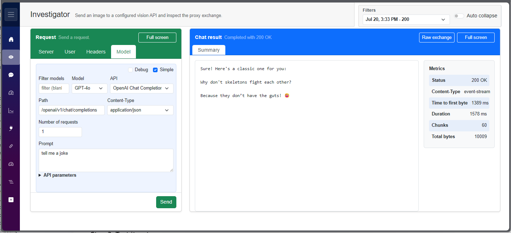
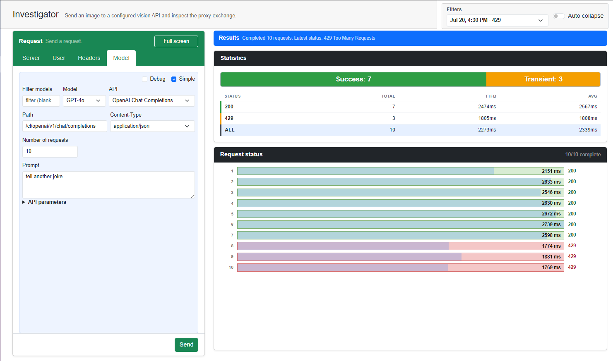
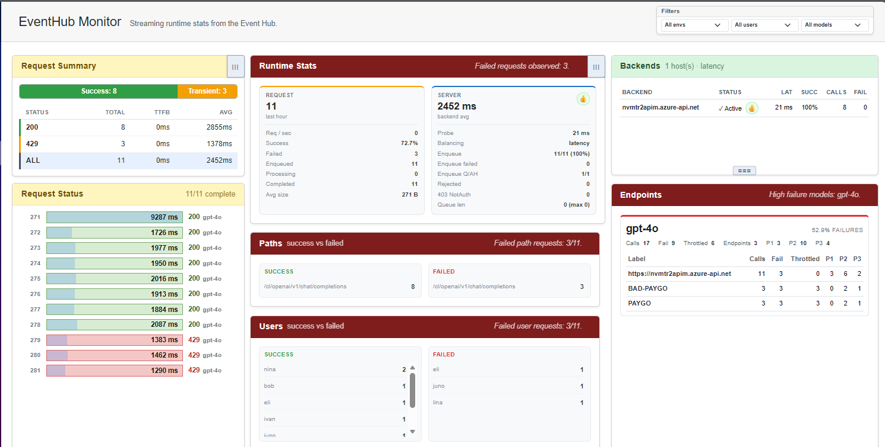
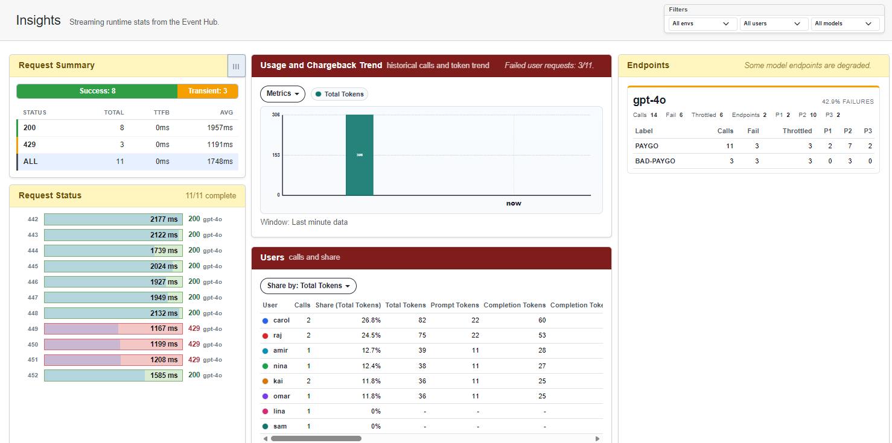
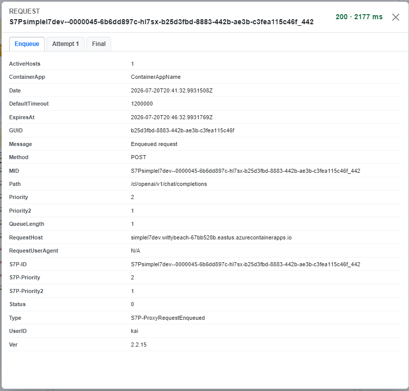
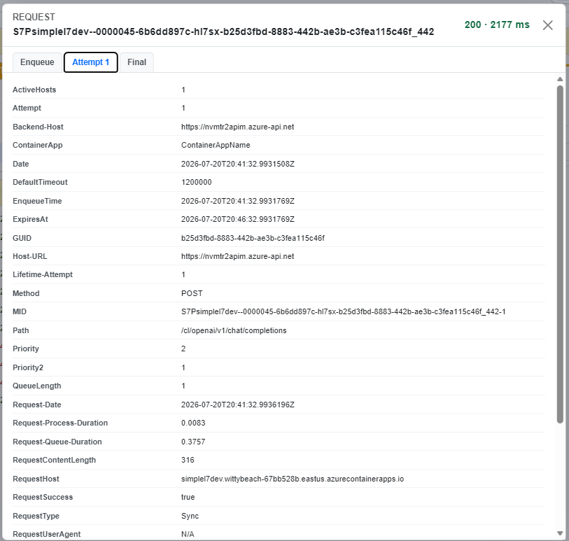
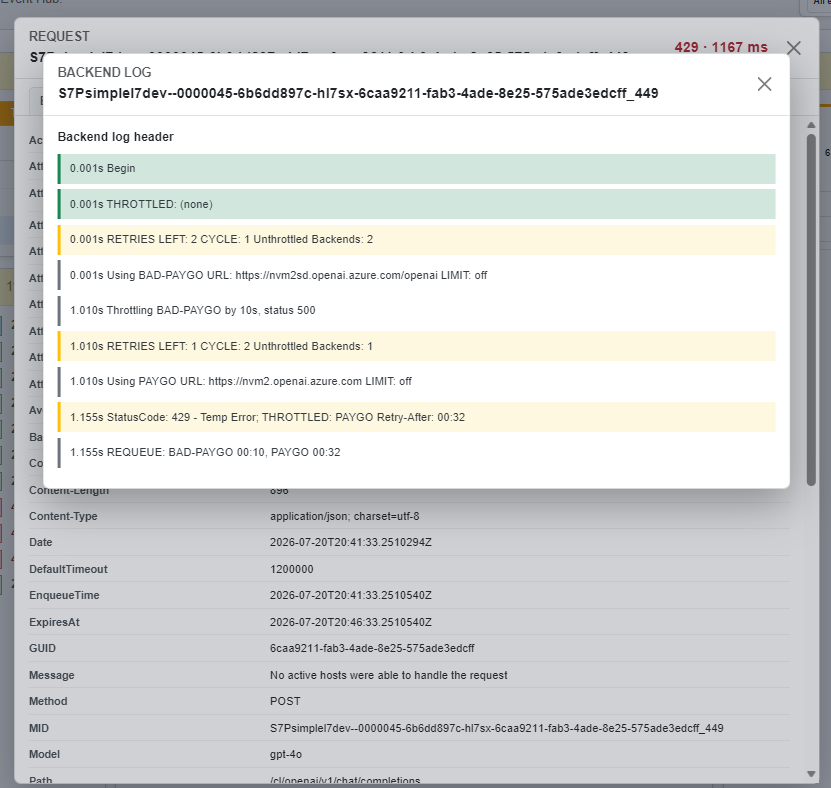

# Run SimpleL7Proxy

Run the proxy locally or in Azure, connect one backend, and verify that traffic reaches it.

## TL;DR

1. Clone the repository and choose a local or Azure setup.
2. Connect an LLM endpoint, APIM instance, or the included LLM simulator.
3. Check readiness, send a request, and confirm the proxy response headers.

**Expected outcome:** `/readiness` returns `200 OK`, and a proxied response identifies the selected backend in the `BackendHost` header.

## 1. Clone the Repository

**Run all remaining commands from the repository root unless a step says otherwise.**

```bash
git clone https://github.com/microsoft/SimpleL7Proxy.git
cd SimpleL7Proxy
```

## 2. Choose Where to Run

**Use the local path for development and the Container Apps path for an Azure deployment.**

<table>
<tr>
<td width="50%" valign="top">

### [Run Locally](local.md)

Use .NET 10 or Docker.

</td>
<td width="50%" valign="top">

### [Run in Azure Container Apps](container-apps.md)

Use the repository deployment workflow.


</td>
</tr>
</table>

> [!NOTE]
> When running a container with `Port=8000`, publish the same container port: `-p 8000:8000`. See [Deploy to Azure Container Apps](../how-to/deploy-container-apps.md) for image and ingress configuration.

## 3. Connect a Backend

**Configure one backend before checking readiness.**

<table>
<tr>
<td width="33%" valign="top">

### [LLM Endpoint](connect-endpoint.md)

Use an Azure OpenAI or Azure AI Foundry endpoint.

</td>
<td width="33%" valign="top">

### [API Management](connect-apim.md)

Use an APIM gateway with the priority-and-retry policy.

</td>
<td width="33%" valign="top">

### [LLM Simulator](connect-llm-simulator.md)

Run the included simulator without a real model endpoint.

</td>
</tr>
</table>

> [!WARNING]
> `/liveness` can succeed before a backend is eligible. Do not send test traffic until `/readiness` returns `200 OK`.

## 4. Verify the Proxy

**Check health first, then send a request through the proxy.**

```bash
curl -i http://localhost:8000/liveness
curl -i http://localhost:8000/readiness
curl -i http://localhost:8000/your/path
```

A successful proxied response normally includes these proxy-generated headers:

| Header | Meaning |
|--------|---------|
| `BackendHost` | Backend that handled the request |
| `Request-Queue-Duration` | Time spent in the priority queue |
| `Request-Process-Duration` | Time spent processing after dequeue |
| `Total-Latency` | Total time from enqueue to response |
| `Attempts` | Backend attempts in the current dispatch cycle |
| `Lifetime-Attempts` | Backend attempts across requeue cycles |

Exhausted-host error responses use a different set of diagnostic headers, including `x-Request-Queue-Duration` and `x-Total-Latency`. See [Headers and Status Codes](../reference/headers-and-status-codes.md) for the response-specific contract.

### Use Chat Tester

**Use Chat Tester for an interactive request and telemetry view.**

```bash
cd src/ChatTester
dotnet run
```

Open the URL printed by Chat Tester, then configure the server as `http://localhost:8000` or use the HTTPS URL assigned to your Container App.



If Event Hub is configured, connect it in Chat Tester to inspect proxy activity. Select a thumbnail to open the full-size image.

<table>
<tr>
<td width="33%" align="center"><a href="chat-requests.png"></a></td>
<td width="33%" align="center"><a href="chat-monitor.png"></a></td>
<td width="33%" align="center"><a href="chat-insights.png"></a></td>
</tr>
<tr>
<td width="33%" align="center"><a href="chat-enqueue.png"></a></td>
<td width="33%" align="center"><a href="chat-attempt.png"></a></td>
<td width="33%" align="center"><a href="chat-final.png"></a></td>
</tr>
</table>

## Verification Checklist

- [ ] `/liveness` returns `200 OK`.
- [ ] `/readiness` returns `200 OK`.
- [ ] A test request returns the expected backend response.
- [ ] `BackendHost` identifies the selected backend on a successful proxied response.
- [ ] Chat Tester or `eventslog.json` shows the request when telemetry is configured.

## Next Steps

| Task | Document |
|------|----------|
| Run from source or Docker | [Run Locally](local.md) |
| Configure Azure App Configuration | [Configure Azure App Configuration](../how-to/configure-app-configuration.md) |
| Deploy to Azure Container Apps | [Deploy to Azure Container Apps](../how-to/deploy-container-apps.md) |
| Test without a model endpoint | [LLM Simulator](../how-to/llm-simulator.md) |
| Review runtime settings | [Environment Variables](../reference/environment-variables.md) |
| Contribute to the project | [Development and Contributing](../contributing/README.md) |
| Diagnose startup or request failures | [Troubleshooting](../troubleshooting/README.md) |

For exact health behavior and a focused verification sequence, see [Verify SimpleL7Proxy](verify.md).