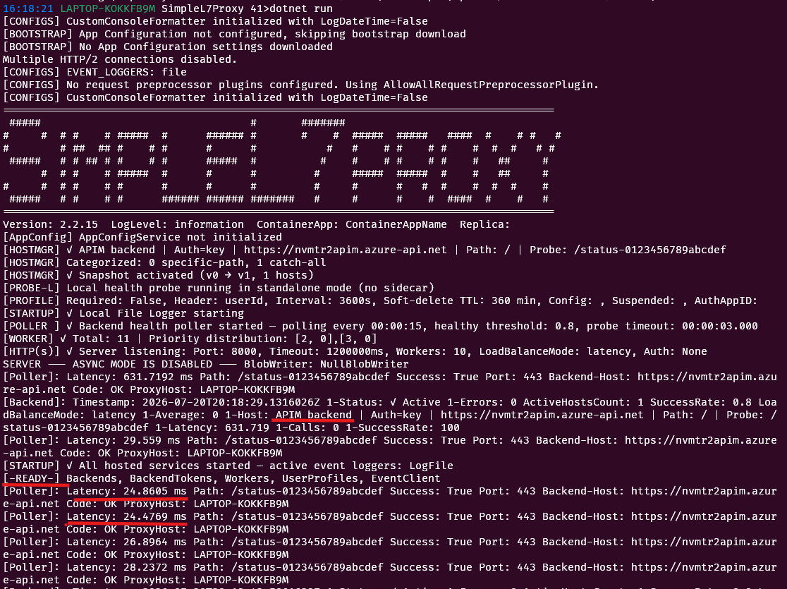

# Connect an Azure API Management Gateway

Connect SimpleL7Proxy to an Azure API Management (APIM) gateway that routes requests to your model backends.

## TL;DR

- Apply the bundled APIM policy and its endpoint-selection fragment.
- Configure one `Host_apim` connection string with the APIM URL, probe path, and authentication mode.
- Verify successful probes, authentication, and request forwarding before sending production traffic.

## Apply the Bundled Policy

**Create the v3.0 endpoint-selection fragment before applying the API policy because the policy includes that fragment by ID.**

1. Edit [`APIM-Policy/v3.0/endpoint_selection_frag_30.xml`](../../APIM-Policy/v3.0/endpoint_selection_frag_30.xml) with your model backends, priority rules, and authentication resource.
2. In the APIM portal, open **APIs > Policy fragments**, create a fragment with the ID `endpoint_selection_frag_30`, and paste the edited fragment XML.
3. Open the target API, select **All operations**, open the policy editor, and apply [`APIM-Policy/v3.0/Priority-with-retry.xml`](../../APIM-Policy/v3.0/Priority-with-retry.xml).
4. Save the fragment and API policy, then confirm that APIM accepts both without a policy validation error.

The API policy contains `<include-fragment fragment-id="endpoint_selection_frag_30" />`; a different fragment ID will prevent the policy from running. If the API already has required authentication, CORS, or other policies, merge those elements into the bundled policy instead of overwriting them.

See the [APIM Policy Guide](../../APIM-Policy/readme.md) for backend catalog fields, priority rules, and supported policy versions.

## Configure the APIM Host

**Use an APIM operation that returns a successful response to `GET` as the probe path.**

Replace `<probe-path>` with that operation's path, including its leading slash. SimpleL7Proxy periodically calls this path and removes the APIM host from the active pool when probe success falls below the configured threshold.

### No Gateway Authentication

```bash
export Host_apim="host=https://<apim-name>.azure-api.net;path=/;mode=apim;probe=/<probe-path>"
```

### APIM Subscription Key

**Configure the proxy to send the APIM subscription key in `Ocp-Apim-Subscription-Key`.**

```bash
export APIM_SUBSCRIPTION_KEY="<subscription-key>"
export Host_apim="host=https://<apim-name>.azure-api.net;path=/;mode=apim;probe=/<probe-path>;api-key-header=Ocp-Apim-Subscription-Key;api-key=${APIM_SUBSCRIPTION_KEY}"
```

The configured header is sent to both the probe operation and forwarded requests.

### Managed Identity

**Use managed identity when APIM has an inbound JWT validation policy that accepts the proxy identity's token.**

```bash
export Host_apim="host=https://<apim-name>.azure-api.net;path=/;mode=apim;probe=/<probe-path>;usemi=true;audience=<application-id-uri>"
```

Set `audience` to the application ID URI expected by the APIM JWT validation policy. The policy must also accept the token issuer and any required claims or roles.

## Verify the Connection

**A complete verification proves that the probe is accepted, authentication succeeds, and APIM forwards a model request.**

Start the proxy after exporting one host configuration:

```bash
dotnet run --project src/SimpleL7Proxy/SimpleL7Proxy.csproj
```

Check readiness, then send a model request through the proxy:

```bash
curl -i http://localhost:8000/readiness
curl -i "http://localhost:8000/openai/deployments/<deployment>/chat/completions?api-version=<api-version>" \
	-H "Content-Type: application/json" \
	-H "x-LLMModel: <model-name>" \
	-H "S7PDEBUG: true" \
	--data '{"messages":[{"role":"user","content":"Reply with OK"}]}'
```

### Expected Result

- **Probe:** Proxy logs contain `[Poller]` entries for `<probe-path>` with `Success: True`, followed by `_READY_`; `/readiness` returns `200 OK`.
- **Authentication:** The probe and model request do not return `401 Unauthorized` or `403 Forbidden`. With managed identity, startup logs show token acquisition for the configured audience.
- **Forwarding:** The model request returns the backend response, `BackendHost` identifies the APIM hostname, and the APIM `backendLog` response header ends with `CALL SUCCESSFUL`.



> [!WARNING]
> Repeated probe failures usually indicate an incorrect probe path, subscription key, token audience, or APIM authorization policy. The APIM host remains unavailable until its probes succeed.

[Back to backend selection](README.md#3-connect-a-backend)
