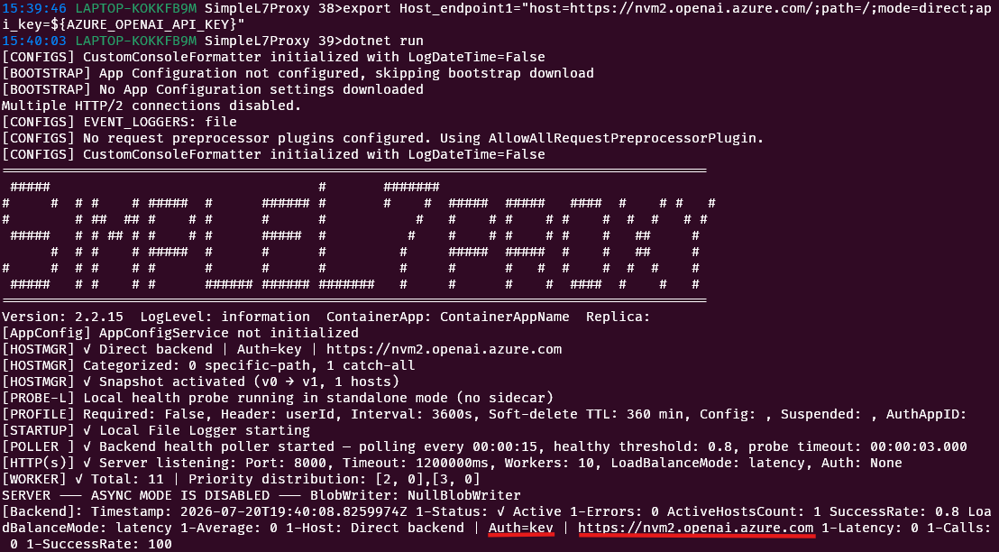
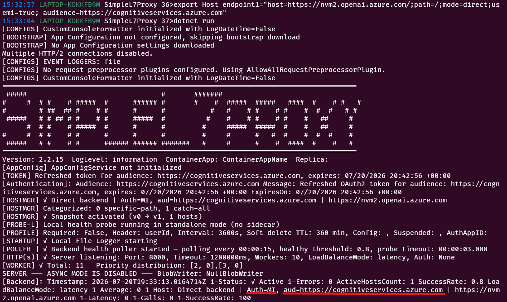

# Connect an Azure OpenAI or Azure AI Foundry Endpoint

Connect SimpleL7Proxy directly to a model endpoint without an API Management gateway.

## TL;DR

- Set `Host1` with `mode=direct` and `processor=OpenAI`.
- Authenticate with an API key or the proxy's managed identity.
- Verify `/readiness`, then send a model request and check `BackendHost`.

## Use an API Key

**Store the endpoint API key in `Host1`; the proxy sends it in the backend `api-key` header.**

```bash
export AZURE_OPENAI_API_KEY="<api-key>"
export Host1="host=https://<resource-name>.openai.azure.com;mode=direct;processor=OpenAI;api-key=${AZURE_OPENAI_API_KEY}"
dotnet run --project src/SimpleL7Proxy/SimpleL7Proxy.csproj
```



> [!NOTE]
> Use the API key from the Azure OpenAI or Azure AI Foundry resource. Do not use an Azure subscription key or an APIM subscription key for a direct endpoint.

## Use Managed Identity

**Assign the proxy's managed identity the `Cognitive Services OpenAI User` role at the Azure OpenAI or Azure AI Foundry resource scope.**

The role assignment belongs on the model resource that receives the request, not on the user account, virtual machine, or Container App resource itself. When the proxy runs in Azure Container Apps, select the system-assigned or user-assigned identity attached to that Container App as the role member.

```bash
export Host1="host=https://<resource-name>.openai.azure.com;mode=direct;processor=OpenAI;usemi=true;audience=https://cognitiveservices.azure.com"
dotnet run --project src/SimpleL7Proxy/SimpleL7Proxy.csproj
```



> [!NOTE]
> `https://cognitiveservices.azure.com` is the token audience for Azure OpenAI. Use the audience required by the target service when connecting a different provider.

See [Azure AI Foundry and OpenAI Integration](../reference/ai-foundry-integration.md) for routing, authentication, and token-usage configuration.

## Verify the Connection

**Readiness must succeed before a model request can be forwarded.**

```bash
curl -i http://localhost:8000/readiness
curl -i "http://localhost:8000/openai/deployments/<deployment>/chat/completions?api-version=<api-version>" \
  -H "Content-Type: application/json" \
  --data '{"messages":[{"role":"user","content":"Reply with OK"}]}'
```

### Expected Result

- `/readiness` returns `200 OK` after the proxy finishes startup.
- The model request returns the backend response rather than an authentication error.
- A successful proxied response includes `BackendHost` with the configured endpoint hostname.

> [!WARNING]
> A `401` or `403` from the model request indicates an invalid API key, an incorrect token audience, or a missing role assignment. Readiness can still succeed in direct mode because direct hosts are not actively probed.

[Back to backend selection](README.md#3-connect-a-backend)
