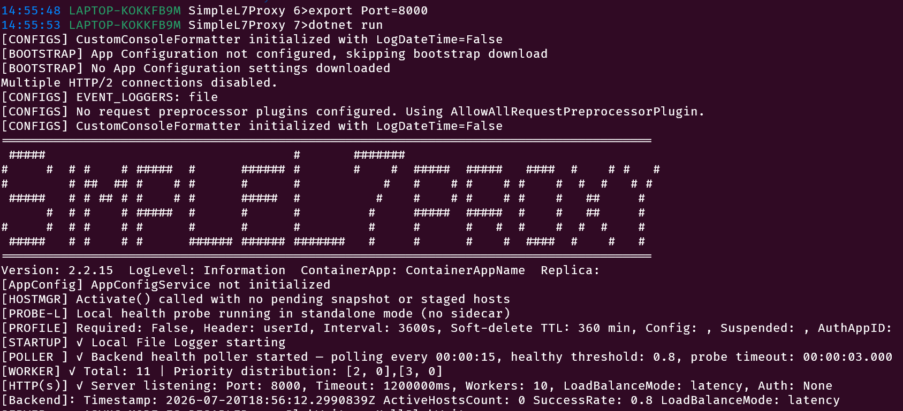

# Run the Proxy Locally

The proxy has over 80 settings, thankfully they all have sensible defaults. The two most important settings are the port that the proxy listens on and the backend list.  We'll cover the backends later in the guides, but for the port the proxy listens on `8000`. To use a different port, set the `Port` environment variable.

When running in Docker:

- The container's exposed port must match the value of `Port`.
- The host port can be any available port and does not need to match `Port`.

This guide starts the proxy and verifies that it is accepting HTTP requests.


## Prerequisites

**Run commands from the repository root and choose one local runtime.**

- [.NET 10 SDK](https://dotnet.microsoft.com/download/dotnet/10.0) for running from source.
- [Docker](https://docs.docker.com/get-docker/) for running the container image.

## Run from Source

**Run the .NET project from the repository root.**

```bash
dotnet run --project src/SimpleL7Proxy/SimpleL7Proxy.csproj
```

## Run in Docker

**Build the image with `src` as the Docker context, then publish the default port.**

```bash
docker build --tag simplel7proxy:latest \
	--file src/SimpleL7Proxy/Dockerfile src

docker run --publish 8000:8000 simplel7proxy:latest
```

To use a different proxy port, pass the same value to the container:

```bash
export Port=8080
docker run --env Port="${Port}" --publish "${Port}:${Port}" simplel7proxy:latest
```

## Verify the Listener

**Call the health endpoints from a second terminal.**

```bash
curl -i http://localhost:8000/liveness
curl -i http://localhost:8000/readiness
```

- `/liveness` returns `200 OK` when the proxy process is running.
- `/readiness` returns `503 Service Unavailable` until an eligible backend is configured.



Press `Ctrl+C` in the first terminal to stop the proxy.


[← Back to Choose Your Setup](README.md#2-choose-where-to-run)
