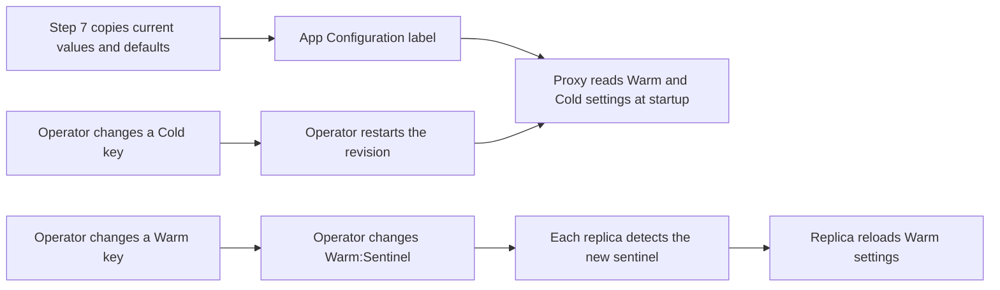

# Using Azure App Configuration with SimpleL7Proxy

SimpleL7Proxy can read settings from **Container App environment variables** or **Azure App Configuration**. Both sources configure the same proxy behavior. The difference is how changes take effect: **environment variables** are read when a replica starts, while settings that support runtime updates can be reloaded from App Configuration **without restarting** the replica.

App Configuration is a dedicated service for managing configurations and keeps a labeled copy of the settings in a central store. Operators can view and change values, maintain separate values for each environment, and review the history of each key.

To set up App Configuration, run [deploy.sh](../../deployment/README.md#app-configuration) and select **7) App Configuration**. This creates the store, copies the proxy's current and default values under the selected label, grants the Container App managed identity read access, and adds the store endpoint and label to the Container App.

The deployment script connects the proxy through its managed identity and `AZURE_APPCONFIG_ENDPOINT`, so the Container App does not need to store a connection string. The proxy also supports `AZURE_APPCONFIG_CONNECTION_STRING` when a managed identity setup is not available.

> **TL;DR**
> - Deploy the proxy, then run `deployment/deploy.sh` to connect the App Configuration resource.
> - Use Configuration explorer to view and change the copied settings under the label for the environment.
> - Some changes can be loaded by running replicas. Other changes take effect after the proxy restarts. The key prefix identifies which behavior applies.

## How Dynamic Settings Work

**The prefix on each key tells the operator how the proxy receives a changed value.**

A `Warm:` setting can be reloaded while the proxy is running. Each replica checks `Warm:Sentinel` at a configured interval. When the sentinel value changes, that replica downloads the current `Warm:` settings under the selected label and applies them to subsequent work.

A `Cold:` setting is loaded when the proxy starts. Changing the value in App Configuration does not alter a running process; the Container App revision must be restarted before the proxy reads the new value.

```text
Warm:<setting path>   Changes after Warm:Sentinel changes
Cold:<setting path>   Changes after the proxy restarts
Warm:Sentinel         Tells running replicas to reload Warm settings
```

The label keeps settings for different environments separate. A key and `Warm:Sentinel` must use the same label selected by the proxy through `AZURE_APPCONFIG_LABEL`.



> [!TIP]
> If App Configuration shows a new value but the proxy still uses the old value, check the key prefix first. A Warm change needs a sentinel change; a Cold change needs a restart.

## Configuration Reference

### Setting Precedence

Each proxy replica resolves its settings at startup in this order:

1. Built-in proxy defaults.
2. Container App environment variables.
3. `Cold:` values from App Configuration.
4. `Warm:` values from App Configuration, refreshed on a schedule.

Each source overrides the sources listed before it. If an App Configuration key is missing, empty, or set to `-`, the environment variable or built-in default remains in effect. If App Configuration cannot be reached, the proxy starts with its environment variables and built-in defaults.

During a runtime refresh, the proxy applies the `Warm:` keys that are present in App Configuration. Deleting a `Warm:` key does not restore its environment variable value on a running replica. Restart the replica to rebuild its settings and return to the environment variable or built-in default.

### Proxy Runtime Variables

These Container App environment variables tell each replica how to connect to App Configuration. The replica reads them before connecting to the store, so App Configuration does not override them.

| Name | Required/default | What it controls |
|---|---|---|
| `AZURE_APPCONFIG_ENDPOINT` | Required | Store endpoint used by the proxy with its managed identity |
| `AZURE_APPCONFIG_CONNECTION_STRING` | Optional; unset | Alternative connection method when managed identity is not used |
| `AZURE_APPCONFIG_LABEL` | Value of `APPCONFIG_LABEL` | Label the proxy reads from the store |
| `AZURE_APPCONFIG_REFRESH_INTERVAL_SECONDS` | `30` | Interval the proxy uses when checking `Warm:Sentinel` |

## Before Changing Settings

App Configuration must be deployed and connected to the proxy first. Follow the [App Configuration deployment steps](../../deployment/README.md#app-configuration) to configure the deployment variables and run step 7.

After step 7 completes, return here to change and verify settings in Configuration explorer.

## Change and Verify Settings

**Use Configuration explorer to find the settings copied for the deployed proxy; do not type a key name from memory.**

Step 7 copies the available proxy settings into the App Configuration store. Configuration explorer is therefore the starting point for finding the full key name, current value, and label used by that deployment.  See [Configuration Settings](../reference/configuration.md) reference for setting details.

In the Azure portal:

1. Open the App Configuration store.
2. Open **Configuration explorer**, select the label configured in `APPCONFIG_LABEL`, and enable **Hierarchy view**.
3. Expand `Warm:` or `Cold:`, then expand a category such as `CircuitBreaker:` or `Async:` to browse its settings.
4. Select an existing key, change its value, and keep the same label. A key and its label identify one value in App Configuration.
5. For a `Warm:` key, give `Warm:Sentinel` a new value under the same label and wait one refresh interval.
6. For a `Cold:` key, restart each active Container App revision that needs the new value. The sentinel does not need to change.
7. Send a new request through the proxy and confirm the expected behavior.

In hierarchy view, the colon-separated key path is displayed as a tree. See Microsoft Learn for details about [keys, hierarchy, and labels in Azure App Configuration](https://learn.microsoft.com/azure/azure-app-configuration/concept-key-value#keys) and [viewing a key's history in Configuration explorer](https://learn.microsoft.com/azure/azure-app-configuration/concept-point-time-snapshot#historical-timeline-view-of-key-values).

To discover the same keys from Azure CLI, list the values under the proxy's label:

```bash
source deployment/deploy.parameters.sh
az appconfig kv list --name "$APPCONFIG_NAME" --auth-mode login \
    --label "$APPCONFIG_LABEL" --query "[].{Key:key,Value:value}" -o table
```

After choosing a key, copy its full name from Configuration explorer or the CLI output. This example uses `Warm:CircuitBreaker:ErrorThreshold`, which is visible in the screenshot:

```bash
SETTING_KEY="Warm:CircuitBreaker:ErrorThreshold"
NEW_VALUE="60"
az appconfig kv set --name "$APPCONFIG_NAME" --auth-mode login \
    --label "$APPCONFIG_LABEL" --key "$SETTING_KEY" \
    --value "$NEW_VALUE" --yes
```

If `SETTING_KEY` starts with `Warm:`, update the sentinel:

```bash
az appconfig kv set --name "$APPCONFIG_NAME" --auth-mode login \
    --label "$APPCONFIG_LABEL" --key "Warm:Sentinel" \
    --value "$(date -u +%Y-%m-%dT%H:%M:%S.%NZ)" --yes
```

If `SETTING_KEY` starts with `Cold:`, restart the revision:

```bash
REVISION=$(az containerapp revision list --name "$CONTAINER_APP_NAME" \
    --resource-group "$CONTAINER_APP_RESOURCE_GROUP" \
    --query "[?properties.active].name | [0]" -o tsv)
az containerapp revision restart --name "$CONTAINER_APP_NAME" \
    --resource-group "$CONTAINER_APP_RESOURCE_GROUP" --revision "$REVISION"
```

For a Warm change, each replica checks the sentinel independently. With the default polling interval, replicas normally receive the new value within 30 seconds. For a Cold change, the example above restarts only the first active revision returned by Azure CLI. Restart every revision receiving traffic, or deploy a replacement revision and move traffic to it.

Use the first and third commands to verify any setting. For a Warm setting, also inspect the sentinel with the second command:

```bash
az appconfig kv show --name "$APPCONFIG_NAME" --auth-mode login \
    --label "$APPCONFIG_LABEL" --key "$SETTING_KEY" -o table
az appconfig kv show --name "$APPCONFIG_NAME" --auth-mode login \
    --label "$APPCONFIG_LABEL" --key "Warm:Sentinel" -o table
az containerapp logs show --name "$CONTAINER_APP_NAME" --resource-group "$CONTAINER_APP_RESOURCE_GROUP" --follow
```

Verification checklist:

- [ ] The setting shows the expected value and label.
- [ ] For a Warm change, `Warm:Sentinel` has a new value under the same label and the replica log reports `[APP-CONFIG] Sentinel changed`.
- [ ] For a Cold change, every revision receiving traffic has restarted.
- [ ] New requests show the expected behavior.

When a replica starts, `[BOOTSTRAP] App Configuration- Warm: <count>, Cold: <count> Refresh: <seconds> secs` records how many settings it read and which polling interval it uses.

> [!TIP]
> If the stored value is correct but the proxy still uses the old value, check the key prefix and label. For a Warm key, confirm that the sentinel changed. For a Cold key, confirm that the revision restarted. If the bootstrap counts are zero, compare the stored label with `AZURE_APPCONFIG_LABEL`; labels are exact and case-sensitive.

## Troubleshoot Setting Changes

**Start with the key prefix and label, then check the sentinel, managed identity access, and replica logs.**

These commands show the App Configuration connection values, the keys under the selected label, and recent proxy logs:

```bash
source deployment/deploy.parameters.sh
az containerapp show --name "$CONTAINER_APP_NAME" --resource-group "$CONTAINER_APP_RESOURCE_GROUP" --query "properties.template.containers[0].env[?starts_with(name, 'AZURE_APPCONFIG_')]" -o table
az appconfig kv list --name "$APPCONFIG_NAME" --auth-mode login --label "$APPCONFIG_LABEL" -o table
az containerapp logs show --name "$CONTAINER_APP_NAME" --resource-group "$CONTAINER_APP_RESOURCE_GROUP" --tail 100
```

| Symptom | Likely cause | Check |
|---|---|---|
| `NameUnavailable` during step 7 | Store name is already used in Azure | Set a globally unique `APPCONFIG_NAME` and rerun step 7 |
| `Could not read Container App` | Wrong deployment order, app name, resource group, or subscription | Confirm step 5 completed and run `az account show` |
| `[APP-CONFIG] Sentinel missing` | Sentinel is absent under the selected label | Restore `Warm:Sentinel` under that label; rerun step 7 only if replacing the other stored values is acceptable |
| No `Sentinel changed` log | Sentinel value did not change, label differs, or the poll interval has not elapsed | Query the sentinel by key and label, then wait one interval |
| `[CONFIGS] App Configuration download failed` | Endpoint, managed identity access, role propagation, or network access failed | Check `AZURE_APPCONFIG_ENDPOINT` and **App Configuration Data Reader** on the store |
| Refresh log appears but behavior does not change | Key is Cold, unknown, or invalid | Check the prefix and compare the path with [`ProxyConfig.cs`](../../src/SimpleL7Proxy/Config/ProxyConfig.cs) |
| Update reaches only some replicas | Replicas are on different polling cycles | Wait one complete interval and check logs from each replica |

> [!NOTE]
> If the initial App Configuration download fails, the proxy logs the failure and starts with its Container App environment values. This allows requests to continue, but the App Configuration values are not in effect.

## Related Documents

| Document | What it covers |
|---|---|
| [Configuration Settings](../reference/configuration.md) | Proxy setting names, defaults, and reload behavior |
| [Container Deployment](deploy-container-apps.md) | Container App deployment and runtime configuration |
| [Deployment Guide](../../deployment/README.md) | Deployment script prerequisites and steps |
