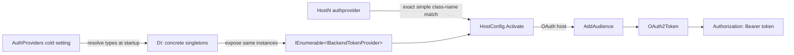

# Customize a Backend Token Provider

Implement `IBackendTokenProvider`, register the implementation at startup, and select it by its exact class name in each backend connection string.

> **TL;DR**
> - Add a concrete `IBackendTokenProvider` implementation to the `SimpleL7Proxy` project assembly.
> - Add its resolvable type name to `AuthProviders`; this is a Cold setting and requires a restart.
> - Set HostN `authprovider` to the implementation's exact simple class name. No suffix or other naming convention is required.

## Configuration Reference

No time units are used by these settings.

| Setting | Scope | Default | Reload | Required value |
|---------|-------|---------|--------|----------------|
| `Server:AuthProviderClass` | App Configuration | `Auth.AzureProvider` | Cold | Comma-separated type names resolved from the `SimpleL7Proxy` assembly. |
| `AuthProviders` | Environment variable alias | `Auth.AzureProvider` | Cold | Same value as `Server:AuthProviderClass`. |
| `authprovider` | HostN connection string | `AzureProvider` | Host configuration reload | Exact simple class name returned by `provider.GetType().Name`; matching is case-insensitive. |
| `usemi` / `useoauth` | HostN connection string | `false` | Host configuration reload | Set `true` to use the selected provider for OAuth2 Bearer tokens. |
| `audience` | HostN connection string | *(empty)* | Host configuration reload | Audience passed to `AddAudience` and `OAuth2Token`. |

> [!WARNING]
> `AuthProviders` and HostN `authprovider` use different name forms. `AuthProviders=Auth.ContosoTokenSource` locates the type; `authprovider=ContosoTokenSource` selects the registered instance.

## Implementing the Contract

**The class MUST be concrete, compiled into the main `SimpleL7Proxy` assembly, and implement all three `IBackendTokenProvider` methods.**

| Method | Runtime use |
|--------|-------------|
| `AddAudience(string audience)` | Called when an OAuth-enabled host is activated with a non-empty audience. Start audience-specific work here when required. |
| `OAuth2Token(string? audience)` | Called during host activation and for outbound authentication. Return an empty string only when the provider intentionally has no token. |
| `StartTokenRefresh()` | Part of the provider contract, but not invoked automatically by the current startup path. Implement it idempotently. |

The following minimal implementation uses the existing `DefaultCredential`. The class is intentionally named `ContosoTokenSource` to show that custom implementations do not need a `Provider` suffix.

```csharp
using Azure.Core;
using SimpleL7Proxy.Config;

namespace SimpleL7Proxy.Auth;

public sealed class ContosoTokenSource : IBackendTokenProvider
{
    private readonly DefaultCredential _defaultCredential;

    public ContosoTokenSource(DefaultCredential defaultCredential)
    {
        _defaultCredential = defaultCredential;
    }

    public void AddAudience(string audience)
    {
    }

    public async Task<string> OAuth2Token(string? audience = null)
    {
        if (string.IsNullOrWhiteSpace(audience)) return string.Empty;

        var context = new TokenRequestContext([audience]);
        var token = await _defaultCredential.Credential.GetTokenAsync(context, CancellationToken.None);
        return token.Token;
    }

    public void StartTokenRefresh()
    {
    }
}
```

Constructor dependencies are supplied by dependency injection and MUST already be registered. A production implementation MUST also define its token caching, refresh, retry, logging, and cancellation behavior.

> [!TIP]
> If activation waits indefinitely, inspect `OAuth2Token`. `HostConfig.Activate` waits for the initial call to finish before the host becomes active.

## Registering Provider Classes

**List each implementation once in `AuthProviders`, using either its full type name or a type name relative to the `SimpleL7Proxy` namespace.**

```bash
export AuthProviders="Auth.AzureProvider,Auth.ContosoTokenSource"
dotnet build src/SimpleL7Proxy/SimpleL7Proxy.csproj
dotnet run --project src/SimpleL7Proxy/SimpleL7Proxy.csproj
```

Startup resolves and registers each valid class as:

1. Its concrete runtime type, as a singleton.
2. `IBackendTokenProvider`, mapped to the same singleton.
3. `IHostedService`, mapped to the same singleton only when the class implements `IHostedService`.

| Configured name | Type resolution attempt |
|-----------------|-------------------------|
| `SimpleL7Proxy.Auth.ContosoTokenSource` | Exact full type name |
| `Auth.ContosoTokenSource` | `SimpleL7Proxy.Auth.ContosoTokenSource` |
| `ContosoTokenSource` | `SimpleL7Proxy.ContosoTokenSource` |

The loader does not scan external assemblies. A type in a separate plugin assembly is not discovered by this setting.

> [!WARNING]
> An unresolved, abstract, or incompatible type logs `[AUTH] Auth provider '<name>' was not found or does not implement IBackendTokenProvider. Skipping.` Correct the type name or implementation, then restart the proxy.

## Selecting a Provider for a Host

**Set `authprovider` to the exact simple class name of one registered implementation; do not add or remove a suffix.**

```bash
export Host1="host=https://api.contoso.example;useoauth=true;audience=api://contoso;authprovider=ContosoTokenSource"
export Host2="host=https://api.azure.example;usemi=true;audience=https://cognitiveservices.azure.com;authprovider=AzureProvider"
export AuthProviders="Auth.AzureProvider,Auth.ContosoTokenSource"
```

`HostConfig` requests every registered `IBackendTokenProvider` and selects the first implementation whose `GetType().Name` equals `authprovider`, using a case-insensitive comparison. Provider implementations MUST therefore have unique simple class names even when their namespaces differ.

> [!TIP]
> If startup reports `IBackendTokenProvider '<name>' is not registered`, compare HostN `authprovider` with the class declaration itself. Do not compare it with the namespace-qualified `AuthProviders` entry.

## Managing Provider Lifecycle

**Implement `IHostedService` only when the provider owns background work, and make `StopAsync` idempotent.**

```csharp
public sealed class ContosoTokenSource :
    IBackendTokenProvider,
    IHostedService
```

The host starts implementations registered as `IHostedService`. Coordinated shutdown also enumerates every registered `IBackendTokenProvider` and calls `StopAsync` on implementations that implement `IHostedService`.

> [!WARNING]
> A provider that owns refresh tasks MUST stop them safely when cancellation is requested. Repeated shutdown calls MUST NOT throw or dispose the same resource twice.

## Tracing Provider Selection

**Registration determines which implementations exist; each HostN connection string independently selects one instance by class name.**

```bash
AuthProviders="Auth.AzureProvider,Auth.ContosoTokenSource"
Host1="host=https://one.example;useoauth=true;audience=api://one;authprovider=ContosoTokenSource"
Host2="host=https://two.example;usemi=true;audience=api://two;authprovider=AzureProvider"
```



## Worked Example

**The global list registers available implementations; the per-host key chooses among them.**

| Step | Input | Result |
|------|-------|--------|
| 1 | `AuthProviders=Auth.AzureProvider,Auth.ContosoTokenSource` | Two singleton implementations are registered as `IBackendTokenProvider`. |
| 2 | Host1 has `authprovider=ContosoTokenSource` | Host1 selects the `ContosoTokenSource` instance. |
| 3 | Host1 has `useoauth=true;audience=api://orders` | Host1 calls `AddAudience("api://orders")`. |
| 4 | Host1 activates | Host1 waits for `OAuth2Token("api://orders")` to return. |
| 5 | Host1 forwards a request | The returned token is sent as the outbound Bearer token. |

## Verifying the Provider

**Verify type registration first, host selection second, and token behavior last.**

```bash
dotnet build src/SimpleL7Proxy/SimpleL7Proxy.csproj
export AuthProviders="Auth.AzureProvider,Auth.ContosoTokenSource"
export Host1="host=https://api.contoso.example;useoauth=true;audience=api://orders;authprovider=ContosoTokenSource"
```

Check these observable signals:

- Startup does not log an `[AUTH]` warning for the configured type.
- Host activation does not throw an `IBackendTokenProvider '<name>' is not registered` exception.
- The implementation receives the configured audience and returns a non-empty token.
- The backend receives an `Authorization: Bearer <token>` header and does not return `401` or `403` for provider-related authentication failures.

## Troubleshooting

**Match each failure to the name form and lifecycle stage that controls it.**

| Symptom | Cause | Check |
|---------|-------|-------|
| `[AUTH] ... was not found` | `AuthProviders` cannot resolve the type in the main assembly. | Use `Auth.Namespace.ClassName` or the full `SimpleL7Proxy.Namespace.ClassName`. |
| `[AUTH] ... does not implement IBackendTokenProvider` | The class does not implement the required contract or is abstract. | Check the class declaration and all three methods. |
| `IBackendTokenProvider 'X' is not registered` | HostN `authprovider` does not equal a registered implementation's simple class name. | Compare `X` with `provider.GetType().Name`; do not impose a suffix. |
| Host activation does not finish | The initial `OAuth2Token` call is waiting or retrying indefinitely. | Inspect provider token acquisition logs, audience, retry policy, and cancellation handling. |
| Backend returns `401` or `403` | The provider returned the wrong token or audience. | Inspect the token audience and backend authorization policy. |
| Shutdown hangs or throws | Provider background work does not honor cancellation or shutdown is not idempotent. | Inspect `IHostedService.StopAsync` and all refresh tasks. |

## Related Documentation

- [Backend Host Configuration](../reference/backend-hosts.md)
- [Configure Backends](configure-backends.md)
- [`IBackendTokenProvider` contract](../../src/SimpleL7Proxy/Auth/IBackendTokenProvider.cs)
- [Default `AzureProvider` implementation](../../src/SimpleL7Proxy/Auth/AzureProvider.cs)