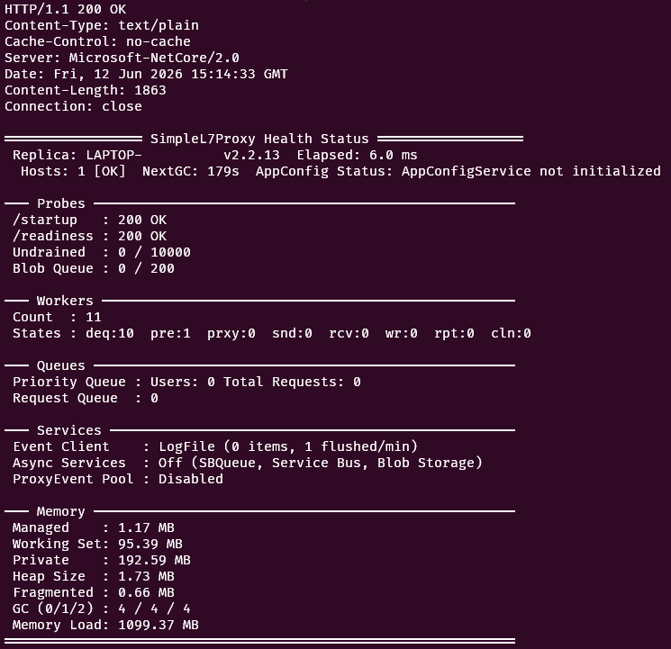

# Running the Proxy: From Zero to Proxying Traffic in Minutes

Choose the path that matches where the proxy runs and what it connects to, then follow that panel through the first successful query.

---

## Choose Your Setup

**Select one panel below.** Each panel is a complete route from prerequisites to the shared ChatTester verification step.

```text
Where will the proxy run?
├── Local source or Docker
│   ├── LLM Simulator
│   ├── Real LLM endpoint
│   └── APIM
└── Azure Container Apps
    ├── LLM Simulator on Azure Functions
    ├── Real LLM endpoint
    └── APIM
```

### Run the proxy locally

<details>
<summary><strong>Local proxy → local LLM Simulator</strong> — fastest path, no Azure resources</summary>

**Use this path to prove the request flow without Azure or real model access.**

1. Run the simulator locally with [LLM Simulator](../../test/LLMSimulator/Readme.md#run-it-locally-60-seconds).
2. Run the proxy [from source](#how-do-i-run-the-proxy-from-source-locally-exact-commands) or [in Docker](#how-do-i-run-the-proxy-as-a-docker-container-locally).
3. Set `Host1` to the simulator URL with `mode=direct`; no backend authentication is required.
4. Continue to [Run ChatTester and send the first query](#run-chattester-and-send-the-first-query).

> [!TIP]
> If the proxy runs in Docker, use `host.docker.internal` instead of `localhost` for the simulator host.

</details>

<details>
<summary><strong>Local proxy → real LLM endpoint</strong> — direct connection</summary>

**Use this path when APIM is not required and the proxy can reach the model endpoint directly.**

1. Run the proxy [from source](#how-do-i-run-the-proxy-from-source-locally-exact-commands) or [in Docker](#how-do-i-run-the-proxy-as-a-docker-container-locally).
2. Configure the endpoint with [Managed Identity](../BACKEND_HOSTS.md#per-host-auth-behavior) or an [API key](../BACKEND_HOSTS.md#per-host-auth-behavior).
3. Use `mode=direct` when the endpoint has no suitable health probe.
4. Continue to [Run ChatTester and send the first query](#run-chattester-and-send-the-first-query).

> [!WARNING]
> Managed Identity works locally only when the local credential chain has access to the LLM resource. Use an API key when that identity path is unavailable.

</details>

<details>
<summary><strong>Local proxy → APIM → LLM or Simulator</strong> — policy routing and governance</summary>

**Use this path to test APIM priority, retry, throttling, affinity, or mixed-backend behavior.**

1. Deploy the simulator to [Azure Functions](../../test/LLMSimulator/Readme.md#run-it-on-azure-functions-recommended), or prepare the real LLM endpoints.
2. Upload the [APIM policy](../../APIM-Policy/readme.md) and edit every backend URL, path, priority, and `auth` value.
3. Configure `Host1` with the APIM URL and the required APIM subscription-key or OAuth authentication.
4. Run the proxy locally, then continue to [Run ChatTester and send the first query](#run-chattester-and-send-the-first-query).

> [!NOTE]
> APIM-to-backend authentication is separate from proxy-to-APIM authentication. Configure both hops.

</details>

### Deploy the proxy to Azure Container Apps

<details>
<summary><strong>Container Apps proxy → Azure Functions LLM Simulator</strong> — cloud test path</summary>

**Use this path to validate the deployed proxy without consuming a real model endpoint.**

1. Deploy and verify the [Azure Functions LLM Simulator](../../test/LLMSimulator/Readme.md#run-it-on-azure-functions-recommended).
2. Choose public or private networking and [deploy the proxy](../../deployment/README.md).
3. Set `HOST1` to the function URL with `mode=direct`; the included simulator requires no backend authentication.
4. Continue to [Run ChatTester and send the first query](#run-chattester-and-send-the-first-query).

> [!TIP]
> Confirm the Container App can reach the function app before diagnosing proxy behavior.

</details>

<details>
<summary><strong>Container Apps proxy → real LLM endpoint</strong> — direct production path</summary>

**Use this path for the shortest production topology without APIM.**

1. Choose public or private networking and [deploy the proxy](../../deployment/README.md).
2. Configure the LLM endpoint with [Managed Identity](../BACKEND_HOSTS.md#per-host-auth-behavior) or an [API key](../BACKEND_HOSTS.md#per-host-auth-behavior).
3. Grant the Container App identity access to the model resource when using Managed Identity.
4. Continue to [Run ChatTester and send the first query](#run-chattester-and-send-the-first-query).

> [!WARNING]
> Do not store API keys in committed deployment parameter files.

</details>

<details>
<summary><strong>Container Apps proxy → APIM → LLM or Simulator</strong> — governed production or failover path</summary>

**Use this path when APIM owns backend selection, priority eligibility, retries, or governance.**

1. Prepare real LLM endpoints, an [Azure Functions simulator](../../test/LLMSimulator/Readme.md#run-it-on-azure-functions-recommended), or both.
2. Upload the [APIM policy](../../APIM-Policy/readme.md) and edit every backend URL, path, priority, and `auth` value.
3. [Deploy the proxy](../../deployment/README.md), point `HOST1` at APIM, and configure subscription-key or OAuth authentication.
4. Continue to [Run ChatTester and send the first query](#run-chattester-and-send-the-first-query).

> [!NOTE]
> For private deployments, Container Apps, APIM, Functions, DNS, and model private endpoints must share a working network path.

</details>

### Run ChatTester and send the first query

<details open>
<summary><strong>Shared final step for every setup</strong></summary>

**A setup is complete only after one request passes through the proxy and returns a model-shaped response.**

1. Verify the proxy `/health` and `/readiness` endpoints.
2. Start [ChatTester](../../test/chat_tester/readme.md#requirements-and-startup).
3. Set `ServerBaseUrl` to the local or Container App proxy URL and configure client-to-proxy authentication when required.
4. Send one chat request and confirm `200 OK`, response content, `BackendHost`, and `x-Request-Worker`.

> [!TIP]
> If health succeeds but the query fails, test each hop directly: ChatTester → proxy, proxy → APIM, and APIM → backend.

</details>

---

## Full Answers

### Minimum required before starting?

#### What do I need installed before I can run the proxy? (.NET version, Docker, Azure CLI, subscriptions)

SimpleL7Proxy requires .NET 10 and Git for source-based local work. For local containers, add Docker. For Azure deployment, add Azure CLI, `azd`, and a subscription that can create Container Apps resources.

#### What is the absolute minimum configuration required to start? (Port + Host1)

SimpleL7Proxy needs two things to start: `Port` (the port to listen on, typically `8000`) and one backend via `Host1` in the format `host=https://api.example.com;probe=/health`. If your backend has no health-check URL, append `mode=direct` instead of a probe path — this tells the proxy to treat the backend as always available without polling it. See [→ Direct Mode](../Glossary.md#backend-management).

```bash
export Port=8000
export Host1="host=https://api.example.com;probe=/health"
```

#### Do I need any Azure resources before my first run, or can I run it fully locally?

SimpleL7Proxy can run fully locally first, especially if you use the included mock backend or simulator — no Azure account or subscription required for an initial run.

---

### How do I run it?

#### How do I run the proxy from source locally? (exact commands)

SimpleL7Proxy starts with two environment variables and one command:

```bash
export Port=8000
export Host1="host=http://localhost:9000;probe=/health"
cd src/SimpleL7Proxy && dotnet run
```

The proxy is ready when you see the startup banner in the console.

#### How do I run the proxy as a Docker container locally?

SimpleL7Proxy packages as a container. Build from `src`, then run with environment variables:

```bash
docker build -t simplel7proxy:latest -f SimpleL7Proxy/Dockerfile .
docker run -p 8000:443 -e "Host1=host=https://api.example.com;probe=/health" simplel7proxy:latest
```

#### How do I deploy the proxy to Azure Container Apps? (minimal steps)

SimpleL7Proxy deploys to ACA via the included scripts. The shortest documented path is:

```bash
.azure/setup.sh       # provision infrastructure
azd provision
# optionally seed App Configuration
.azure/deploy.sh      # deploy the container
```

#### What port does the proxy listen on by default?

Use `Port=8000` for local development — it's the value all examples in this documentation use, and it avoids the elevated-permission requirement that Linux places on ports below 1024 (including the built-in default of `80`). Inside the container image, the proxy also listens on port `443` (TLS). For ACA deployments using `Port=8000`, point the ingress rule at port `8000`.

---

### How do I point it at a backend?

#### What is the `Host1` connection string format? (minimal valid example)

SimpleL7Proxy uses a semicolon-delimited connection string for each backend:

```
Host1="host=https://api.example.com;probe=/health"
```

The `host` and `probe` keys are the minimum for a probed backend.

#### What is the `probe` path and why is it required?

SimpleL7Proxy uses the probe path to call each backend on a schedule (every 15 seconds by default) to confirm it is alive. A probe must return a success response (HTTP 200–299) for the backend to stay in the [active pool](../Glossary.md#backend-management) and receive traffic. If your backend has no health-check endpoint, use `mode=direct` to skip health polling and always treat the backend as available. See [→ Direct Mode](../Glossary.md#backend-management).



#### Can I use the included LLM simulator as a backend so I don't need a real Azure OpenAI endpoint?

SimpleL7Proxy includes a mock backend and LLM simulator specifically for this purpose — you can validate the full proxy pipeline, including `429` throttling and streaming responses, without a real Azure OpenAI deployment. See [→ LLM Simulator](../DUMMY_BACKEND.md).

---

### How do I verify it's working?

#### What health endpoints can I call to verify the proxy is up? (`/liveness`, `/readiness`, `/startup`)

SimpleL7Proxy exposes `/liveness`, `/readiness`, and `/startup` probes. Use `/health` as a simple liveness alias.

```bash
curl -i http://localhost:8000/health
# expect: HTTP/1.1 200 OK
```

#### What does a healthy response look like?

SimpleL7Proxy returns `200 OK` with an `OK` body for a healthy liveness check. The readiness probe also confirms at least one backend is in the active pool — if readiness returns non-200, no healthy backends are available.

#### How do I send a test request and see it proxied?

SimpleL7Proxy injects `BackendHost` into every proxied response. Send a request and check for that header:

```bash
curl -i http://localhost:8000/your/path
# look for: BackendHost: https://api.example.com
```

If `BackendHost` is absent, the request did not pass through the proxy.

#### What headers does the proxy add to the response so I can confirm it passed through?

SimpleL7Proxy adds five headers to every proxied response: `BackendHost` (the backend URL used), `x-Request-Worker` (which worker processed it), `x-Request-Queue-Duration` (milliseconds the request waited in the queue), `x-Request-Process-Duration` (milliseconds the backend took to respond), and `Total-Latency` (end-to-end time). Seeing `BackendHost` is the simplest confirmation.

---

### What if it doesn't start?

#### What are the three most common startup failures and how do I fix each?

SimpleL7Proxy startup fails in three predictable ways:

| Symptom | Cause | Fix |
|---------|-------|-----|
| `Host1` parse error or no backends registered | Missing or malformed `Host1` | Verify the connection string contains `host=` and matches `host=<url>;probe=<path>` exactly |
| Probe fails immediately, backend never enters pool | Backend unreachable or probe path returns a non-success response | Verify the backend URL and probe path are reachable from the proxy's network |
| App Configuration connection refused or `403` | Missing endpoint, wrong label, or identity missing role | Verify `AZURE_APPCONFIG_ENDPOINT`, the label, and that the managed identity has `App Configuration Data Reader` |

In all cases, the console output and `eventslog.json` include the specific error message.

#### Where do I look for startup logs?

SimpleL7Proxy writes startup events to the console and to `eventslog.json` in its working directory. For containers, also check `docker logs <container>`.

---

## You Should Now Be Able To

- [ ] Proxy is running and accepting requests
- [ ] At least one backend is healthy in the backend pool
- [ ] Can hit `/readiness` and see a `200 OK`
- [ ] Can send a request and see it proxied with `x-Request-Worker` in the response headers
- [ ] Knows where to go next: CONFIGURATION_CATEGORIES for tuning, or a POC for validation

---

## Related Documents

| Document | What it covers |
|----------|----------------|
| [Quickstart](../QUICKSTART.md) | First-run instructions for Azure Container Apps and local environments |
| [Beginner Development](../BEGINNER_DEVELOPMENT.md) | Local development from source |
| [Container Deployment](../CONTAINER_DEPLOYMENT.md) | Detailed Azure Container Apps deployment |
| [Dummy Backend](../DUMMY_BACKEND.md) | LLM simulator setup for testing without a real backend |
| [Environment Variables](../ENVIRONMENT_VARIABLES.md) | Minimum and complete runtime configuration |

---
