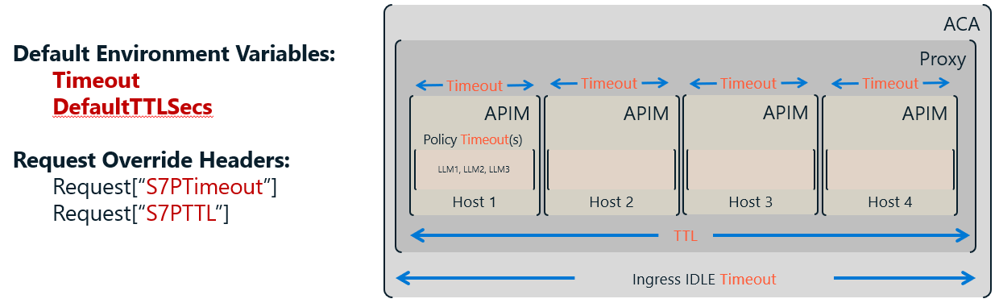

# Configuring for Resilience, Speed, and Cost Control

Once it's running, these are the settings that separate a reliable AI gateway from one that fails under load. Backends, load balancing, circuit breaking, timeouts — and how to change them without taking a running container offline.

---

## Quick Answers

<table>
<tr>
<td width="33%" valign="top">

### How do I add a backend?
Set `Host1` (through `Host9`) to a semicolon-delimited connection string: `host=https://api.example.com;probe=/health`. The `host` and `probe` keys are the minimum for a probed backend.

[→ How do I add a backend?](#how-do-i-add-a-backend)

</td>
<td width="33%" valign="top">

### Which load balance mode to use?
`latency` mode keeps your fastest backend getting traffic — if one endpoint slows down, the proxy routes around it automatically. Use `roundrobin` if backends are equivalent and you want even cost distribution. `random` works if you just need spread without tracking state.

[→ Which load balance mode to use?](#which-load-balance-mode-to-use)

</td>
<td width="33%" valign="top">

### Timeout vs TTL — what's the difference?
TTL is the promise to your caller — a maximum wait before they get a definitive answer. Timeout is the limit on a single backend attempt. Get TTL wrong and callers wait too long or get `412`; get Timeout wrong and retries never have a chance to succeed.

[→ Timeout vs TTL — what's the difference?](#timeout-vs-ttl--whats-the-difference)

</td>
</tr>
<tr>
<td width="33%" valign="top">

### When does a circuit breaker open?
When failures in the last `CBTimeslice` seconds (default 60 s) exceed `CBErrorThreshold` (default 50), the circuit opens and the host is skipped. It self-heals when old failures age out of the window.

[→ When does a circuit breaker open?](#when-does-a-circuit-breaker-open)

</td>
<td width="33%" valign="top">

### How many workers should I set?
Workers control how many requests run simultaneously. Too few and callers wait in the queue; too many and you spend more on memory and compute than you need. Start at the default of 10 — it handles most workloads — and tune up only if queue wait times are consistently high.

> **⚠️ GAP:** No guidance on workers-per-backend sizing formula exists in any doc. → [Content gap details](#content-gaps-to-fill)

[→ How many workers should I set?](#how-many-workers-should-i-set)

</td>
<td width="33%" valign="top">

### How do I change settings without a restart?
Connect to Azure App Configuration. Warm settings — timeouts, queue length, circuit breaker thresholds — update across all instances within ~30 seconds when the Sentinel key changes. No container restart, no dropped requests, no deployment coordination needed.

[→ How do I change settings without a restart?](#how-do-i-change-settings-without-a-restart)

</td>
</tr>
</table>

---

## Full Answers

### How do I add a backend?

#### How do I add a backend host? What is the connection string format?

SimpleL7Proxy registers backends via `Host1` through `Host9`, each set to a semicolon-delimited connection string:

```
Host1="host=https://api.example.com;probe=/health"
Host2="host=https://api2.example.com;probe=/health;path=/openai/"
```

The `host` and `probe` keys are the minimum for a probed backend.

#### What keys are supported in a `Host1` connection string? (`host=`, `probe=`, `weight=`, `usemi=`, `processor=`, etc.)

SimpleL7Proxy supports these connection string keys: `host`, `probe`, `path`, `mode`, `ipaddress`, `processor`, `usemi` or `useoauth`, `audience`, `api-key`, `api-key-header`, `stripprefix`, and `retryafter`. See [→ Connection String Keys](../BACKEND_HOSTS.md#reference--connection-string-keys) for the full reference.

#### How does the proxy discover that a backend is healthy or unhealthy?

SimpleL7Proxy polls each backend's probe path every `PollInterval` milliseconds (default 15,000 ms). It tracks the percentage of recent probes returning `2xx`. When this rolling success rate drops below `SuccessRate` (default 80%), the backend leaves the [active pool](../Glossary.md#backend-management) and stops receiving traffic. It re-enters automatically once its success rate recovers.


#### How do I configure path-based routing — send `/openai/` to one host and `/embeddings/` to another?

SimpleL7Proxy uses the `path=` key to filter which requests a backend handles. Add `path=/openai/` to one backend and `path=/embeddings/` to another. A backend with no `path=` key acts as the catch-all.

**Example:**
```
Host1="host=https://aoai1.openai.azure.com;probe=/health;path=/openai/"
Host2="host=https://embed.openai.azure.com;probe=/health;path=/embeddings/"
Host3="host=https://fallback.openai.azure.com;probe=/health"
```
Requests to `/openai/*` route to Host1. Requests to `/embeddings/*` route to Host2. Everything else goes to Host3.

#### What is "direct mode" and when should I use it?

SimpleL7Proxy skips health polling for a backend when `mode=direct` is set in its connection string. Use this for backends that start on demand — for example, a provisioned Azure OpenAI endpoint that may have zero active replicas when idle. Without `mode=direct`, failed probes while the backend is cold would incorrectly remove it from the [active pool](../Glossary.md#backend-management).

```
Host1="host=https://api.example.com;mode=direct"
```

#### How do I use Managed Identity instead of an API key?

SimpleL7Proxy supports keyless authentication via `usemi=true` and `audience=<resource-uri>`:

```
Host1="host=https://myaoai.openai.azure.com;probe=/health;usemi=true;audience=https://cognitiveservices.azure.com/"
```

The proxy uses its [Managed Identity](../Glossary.md#authentication-and-security) to request a short-lived OAuth2 access token at runtime — nothing to rotate or accidentally leak. See [→ Keyless Auth](../Glossary.md#authentication-and-security).

---

### Which load balance mode to use?

#### What are the three load balancing modes (roundrobin / latency / random) and when do I use each?

SimpleL7Proxy supports three load balancing modes. `roundrobin` cycles through backends evenly. `latency` reorders backends by observed response time (measured by the health poller) and always routes to the fastest one first. `random` assigns backends in a different order each request. For AI workloads with uneven backend throughput, `latency` or `roundrobin` is recommended. See [→ Load Balance Mode](../Glossary.md#backend-management).

| Mode | Best for |
|------|----------|
| `latency` | Heterogeneous backends with different response times |
| `roundrobin` | Evenly provisioned backends where you want predictable distribution |
| `random` | Spreading load without tracking state |

#### How does the proxy retry across backends when one fails?

SimpleL7Proxy tries backends one by one in the order determined by load balancing. It skips any host whose [circuit breaker](../Glossary.md#reliability) is open. If a backend returns a status code not in `AcceptableStatusCodes`, that counts as a failure and the proxy advances to the next host. Retries continue until success, all hosts are exhausted (returning `503`), or the request's [TTL](../Glossary.md#request-lifecycle) expires (returning `412`).

#### What is `MaxAttempts` and what happens when it is exceeded?

SimpleL7Proxy's `MaxAttempts` applies only when `IterationMode=MultiPass`, which allows the proxy to cycle through the backend list more than once. In that mode, `MaxAttempts` caps the total number of backend attempts across all cycles — once reached, the proxy returns `503`. The default `IterationMode=SinglePass` tries each backend at most once and `MaxAttempts` has no effect.

---

### Timeout vs TTL — what's the difference?



#### What is the difference between `Timeout` (per-host) and `TTL` (total request budget)?

SimpleL7Proxy uses two separate time limits: `Timeout` (default 20 minutes) caps a single backend call — if the backend doesn't respond, the attempt fails and the proxy tries the next host. [TTL](../Glossary.md#request-lifecycle) (`DefaultTTLSecs`, default 300 seconds) caps the entire request lifetime, including queue wait time and all retry attempts. When TTL expires, the caller receives `412`. For most AI workloads, TTL is the more relevant limit to tune.

**Example:** `DefaultTTLSecs=60` means a request gets at most 60 seconds total. If it waits 50 seconds in the queue and the backend takes 15 seconds to respond, the proxy returns `412` because the total exceeds 60 seconds — even though the individual backend call would have succeeded under `Timeout`.

#### How do I set a timeout per backend host?

SimpleL7Proxy documents a global `Timeout` and a per-request `S7PTimeout` header override. A per-host timeout in `HostN` is not currently documented.

#### How can a caller override the timeout on a per-request basis?

SimpleL7Proxy respects the [`S7PTimeout`](../Glossary.md#protocol-and-headers) request header (value in milliseconds) to override the global `Timeout` for that one request. For example, `S7PTimeout: 60000` sets a 60-second per-attempt limit. The request's overall [TTL](../Glossary.md#request-lifecycle) still applies as the ceiling.

---

### When does a circuit breaker open?

#### What settings control when a circuit opens? (`CBErrorThreshold`, `CBTimeslice`)

SimpleL7Proxy opens the [circuit breaker](../Glossary.md#reliability) for a backend when its failure count within the last `CBTimeslice` seconds (default 60) exceeds `CBErrorThreshold` (default 50). Think of it as a rolling window: if 50 failures occur within any 60-second span, the circuit opens and that host is skipped. Failures older than `CBTimeslice` expire automatically, so a backend with occasional errors won't stay blocked indefinitely.

#### What HTTP status codes count as failures?

SimpleL7Proxy counts any response code not listed in `AcceptableStatusCodes` as a circuit-breaker failure. The default list is `200, 202, 400, 401, 403, 404, 408, 410, 412, 417`. Notably, `429` and `5xx` codes are not in the default list and increment the failure counter. To have the proxy requeue on `429` instead, configure the backend to return [`S7PREQUEUE: true`](../Glossary.md#protocol-and-headers) on its `429` responses.

#### How quickly does the circuit recover once the backend is healthy again?

SimpleL7Proxy self-heals automatically. As failures older than `CBTimeslice` seconds expire, the failure count drops. Once it falls below `CBErrorThreshold`, the circuit closes and the host re-enters the [active pool](../Glossary.md#backend-management). No manual reset is needed — the window drains on its own.

---

### How many workers should I set?

#### How many workers should I configure?

SimpleL7Proxy defaults to `Workers=10`, meaning at most 10 requests run simultaneously. Any beyond that wait in the queue. Increase `Workers` to handle more concurrent load. Because `Workers` is a [Cold setting](../Glossary.md#configuration-management), changing it requires a container restart. See [→ Priority Workers](../Glossary.md#request-governance) to reserve a portion of the worker pool for high-priority traffic.

#### What is `MaxQueueLength` and what happens when the queue is full?

SimpleL7Proxy rejects incoming requests with a proxy-generated `429 Too Many Requests` when the [priority queue](../Glossary.md#request-lifecycle) reaches `MaxQueueLength` (default 1000). No backend is contacted — the `429` comes from the proxy itself. See [→ Getting 429](05-diagnose-a-problem.md#getting-429-too-many-requests) to distinguish a proxy queue-full `429` from a backend throttle `429`.

#### How does the priority queue work — who gets served first?

SimpleL7Proxy dispatches lower integer priorities first — priority 1 runs before priority 2. Without worker reservations, a flood of high-priority requests could monopolize all workers and starve lower-priority requests. [Priority Workers](../Glossary.md#request-governance) prevent this by dedicating a fixed number of worker slots to each priority tier.

---

### How do I change settings without a restart?

#### Which settings can be changed without restarting the container?

SimpleL7Proxy distinguishes three setting categories: **Warm** settings are hot-reloaded from Azure App Configuration within ~30 seconds when the [Sentinel](../Glossary.md#configuration-management) key changes. **Cold** settings (such as `Workers` and `AsyncModeEnabled`) only take effect after a container restart. **Hidden** settings are derived at startup from connection strings and cannot be changed at runtime.

| Category | Reload method | Example settings |
|----------|--------------|-----------------|
| Warm | Sentinel bump (~30 s) | Timeouts, queue length, circuit breaker thresholds |
| Cold | Container restart | `Workers`, `AsyncModeEnabled` |
| Hidden | Re-deploy | Backend connection string keys |

#### How do I connect to Azure App Configuration for hot-reload?

SimpleL7Proxy picks up App Configuration settings when `AZURE_APPCONFIG_ENDPOINT` is set (or a connection string), the managed identity has `App Configuration Data Reader`, and the configured `AZURE_APPCONFIG_LABEL` matches the label on your settings.

#### What is the Sentinel key pattern and how does it work?

SimpleL7Proxy polls App Configuration on a ~30-second interval. It detects changes via a dedicated [`Warm:Sentinel`](../Glossary.md#configuration-management) key — after updating any Warm setting, change the value of `Warm:Sentinel` to anything new. All running instances detect the change on their next poll and reload atomically. If you forget to bump Sentinel, the updated values are never applied to running containers.

---

### Governance

#### How do I restrict which callers can use the proxy (Entra App ID allowlist)?

SimpleL7Proxy rejects requests from unlisted callers with `401` when `ValidateAuthAppID=true`. Set `ValidateAuthAppIDHeader` (the header carrying the caller's Microsoft Entra Application ID, default `X-MS-CLIENT-PRINCIPAL-ID`) and `ValidateAuthAppIDUrl` (a URL or file path returning the permitted app IDs as JSON). See [→ App ID Allowlist](../Glossary.md#request-governance).

#### How do I assign different priority tiers to different callers?

SimpleL7Proxy maps caller identifiers to priority integers via `PriorityKeyHeader`, `PriorityKeys`, and `PriorityValues`. For example:
```
PriorityKeyHeader=S7PPriorityKey
PriorityKeys=gold,silver
PriorityValues=1,2
```
A request with `S7PPriorityKey: gold` gets priority 1; `silver` gets priority 2. See [→ Priority Mapping](../Glossary.md#request-governance).

#### How do I configure per-user request limits?

SimpleL7Proxy caps how much of the worker pool a single user can occupy using `UserPriorityThreshold` (default `0.1` — 10% of workers). With `Workers=10`, one user's requests can hold at most 1 worker at a time. Enable user profiles by setting `UserProfilesUrl` or `UserProfilesPath` to a JSON file defining per-user settings.

---

## You Should Now Be Able To

- [ ] All backend hosts are configured and healthy
- [ ] Timeouts and circuit breaker thresholds match the SLA of their backends
- [ ] Load balancing strategy is chosen and applied
- [ ] Governance rules (if needed) are in place
- [ ] Settings are stored in App Configuration and hot-reload is working
- [ ] Knows what to go to next: a POC to validate, or OBSERVABILITY to set up telemetry

---

## Existing documents that cover this area

| Document | What it covers | Gap? |
|----------|----------------|------|
| [CONFIGURATION_CATEGORIES.md](../CONFIGURATION_CATEGORIES.md) | Settings grouped by goal: essential / common / advanced | Entry point — verify it is the first document operators read |
| [ENVIRONMENT_VARIABLES.md](../ENVIRONMENT_VARIABLES.md) | Exhaustive reference for all variables | Reference doc — too long to read top-to-bottom |
| [BACKEND_HOSTS.md](../BACKEND_HOSTS.md) | Host connection string format, routing, health polling | Primary backend config reference |
| [LOAD_BALANCING.md](../LOAD_BALANCING.md) | Load balance modes, retry, requeue | Covers retry and pipeline well |
| [TIMEOUTS.md](../TIMEOUTS.md) | Timeout vs TTL, per-request overrides | Covers async too — keep async section linked from Async area |
| [CIRCUIT_BREAKER.md](../CIRCUIT_BREAKER.md) | CB states, thresholds, recovery | Self-contained — link from reliability context |
| [ADVANCED_CONFIGURATION.md](../ADVANCED_CONFIGURATION.md) | Priority management, user governance | Contains content for both operator and governance readers |
| [AZURE_APP_CONFIGURATION.md](../AZURE_APP_CONFIGURATION.md) | App Config setup, RBAC, Sentinel | Required before hot-reload will work |
| [SCENARIOS.md](../SCENARIOS.md) | Copy-paste config blocks for common patterns | The fastest path to a working config |

---

## Content gaps to fill

- [ ] A "start here" decision tree: what kind of workload? → which settings matter?
- [ ] An annotated minimal `Host1` connection string with all optional keys explained inline
- [ ] A single "Warm / Cold / Hidden" table at the top of the config section so operators know what they can change live
- [ ] A worked example: two backends, path routing, different timeouts — shows all the moving parts together
- [ ] A "do not set these unless you understand them" callout for dangerous settings (`Workers`, `CBErrorThreshold`)
