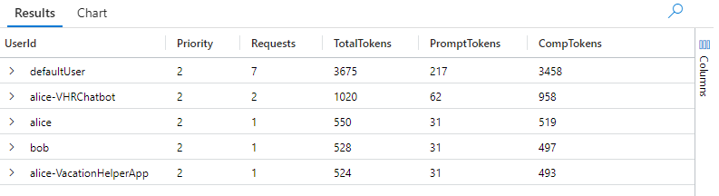

# POC: LLM Chargeback

**Purpose:** Report token consumption in a smart router deployment.

> [!CONCEPT]
> **When you're sharing an endpoint across multiple users or groups, you want to know everyone's share of the usage. The proxy can seamlessly capture the token consumption data and store it in Application Insights or an Event Hub. Once the data is stored, the chargeback can be reported via KQL, SQL, etc.**

## TL;DR

1. The proxy identifies the caller and enriches the request.
2. The proxy captures token usage from each response and logs it.
3. A KQL query confirms that token usage is attributed to each caller.

## What you will observe

The proxy can intercept LLM requests and log metrics in real time to Application Insights. You can then generate chargebacks to usrs or departments based on data from Log Analytics or an alternate sink such as Event Hubs.

## How it works

The proxy identifies the caller, looks up the caller's profile, and enriches the request. It then pairs the response's token metrics with the caller's identity.

The caller's identity can come from the `applicationId` embedded in the OAuth token or from a custom combination of headers. For this POC, we bypass the profile lookup and include `X-UserID` directly in each request.

---

## Minimal Prerequisites

- A running a proxy
- An endpoint with `gpt-4o` deployed to it.
- An Application Insights resource 
- A client to make calls: ( curl or other ) 

**Optional ( when smart governance capabiities are required  ):**
- An APIM configured with the reference policies.

---

## Step 1. Validate connectivity

You already have a running proxy. Now, we want to make sure that everything is working before we begin the POC. We'll start with a simple health check. Replace the hostname with your proxy URL. In this example, the proxy is running on port 8000 on the local machine.

If your proxy is deployed in an internal VNet, make sure to run this check from a machine in the same VNet.

```bash
# proxy running on localhost port 8000
export PROXYHOST="http://localhost:8000"

# Call the proxy to test it:
curl -i $PROXYHOST/health

# → 200 OK
```

**Optional connectivity checks:**

If you are using an APIM, check that it is responding to its health probe as well:

Replace `<apim-name>` with the name of your APIM instance.

**APIM:**
```bash
# Health probe - APIM's built-in health probe
curl -i https://<apim-name>.azure-api.net/status-0123456789abcdef

# → 200 OK
```
---

## Step 2. Configure a backend in the proxy

The proxy can load balance across multiple backends, but we only need a single backend for this POC. The simplest way to specify a backend is to set `Host1` to a comma-separated list of `key=value` fields.

- `host`: The LLM endpoint URL.
- `mode`: How the proxy connects to the endpoint. Use `direct` for this setup or `apim` for the optional APIM setup.
- `usemi=true, audience=<audience>` **[if using managed identity]**
- `api-key=<api-key>;api-key-header=api-key` **[if using API-key authentication]**
- `Processor=MultiLineAllUsage`: The token processing algorithm. See [Reference](#reference) **[direct mode]**
- Other optional fields are explained in [backend host settings](../reference/backend-hosts.md).

### Direct Host 

If the proxy will connect to the LLM endpoint directly, it is called a direct host.  Combine the above values to construct the setting.  

```bash
export Host1="host=https://<endpoint>.openai.azure.com;mode=direct;api-key=<api-key>,api-key-header=<headername>"
```

### APIM Mode

If the proxy connects to an APIM instance, it uses APIM mode. Set `mode=apim` and add `probe=/status-0123456789abcdef`. Construct the remaining parameters based on the authentication mode.

```bash
export Host1="host=https://<apim-name>.azure-api.net;mode=apim;probe=/status-0123456789abcdef;api-key-header=<headername>;api-key=<apim-key>"
```

APIM can route to multiple models, so it needs to return the appropriate processor for the selected model. The included APIM policy already does this.  

If you choose not to use the included policy, set the `TOKENPROCESSOR` response header in the APIM policy `<outbound>` block to `OpenAI`, `AllUsage-2`, or `MultiLineAllUsage`:

```xml
<outbound>
    <set-header name="TOKENPROCESSOR" exists-action="override">
        <value><!-- OpenAI | AllUsage-2 | MultiLineAllUsage --></value>
    </set-header>
    ...
</outbound>
```


---

## Step 3. Configure Application Insights

Set `APPINSIGHTS_CONNECTIONSTRING` to your Application Insights connection string. Data sent to App Insights is typically queryable within 3-5 minutes.

If you modified `LogToAI`, change it back to `'*'`.

---

## Step 4. Send a request to confirm the pipeline is working.

Depending on your scenario, the URL and body will differ. Define `URL` and `BODY` for your test endpoint.

```bash
# OpenAI - gpt-4o
export URL="openai/v1/chat/completions"
export BODY='{"model":"gpt-4o","messages":[{"role":"user","content":"hello"}],"stream":true}'
```

**Optional backend options:**
<details><summary>If you choose to use the LLM Simulator or APIM:</summary>

```bash
# Optional alternative - OpenAI - gpt-5.4-mini
export URL="openai/v1/chat/completions"
export BODY='{"model":"gpt-5.4-mini","messages":[{"role":"user","content":"hello"}],"stream":true}'
```
</details>

Now that `$PROXYHOST`, `URL`, and `BODY` are defined, run the following command to get a response.

```bash
# Make the call
curl -i -H "X-UserID: alice" \
  -H "Content-Type: application/json" -d "$BODY" "$PROXYHOST/$URL"
```

---

## Verifying the first pass

The proxy writes a `requests` entry to Application Insights for every completed request, with token counts in `customDimensions`.

The queries below use OpenAI field names. For Anthropic or Gemini, substitute the field names from the [provider table](#reference).


Open the Log Analytics workspace linked to your Application Insights resource, then run:

```kusto
requests
| where timestamp > ago(1h)
| where customDimensions contains "Usage.Total_Tokens"
| project
    timestamp,
  UserId       = tostring(coalesce(customDimensions["UserID"], customDimensions["userID"])),
  Priority     = tostring(coalesce(customDimensions["S7P-Priority"], customDimensions["S7P_Priority"])),
  Backend      = tostring(coalesce(customDimensions["BackendHost"], customDimensions["Backend-Host"])),
  PromptTokens = toint(coalesce(customDimensions["Usage.Prompt_Tokens"], customDimensions["Usage.Input_Tokens"])),
  CompTokens   = toint(coalesce(customDimensions["Usage.Completion_Tokens"], customDimensions["Usage.Output_Tokens"])),
    TotalTokens  = toint(customDimensions["Usage.Total_Tokens"])
| summarize
    Requests     = count(),
    TotalTokens  = sum(TotalTokens),
    PromptTokens = sum(PromptTokens),
    CompTokens   = sum(CompTokens)
    by UserId, Priority
| order by TotalTokens desc
```

You should see a response similar to the screenshot. If the query shows a `UserId` and counts for the usage fields, the full pipeline is working.



Depending on the model, there may be additional usage fields worth reporting.

For example, for `gpt-5.4-mini`, these are available in custom dimensions:


---

### Send more data

For a chargeback test across multiple users, send the batch below before running the queries:

```bash
for i in {1..3}; do
  curl -s -o /dev/null \
    -H "X-UserID: bob" \
    -H "Content-Type: application/json" -d "$BODY" "$PROXYHOST/$URL" &
done
```
After a few minutes, rerun the query above. Expected result (1 request for `alice` from Step 4 and 3 for `bob` from the batch above):

| UserId | Priority | Requests | TotalTokens | PromptTokens | CompTokens |
|--------|----------|----------|-------------|--------------|------------|
| bob    | 1        | 3        | 3174        | 174          | 3000       |
| alice  | 1        | 1        | 1058        | 58           | 1000       |

To break down by backend (useful when multiple deployments serve different tiers):

```kusto
requests
| where timestamp > ago(1h)
| where customDimensions contains "Usage.Total_Tokens"
| summarize
    TotalTokens = sum(toint(customDimensions["Usage.Total_Tokens"])),
    Requests    = count()
  by UserId = tostring(coalesce(customDimensions["UserID"], customDimensions["userID"])),
     Backend = tostring(coalesce(customDimensions["BackendHost"], customDimensions["Backend-Host"]))
| order by TotalTokens desc
```

---

## Send data to additional sinks

Set `EVENT_LOGGERS` to one or more of `appinsights`, `eventhub`, or `file` (comma-separated). See [CONFIGURATION_SETTINGS.md](../reference/configuration.md) for all options.

<details>
<summary>Event Hubs</summary>

Set `EVENT_LOGGERS=eventhub` and `EVENTHUB_CONNECTIONSTRING` to enable the Event Hubs sink. The proxy emits the same JSON envelope it writes to the file log, so every token field is present in the event body.

**Capture to a storage account:** Enable the Event Hubs Capture feature on the hub to land events as Avro files in Azure Blob Storage automatically. This gives you a durable, queryable archive without building a consumer.

**Query with ADX (Azure Data Explorer):** Connect ADX to the hub or to the captured Blob Storage container using an external table or continuous ingestion. Once the data is in ADX you can run the equivalent chargeback query:

```kusto
ProxyEvents
| where UsageTotalTokens > 0
| summarize
    Requests    = count(),
    TotalTokens = sum(UsageTotalTokens),
    PromptTokens = sum(UsagePromptTokens),
    CompTokens  = sum(UsageCompletionTokens)
    by UserId, Priority
| order by TotalTokens desc
```

Other tools that work directly with Event Hubs or Blob-captured data include Fabric Real-Time Intelligence, Stream Analytics, and Azure Synapse.

</details>

<details>
<summary>Local File</summary>

If `EVENT_LOGGERS=file` (the default), token data appears in `eventslog.json` immediately, with no ingestion delay. This is useful for a quick sanity check before querying Application Insights.

If the proxy is deployed to Azure Container Apps, the file is written inside the container. Use the ACA console to inspect it: in the Azure portal, open the container app → **Containers** → **Console**, then run the `jq` command below. For a more durable setup, ACA supports mounting an Azure Files share as a volume — configure a storage mount in the container app and set the proxy's working directory to that path so `eventslog.json` persists across container restarts.

```bash
cat eventslog.json | jq 'select(."Usage.Total_Tokens" != null) | {"user": .userId, "total": ."Usage.Total_Tokens", "backend": .BackendHost}'
```

Expected output per OpenAI request:
```json
{
  "user": "alice",
  "total": "1058",
  "backend": "https://<funcapp>.azurewebsites.net"
}
```

</details>

<details>
<summary>None</summary>

If `EVENT_LOGGERS` is not set or is set to an empty value, telemetry is turned off and nothing is captured. Requests are still proxied normally, but no token data, request events, or usage metrics are written anywhere. Set at least one logger before running this POC.

</details>

---

## Tuning and Further Exploration

Once the basic data is confirmed, these variations are worth trying:

<details>
<summary>Stream Analytics + Power BI dashboard</summary>

With `EVENT_LOGGERS=eventhub`, every request event lands in the hub in real time. Connect an Azure Stream Analytics job to the hub and project the token fields into an output — a Power BI streaming dataset works well here. You can build a live dashboard showing token consumption by user, priority tier, and backend, updating as requests arrive. This is the closest thing to a real-time chargeback view without any custom code.

For a batch approach, use the Event Hubs Capture output (Avro files in Blob Storage) as a Power BI dataflow source, or import it into a Fabric lakehouse for scheduled reporting.

</details>

<details>
<summary>Add a second backend by tier</summary>

Use `acceptablePriorities` to route priority-1 to a "premium" backend and priority-3 to a "standard" one. The `BackendHost` dimension in telemetry then lets you split cost by tier automatically in any of the queries above.

</details>

<details>
<summary>Increase concurrency</summary>

Raise `Workers` and send a larger burst. Watch `eventslog.json` — every line should have a `Usage.Total_Tokens` entry. Missing entries indicate the stream was closed before the final usage chunk arrived, which is common if a real backend is configured without `processor=OpenAI`.

</details>

---

## Reference

<details>
<summary>Settings, values, units, and when each takes effect</summary>

| Setting | Value in this POC | Unit | Set in | Takes effect |
| :--- | :--- | :--- | :--- | :--- |
| `processor=` | `OpenAI`, `AllUsage-2`, or `MultiLineAllUsage` | — | `Host1` env var | proxy restart |
| `X-UserID` header | caller-supplied string | — | request header | per request |
| `APPINSIGHTS_CONNECTIONSTRING` | App Insights connection string | — | env var | proxy restart |
| `EVENT_LOGGERS` | `appinsights`, `eventhub`, `file` (comma-separated) | — | env var | proxy restart |

> [!NOTE]
> For APIM topology, `processor=` is set via the `TOKENPROCESSOR` response header in the APIM policy `<outbound>` block — not in the `Host1` string.

</details>

<details>
<summary>LLM Simulator</summary>

Use the [LLM Simulator](../../test/LLMSimulator/Readme.md) instead of the Azure OpenAI endpoint.

Choose the URL and body for the provider you want to simulate:

```bash
# OpenAI
export URL="api/v1/chat/completions"
export BODY='{"model":"gpt-4o-mini","messages":[{"role":"user","content":"hello"}],"stream":true}'

# Gemini
export URL="v1beta/models/gemini-2.5-pro:generateContent"
export BODY='{"contents":[{"role":"user","parts":[{"text":"hello"}]}]}'

# Anthropic
export URL="anthropic/v1/messages"
export BODY='{"model":"claude-sonnet-3-5","messages":[{"role":"user","content":"hello"}]}'
```

The simulator returns token usage with fixed OpenAI counts (58 prompt / 1000 completion / 1058 total). Missing usage entries are rare with the simulator.

</details>

<details>
<summary>Custom dimensions by provider</summary>

The `processor=` value on the backend host determines which usage fields are extracted:

| Provider | `processor=` value | Usage fields logged |
|----------|--------------------|---------------------|
| Azure OpenAI / OpenAI | `OpenAI` | `Usage.Prompt_Tokens`, `Usage.Completion_Tokens`, `Usage.Total_Tokens` |
| Anthropic | `AllUsage-2` | `Usage.Input_Tokens`, `Usage.Output_Tokens` |
| Google Gemini | `MultiLineAllUsage` | `Usage.PromptTokenCount`, `Usage.CandidatesTokenCount`, `Usage.TotalTokenCount` |

Every request also includes: `S7P_RequestId` (correlation ID), `S7P_Priority` (queue assigned), `BackendHost` (URL that served the request).

</details>

## Related Documentation

- [Run SimpleL7Proxy Locally](../getting-started/local.md) — Running the proxy locally for the first time
- [CONTAINER_DEPLOYMENT.md](../how-to/deploy-container-apps.md) — Deploying to Azure Container Apps
- [CONFIGURATION_SETTINGS.md](../reference/configuration.md) — Full reference for all environment variables
- [POC-Priority-configuration.md](priority-routing.md) — Routing requests across backends by priority tier
- [POC-Failover-configuration.md](failover.md) — Automatic failover and retry behaviour when a backend is slow or unavailable
- [OBSERVABILITY.md](../concepts/observability.md) — Token metrics, telemetry channels, and event logger configuration
- [BACKEND_HOSTS.md](../reference/backend-hosts.md) — `processor=` and other host connection string options
