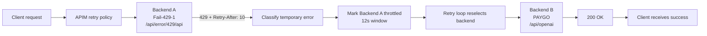

# POC: Failover Configuration

**Purpose:** Show that when the primary backend returns a simulated `429`, the `Priority-with-retry-enhancedLog.xml` APIM policy marks it throttled and retries the same request against a healthy backend that returns a real OpenAI-style response.

> [!NOTE]
> **Policy version:** This POC uses [`APIM-Policy/v2.1.0/Priority-with-retry-enhancedLog.xml`](../../APIM-Policy/v2.1.0/Priority-with-retry-enhancedLog.xml). The older [`APIM-Policy/v2.0.1/Priority-with-retry-enhancedLog.xml`](../../APIM-Policy/v2.0.1/Priority-with-retry-enhancedLog.xml) does not combine `url + path` the same way and will not produce the `backendLog` entries shown below.

> [!IMPORTANT]
> **The rule: when Backend A returns `429`, APIM marks it throttled for `Retry-After + 2s`, retries the request against the next healthy backend, and the client still sees `200 OK`.**

## TL;DR (< 5 minutes)

1. Apply [`APIM-Policy/v2.1.0/Priority-with-retry-enhancedLog.xml`](../../APIM-Policy/v2.1.0/Priority-with-retry-enhancedLog.xml) to your APIM API and use the exact two `listBackends` entries below.
2. Keep `retryCount: 2` so the policy has one failed attempt and one recovery attempt.
3. Send one OpenAI Responses request through APIM, for example `POST https://<apim>.azure-api.net/<api>/v1/responses`.

**Expected outcome:** `200 OK`, `x-Backend-Attempts: 2`, and `backendLog` shows `Fail-429-1` throttled before `PAYGO` succeeds.

## What you will observe

- Request #1 is fast, shows `x-Backend-Attempts: 2`, and returns a successful response from `PAYGO`.
- Request #2 sent within the cool-down window is also successful, but shows `x-Backend-Attempts: 1` because `Fail-429-1` is skipped.
- Request #3 sent after the cool-down expires shows `x-Backend-Attempts: 2` again because `Fail-429-1` is retried and throttled again.
- The client does not see `429`; the failover stays inside APIM.

## Reference

<details>
<summary>Settings, values, units, and when each takes effect</summary>

| Setting | Value in this POC | Unit | Set in | Takes effect |
| :--- | :--- | :--- | :--- | :--- |
| Backend A `url` | `https://simplel7fn-e8bscgd8h4adcjcs.westus-01.azurewebsites.net/api/error/429` | URL | `listBackends` | after policy save |
| Backend A `path` | `/api` | path segment | `listBackends` | after policy save |
| Backend A effective URL | `.../api/error/429/api` | URL | policy normalization (`url + path`) | after policy save |
| Backend B `url` | `https://simplel7fn-e8bscgd8h4adcjcs.westus-01.azurewebsites.net/api` | URL | `listBackends` | after policy save |
| Backend B `path` | `openai` | path segment | `listBackends` | after policy save |
| Backend B effective URL | `.../api/openai` | URL | policy normalization (`url + path`) | after policy save |
| Backend B `timeout` | `20` | seconds | `listBackends` | after policy save |
| Backend A `timeout` | default `10` | seconds | policy default when omitted | after policy save |
| `429` cool-down | `Retry-After + 2` | seconds | parsed from backend response | per request |
| Simulator default `Retry-After` | `10` | seconds | `/api/error/429` default | per request |
| Effective cool-down in this POC | `12` | seconds | policy logic | per request |
| `retryCount` | `2` | attempts | `priorityCfg` | after policy save |
| Default request priority | `3` | level | policy default when header absent | per request |
| `limitConcurrency` | default `off` | mode | policy default when omitted | after policy save |
| `bufferResponse` | default `true` | boolean | policy default when omitted | after policy save |

> [!NOTE]
> **Units used in this doc:** timeouts and cool-downs are in seconds. The policy combines `url + path` once during backend normalization and logs the combined URL in `backendLog`.

</details>

## Setup

### Minimal prerequisites

**What matters:** this POC uses one APIM API and one deployed LLM Simulator function; no extra infrastructure is required.

- An APIM instance with the retry policy applied to the target API.
- The LLM Simulator function deployed at `https://simplel7fn-e8bscgd8h4adcjcs.westus-01.azurewebsites.net`.
- An APIM frontend route that forwards an OpenAI-style request path. The example below uses `/v1/responses`.
- Managed identity enabled for APIM if you want the config to stay identical to real Azure OpenAI backends.

Endpoints used in this POC:

- `GET|POST /api/error/429` returns `429` immediately and sets `Retry-After` to `10` seconds by default.
- `POST /api/openai/v1/responses` returns a real OpenAI-style response from the simulator.

> [!NOTE]
> The simulator accepts anonymous requests. Keeping `auth: "MI"` is still useful here because it matches the production Azure OpenAI configuration shape.

### Apply the policy

**What matters:** apply the policy at the API level on **All operations**, not at product or global scope. Use the Azure portal for this POC; the CLI form is provided only as an automation alternative.

#### Azure portal (recommended)

1. Open your APIM instance in the [Azure portal](https://portal.azure.com).
2. Select **APIs** and open the target API.
3. Select **All operations**.
4. Open the **Inbound processing** policy editor (`</>` icon).
5. Replace the editor contents with [`APIM-Policy/v2.1.0/Priority-with-retry-enhancedLog.xml`](../../APIM-Policy/v2.1.0/Priority-with-retry-enhancedLog.xml).
6. Select **Save**.

<details>
<summary>Azure CLI alternative</summary>

```bash
az apim api policy create \
  --resource-group <rg> \
  --service-name <apim-name> \
  --api-id <api-id> \
  --value "$(cat APIM-Policy/v2.1.0/Priority-with-retry-enhancedLog.xml)" \
  --format xml
```

</details>

### Configure `listBackends`

**What matters:** Backend A must return `429` immediately and Backend B must return a normal OpenAI-style response.

Use these exact backend entries:

```xml
<set-variable name="listBackends" value="@{
...

    backends.Add(new JObject()
    {
        { "url", "https://simplel7fn-e8bscgd8h4adcjcs.westus-01.azurewebsites.net/api/error/429" },
        { "path", "/api"},
        { "priorityGroup", 1},
        { "label", "Fail-429-1" },
        { "acceptablePriorities", new JArray(1,2,3) },
        { "auth", "MI"}
    });

    backends.Add(new JObject()
    {
        { "url", "https://simplel7fn-e8bscgd8h4adcjcs.westus-01.azurewebsites.net/api" },
        { "path", "openai"},
        { "priorityGroup", 2},
        { "label", "PAYGO" },
        { "acceptablePriorities", new JArray(1,2,3) },
        { "timeout" , 20},
        { "auth", "MI"}
    });

...
    return backends;
}" />
```

After normalization, the policy logs these effective backend URLs:

- `Fail-429-1` -> `https://simplel7fn-e8bscgd8h4adcjcs.westus-01.azurewebsites.net/api/error/429/api`
- `PAYGO` -> `https://simplel7fn-e8bscgd8h4adcjcs.westus-01.azurewebsites.net/api/openai`

> [!WARNING]
> **Do not add `/openai` a second time to the backend `url`.** In v2.1+, the policy combines `url + path` once and uses that combined value as the backend base URL.

### Configure `priorityCfg`

**What matters:** `retryCount` must be `2` or higher so the policy can spend one cycle on the `429` and one cycle on recovery.

```xml
<set-variable name="priorityCfg" value="@{
    JObject cfg = new JObject();
    cfg["1"] = new JObject { { "retryCount", 2 }, { "requeue", false } };
    cfg["2"] = new JObject { { "retryCount", 2 }, { "requeue", false } };
    cfg["3"] = new JObject { { "retryCount", 2 }, { "requeue", false } };
    return cfg;
}" />
```

> [!TIP]
> You do not need to send `llm_proxy_priority` for this POC. Both backends accept priorities `1`, `2`, and `3`, so the default priority still exercises failover.

## Run

**What matters:** send one OpenAI-style request through APIM and let the policy route the same request across both backends.

This example uses the real SimpleL7Proxy frontend route `/resp/v1/responses` on the deployed Container App. The backend entry contributes `/openai` via `path: "openai"`, so the effective backend path becomes `/api/openai/v1/responses`.

```bash
curl -i \
  -H "Content-Type: application/json" \
  -d '{"input":"hi","model":"gpt-5-nano","max_output_tokens":500}' \
  "https://simplel7dev.wittybeach-67bb528b.eastus.azurecontainerapps.io/resp/v1/responses"
```

### How the URL is rewritten end-to-end

**What matters:** the `/v1/responses` path the client sends and the `/api/openai/v1/responses` path the simulator receives are the same suffix; APIM strips its API prefix and the backend entry prepends its base path.

| Hop | Receives | Transformation | Forwards |
| :--- | :--- | :--- | :--- |
| 1. `curl` | n/a | n/a | `POST https://simplel7dev.wittybeach-67bb528b.eastus.azurecontainerapps.io/resp/v1/responses` |
| 2. SimpleL7Proxy (Container App) | `POST /resp/v1/responses` | Pass-through to APIM | `POST https://<apim>.azure-api.net/resp/v1/responses` |
| 3. APIM API (suffix `/resp`) | `POST /resp/v1/responses` | Strips the API suffix `/resp`, leaving operation path `/v1/responses` | `POST /v1/responses` into the policy |
| 4. Retry policy + `PAYGO` backend | operation path `/v1/responses` | Prepends the normalized backend base `https://simplel7fn-e8bscgd8h4adcjcs.westus-01.azurewebsites.net/api/openai` (from `url + path`) | `POST https://simplel7fn-e8bscgd8h4adcjcs.westus-01.azurewebsites.net/api/openai/v1/responses` |
| 5. LLM Simulator function | `POST /api/openai/v1/responses` | Returns the OpenAI-style JSON | `200 OK` back up the chain |

Visually:

```text
client:    POST .../resp/v1/responses
              |
              v
proxy:     POST https://<apim>.azure-api.net/resp/v1/responses
              |  (APIM API suffix = /resp -> stripped)
              v
APIM:      operation path = /v1/responses
              |  (PAYGO base = .../api/openai , from url + path)
              v
backend:   POST https://simplel7fn-...azurewebsites.net/api/openai/v1/responses
```

> [!NOTE]
> If your APIM API already exposes `/openai` in the public route, keep that existing frontend route. The key check is the effective backend URL in `backendLog`: `PAYGO` should still resolve to `.../api/openai/...`, not `.../api/openai/openai/...`.

## Verify

**What matters:** use the headers and `backendLog` to confirm each stage of the failover state machine.

- [ ] `200 OK` means APIM hid the backend `429` from the client.
- [ ] `x-Backend-Attempts: 2` means cycle 1 hit `Fail-429-1` and cycle 2 hit `PAYGO`.
- [ ] `x-PolicyCycleCounter: 2` means the retry loop executed exactly two cycles.
- [ ] `backendLog` contains `Using Fail-429-1 URL: https://simplel7fn-e8bscgd8h4adcjcs.westus-01.azurewebsites.net/api/error/429/api`.
- [ ] `backendLog` contains `THROTTLED: Fail-429-1 Retry-After: 00:12` (that is, `Retry-After (10s) + 2s` safety buffer).
- [ ] `backendLog` contains `Using PAYGO URL: https://simplel7fn-e8bscgd8h4adcjcs.westus-01.azurewebsites.net/api/openai`.
- [ ] `backendLog` ends with `CALL SUCCESSFUL`, which means the second attempt completed normally.
- [ ] `x-backend-affinity` maps to the `PAYGO` backend hash, which confirms the recovery backend served the response.

### Verify the cool-down window

**What matters:** the next two requests confirm the `Retry-After + 2s` throttle window is actually enforced.

1. Send request #1. Expect `x-Backend-Attempts: 2` and a `PAYGO` response.
2. Send request #2 within 12 seconds. Expect `x-Backend-Attempts: 1` and no new `Fail-429-1` throttle event.
3. Wait more than 12 seconds and send request #3. Expect `x-Backend-Attempts: 2` again because `Fail-429-1` is retried.

## Deep dive

**What matters:** this POC is a two-cycle loop: pick the `429` backend, classify the `429`, mark it throttled, then retry against the healthy backend.

### Full request flow



### Worked example

**What matters:** the numbers below show why the first request succeeds even though the first backend fails immediately.

| Step | Time | What happens | What it shows |
| :--- | :--- | :--- | :--- |
| 1 | `t=0.0s` | Policy selects `Fail-429-1` because it has `priorityGroup=1` and is not throttled. | Primary path wins first. |
| 2 | `t=0.1s` | Backend A returns `429` with `Retry-After: 10`. | The failure is temporary, not permanent. |
| 3 | `t=0.1s` | Policy calculates `10 + 2 = 12s` and marks Backend A throttled. | APIM enters the cool-down state. |
| 4 | `t=0.1s` | Retry loop runs again and selects `PAYGO`. | Recovery happens inside the same client request. |
| 5 | `t=0.3s` | Backend B returns `200 OK`. | The healthy backend is serving correctly. |
| 6 | `t=0.3s` | Response headers show `x-Backend-Attempts: 2` and `PAYGO` affinity. | The client can confirm failover from headers alone. |
| 7 | `t=5s` | A second request inside the 12-second window shows `x-Backend-Attempts: 1`. | Backend A is skipped while throttled. |
| 8 | `t=13s` | A third request shows `x-Backend-Attempts: 2` again. | The cool-down expired and Backend A re-entered selection. |

### Reading `backendLog` from a real call

**What matters:** every `|`-separated entry in `backendLog` is `<elapsed-seconds> <event>`. Read it top-to-bottom as a state machine: the policy lists currently throttled backends, picks an index, calls it, classifies the result, optionally throttles it, then either succeeds or starts another cycle.

#### Call 1 - cold start, real failover (`x-Backend-Attempts: 2`)

The `curl` command from the [Run](#run) section was sent to `https://simplel7dev.wittybeach-67bb528b.eastus.azurecontainerapps.io/resp/v1/responses`. APIM returned `200 OK` and included the `backendlog` response header recorded below. Each `|`-separated entry is `<elapsed-seconds> <event>`; the full HTTP response is in the [Full HTTP response from Call 1](#full-http-response-from-call-1) section further down.

The received `backendlog` header (re-formatted one entry per line for readability):

```text
0.001s Begin
0.001s THROTTLED: (none)
0.001s RETRIES LEFT: 4 CYCLE: 1 INDEX: 0
0.001s Using Fail-429-1 URL: https://simplel7fn-e8bscgd8h4adcjcs.westus-01.azurewebsites.net/api/error/429/api LIMIT: off
0.322s StatusCode: 429 - Temp Error
0.323s THROTTLED: Fail-429-1 Retry-After: 00:12
0.323s CALL INCOMPLETE, Unthrottled Backends: 2
1.323s RETRIES LEFT: 3 CYCLE: 2 INDEX: 2
1.323s Using PAYGO URL: https://simplel7fn-e8bscgd8h4adcjcs.westus-01.azurewebsites.net/api/openai LIMIT: off
1.629s StatusCode: 200 - Success
1.629s CALL SUCCESSFUL
```

<details>
<summary>Line-by-line explanation (Call 1)</summary>

| Time | Log entry | Meaning |
| :--- | :--- | :--- |
| `0.001s` | `Begin` | Policy entered the retry loop. |
| `0.001s` | `THROTTLED: (none)` | Throttled-backend list is empty; every backend is eligible. |
| `0.001s` | `RETRIES LEFT: 4 CYCLE: 1 INDEX: 0` | Cycle 1 picked `INDEX: 0` (`Fail-429-1`, the first entry in `listBackends`). `RETRIES LEFT: 4` is the remaining budget after the cycle-1 decrement. |
| `0.001s` | `Using Fail-429-1 URL: .../api/error/429/api LIMIT: off` | Effective URL is the normalized `url + path`. `LIMIT: off` means `limitConcurrency` is not enforced. |
| `0.322s` | `StatusCode: 429 - Temp Error` | Simulator answered in 321 ms; policy classified `429` as a temporary error (`isTempError = true`). |
| `0.323s` | `THROTTLED: Fail-429-1 Retry-After: 00:12` | `Fail-429-1` is throttled for `mm:ss = 00:12` = `Retry-After (10s)` + `2s` safety buffer. |
| `0.323s` | `CALL INCOMPLETE, Unthrottled Backends: 2` | Call has not succeeded yet; two backends are still eligible (`FAIL-429-2` at index 1, `PAYGO` at index 2). |
| `1.323s` | `RETRIES LEFT: 3 CYCLE: 2 INDEX: 2` | 1 s later the policy starts cycle 2 and selects `INDEX: 2` (`PAYGO`). Index 1 is skipped because it is also a 429 backend in this deployment. |
| `1.323s` | `Using PAYGO URL: .../api/openai LIMIT: off` | PAYGO's effective URL after normalization. |
| `1.629s` | `StatusCode: 200 - Success` | PAYGO returned in 306 ms. |
| `1.629s` | `CALL SUCCESSFUL` | End of the retry loop; client sees `200 OK` after ~1.63 s. |

The `x-backend-attempts: 2` and `x-policycyclecounter: 2` headers in the response match `CYCLE: 2` and the two `Using ...` lines.

</details>

<details>
<summary>Full HTTP response from Call 1</summary>

```http
HTTP/2 200
request-context: appId=cid-v1:d5a7cc01-2aaa-4e64-8e84-92457137e12c
x-sample-file: gpt5-nano-response.txt
tokenprocessor: MultiLineAllUsage
x-backend-affinity: 7d2da94ea51f53af9140
x-backend-attempts: 2
x-policycyclecounter: 2
backendlog: 0.001s Begin | 0.001s THROTTLED: (none) | 0.001s RETRIES LEFT: 4 CYCLE: 1 INDEX: 0 | 0.001s Using Fail-429-1 URL: https://simplel7fn-e8bscgd8h4adcjcs.westus-01.azurewebsites.net/api/error/429/api LIMIT: off | 0.322s StatusCode: 429 - Temp Error | 0.323s THROTTLED: Fail-429-1 Retry-After: 00:12 | 0.323s CALL INCOMPLETE, Unthrottled Backends: 2 | 1.323s RETRIES LEFT: 3 CYCLE: 2 INDEX: 2 | 1.323s Using PAYGO URL: https://simplel7fn-e8bscgd8h4adcjcs.westus-01.azurewebsites.net/api/openai LIMIT: off | 1.629s StatusCode: 200 - Success | 1.629s CALL SUCCESSFUL
x-policy-lasterror: [{"code":"init","message":"noError"}]
content-type: text/plain; charset=utf-8
server: Microsoft-NetCore/2.0
date: Tue, 19 May 2026 17:50:56 GMT
```

```json
{
  "id": "resp_68a8ac23029c81a0ac7cdc747825224603cd1485deb283f8",
  "object": "response",
  "created_at": 1755884579,
  "status": "incomplete",
  "background": false,
  "content_filters": null,
  "error": null,
  "incomplete_details": { "reason": "max_output_tokens" },
  "instructions": null,
  "max_output_tokens": 500,
  "max_tool_calls": null,
  "model": "gpt-5-nano",
  "output": [
    {
      "id": "rs_68a8ac23391481a0a7034bb6b2c6a6c403cd1485deb283f8",
      "type": "reasoning",
      "summary": []
    }
  ],
  "parallel_tool_calls": true,
  "previous_response_id": null,
  "prompt_cache_key": null,
  "reasoning": { "effort": "high", "summary": null },
  "safety_identifier": null,
  "service_tier": "default",
  "store": true,
  "temperature": 1.0,
  "text": { "format": { "type": "text" } },
  "tool_choice": "auto",
  "tools": [],
  "top_p": 1.0,
  "truncation": "disabled",
  "usage": {
    "input_tokens": 30,
    "input_tokens_details": { "cached_tokens": 0 },
    "output_tokens": 448,
    "output_tokens_details": { "reasoning_tokens": 448 },
    "total_tokens": 478
  },
  "user": null,
  "metadata": {}
}
```

</details>

#### Call 2 - immediate retry inside the cool-down window (`x-Backend-Attempts: 1`)

The same `curl` command was repeated ~7 seconds later, while `Fail-429-1` was still in its cool-down window. APIM again returned `200 OK`, but the `backendlog` header now shows a single-cycle path that skips the throttled backend entirely.

The received `backendlog` header (re-formatted one entry per line):

```text
0.001s Begin
0.001s THROTTLED: (Fail-429-1 - 00:05)
0.001s RETRIES LEFT: 4 CYCLE: 1 INDEX: 2
0.001s Using PAYGO URL: https://simplel7fn-e8bscgd8h4adcjcs.westus-01.azurewebsites.net/api/openai LIMIT: off
0.085s StatusCode: 200 - Success
0.085s CALL SUCCESSFUL
```

<details>
<summary>Line-by-line explanation (Call 2)</summary>

| Time | Log entry | Meaning |
| :--- | :--- | :--- |
| `0.001s` | `Begin` | Policy entered the retry loop. |
| `0.001s` | `THROTTLED: (Fail-429-1 - 00:05)` | Throttled-backend list contains `Fail-429-1` with `00:05` (5 s) remaining out of the original 12 s window. Format is `(<label> - <mm:ss remaining>)`. |
| `0.001s` | `RETRIES LEFT: 4 CYCLE: 1 INDEX: 2` | Cycle 1 skips throttled backends entirely and jumps straight to `INDEX: 2` (`PAYGO`). No retry budget was spent on `Fail-429-1`. |
| `0.001s` | `Using PAYGO URL: .../api/openai LIMIT: off` | Same effective URL as Call 1. |
| `0.085s` | `StatusCode: 200 - Success` | PAYGO answered in 85 ms. |
| `0.085s` | `CALL SUCCESSFUL` | Single-cycle success. |

This is why the response headers show `x-backend-attempts: 1` and `x-policycyclecounter: 1`: the cool-down state from Call 1 is still in effect and throttled backends are not re-tried until their window expires.

</details>

> [!TIP]
> If you re-run after the `00:12` window elapses, `Fail-429-1` returns to the eligible pool, gets picked at `INDEX: 0` again, fails with `429`, and the log pattern matches Call 1.

## Optional variants

### Change the throttle window

**What matters:** the cool-down is `Retry-After + 2s`, and `Retry-After` itself can be changed two different ways without touching the APIM policy.

#### Per-request override (query string)

Change Backend A's URL to one of these:

- `.../api/error/429?retryAfter=1` for a 3-second total cool-down.
- `.../api/error/429?retryAfter=30` for a 32-second total cool-down.

#### Change the simulator default (app setting)

The simulator reads the `ERROR429_RETRY_AFTER_DEFAULT` environment variable / Azure Functions app setting and falls back to `10` when it is unset or invalid. Updating it changes the default `Retry-After` for every `/api/error/429` request that does not pass `?retryAfter=`.

Azure portal:

1. Open the Function App (for example `simplel7fn-e8bscgd8h4adcjcs`).
2. Select **Settings** > **Environment variables** > **App settings**.
3. Add or edit `ERROR429_RETRY_AFTER_DEFAULT` and set the value in seconds (for example `5` or `30`).
4. Select **Apply** and confirm the restart.

Azure CLI:

```bash
az functionapp config appsettings set \
  --name <function-app-name> \
  --resource-group <rg> \
  --settings ERROR429_RETRY_AFTER_DEFAULT=5
```

After the function restarts, the new cool-down is `ERROR429_RETRY_AFTER_DEFAULT + 2s` and the `backendLog` entry becomes `THROTTLED: Fail-429-1 Retry-After: 00:07` for the `5` example.


### Swap the healthy backend to a real Azure OpenAI resource

**What matters:** keep the `429` simulator primary and replace only the `PAYGO` backend if you want to test the same failover flow against a live Azure OpenAI response.

Replace Backend B with your Azure OpenAI endpoint and keep `priorityGroup: 2`, `timeout: 20`, and `auth: "MI"`.

### Timeout variant

**What matters:** if you want to document the timeout branch instead of the `429` branch, point Backend A at a slow or unreachable endpoint and keep Backend B unchanged.

Expected differences:

- `backendLog` shows `likely timeout` instead of `isTempError=true`.
- The cool-down is the hard-coded `10s` timeout window instead of `Retry-After + 2s`.

## Troubleshooting

**What matters:** each symptom below maps to one concrete cause and one concrete check.

| Symptom | Likely cause | Check |
| :--- | :--- | :--- |
| Client still receives `429` | `retryCount` is too low or Backend B is unhealthy | Confirm `priorityCfg[*].retryCount >= 2` and test Backend B directly |
| First request shows `x-Backend-Attempts: 1` and succeeds | Backend A is still throttled from a previous run | Wait more than 12 seconds and run again |
| `backendLog` shows `.../api/openai/openai/...` | `/openai` appears in both the frontend route and the backend base URL | Remove one duplicate path segment and retest |
| `backendLog` does not show `retry-after=10` | Backend A is not the simulator `429` route you expect | Confirm Backend A URL is exactly `/api/error/429` or explicitly set `?retryAfter=<sec>` |
| `x-backend-affinity` does not map to `PAYGO` | Backend URLs changed after affinity hashes were computed | Re-save the policy so the hashes are recalculated |
| Managed identity call fails before the backend request | APIM does not have a valid token for the configured resource | Verify APIM managed identity configuration or temporarily use an empty `auth` value for the simulator-only test |

## Related documentation

- [POC-Priority-configuration.md](priority-routing.md) - Routing requests across backends by priority tier
- [POC-OpenAI-Failover.md](openai-failover.md) - Real Azure OpenAI PTU-to-PAYGO failover
- [BACKEND_HOSTS.md](../reference/backend-hosts.md) - Host connection string options including `timeout` and `retryCount`
- [OBSERVABILITY.md](../concepts/observability.md) - Token metrics, telemetry channels, and event logger configuration
