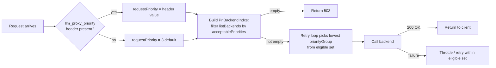

# POC: Priority Levels

**Purpose:** Show how SimpleL7Proxy and APIM implement priority routing together. The proxy assigns and queues each request by priority; the APIM policy uses that priority to restrict the eligible backend set.

> [!IMPORTANT]
> **Priority routing requires both components. SimpleL7Proxy must assign and forward the numeric priority, and APIM must apply the priority-aware policy and backend configuration.**

## How the Two Components Work Together

SimpleL7Proxy and APIM have separate responsibilities connected by request and response headers:

| Component | Responsibility |
| :--- | :--- |
| SimpleL7Proxy | Maps the caller's configured priority key to a number, orders the request in its priority queue, and forwards the number to APIM in `x-S7PPriority`. |
| APIM policy | Reads `x-S7PPriority`, filters `listBackends` by `acceptablePriorities`, and retries within the eligible backend set. |
| SimpleL7Proxy + APIM | When APIM returns `429` with `S7PREQUEUE: true` and a retry delay, the proxy places the request back in its queue instead of returning the throttle response to the caller. |

Configuring only the proxy provides priority queue ordering but not priority-aware backend selection inside APIM. Configuring only APIM can filter backends when a client supplies the priority header, but it does not provide the proxy's queueing and requeue behavior.

> [!NOTE]
> The requests in this POC call APIM directly to isolate and verify its backend-filtering behavior. An end-to-end deployment must also [configure priority mapping in SimpleL7Proxy](../reference/advanced-configuration.md#priority-mapping), [connect the proxy to APIM](../getting-started/connect-apim.md), and set the policy's `priorityHeaderName` to `x-S7PPriority`.

## TL;DR

1. Deploy the LLM Simulator and configure three backends: `Reserved` (priority-1 only), `Shared` (priority-2 and 3), `AlwaysFail` (priority-3, returns 500).
2. Send four requests — with `llm_proxy_priority: 1`, `2`, no header, and a modified config with no eligible backend.
3. Read `x-Backend-Attempts`, `x-backend-affinity`, and `backendLog` to confirm the routing decision for each case.

**Expected outcomes:** priority-1 → `Reserved` only; priority-2 → `Shared` only; no header (defaults to 3) → `Shared` wins over `AlwaysFail`; no eligible backend → `503`.

## What you will observe

- A `llm_proxy_priority: 1` request returns `200 OK` with `x-Backend-Attempts: 1` and the `Reserved` affinity hash.
- A `llm_proxy_priority: 2` request returns `200 OK` with `x-Backend-Attempts: 1` and the `Shared` affinity hash. `Reserved` is never tried.
- A request with no priority header defaults to `3`; `Shared` wins over `AlwaysFail` by `priorityGroup` order.
- A priority-2 request when no backend accepts priority-2 returns `503 Service Unavailable`.
- A priority-2 request sent while `Reserved` is throttled still returns `200 OK` via `Shared` — throttle state on an out-of-set backend has no effect.

## Reference

<details>
<summary>Settings, values, units, and when each takes effect</summary>

| Setting | Value in this POC | Unit | Set in | Takes effect |
| :--- | :--- | :--- | :--- | :--- |
| Policy file | [`APIM-Policy/v2.1.0/Priority-with-retry-enhancedLog.xml`](../../APIM-Policy/v2.1.0/Priority-with-retry-enhancedLog.xml) | — | APIM API | after policy save |
| `acceptablePriorities` (Reserved) | `[1]` | priority levels | `listBackends` | after policy save |
| `acceptablePriorities` (Shared) | `[2, 3]` | priority levels | `listBackends` | after policy save |
| `acceptablePriorities` (AlwaysFail) | `[3]` | priority levels | `listBackends` | after policy save |
| `priorityGroup` (Reserved) | `1` | group | `listBackends` | after policy save |
| `priorityGroup` (Shared) | `2` | group | `listBackends` | after policy save |
| `priorityGroup` (AlwaysFail) | `3` | group | `listBackends` | after policy save |
| `retryCount` | `1` | attempts | `priorityCfg` | after policy save |
| Default request priority | `3` | level | policy default when header absent | per request |
| `llm_proxy_priority` header | `1`, `2`, or `3` | level | request header | per request |
| `limitConcurrency` | `off` | mode | policy default | after policy save |
| `bufferResponse` | `true` | boolean | policy default | after policy save |
| `timeout` | `30` | seconds | `listBackends` | after policy save |

> [!NOTE]
> **Units used in this doc:** `timeout` is in seconds. `priorityGroup` is an integer; lower wins when multiple backends are eligible. `acceptablePriorities` is a JSON array of integer priority levels.

</details>

## Setup

### Minimal prerequisites

**What matters:** the direct tests need one APIM API, one deployed LLM Simulator function, and the v2.1.0 policy. The end-to-end implementation also requires SimpleL7Proxy with priority mapping and an APIM host configured. No real Azure OpenAI endpoints are required.

- An APIM instance with [`APIM-Policy/v2.1.0/Priority-with-retry-enhancedLog.xml`](../../APIM-Policy/v2.1.0/Priority-with-retry-enhancedLog.xml) applied at the API level.
- For the end-to-end implementation, a running SimpleL7Proxy instance configured to:
  - Map caller priority keys with `PriorityKeyHeader`, `PriorityKeys`, and `PriorityValues`.
  - Send requests to APIM through a configured host.
  - Use `x-S7PPriority` as the APIM policy's `priorityHeaderName`.
- The LLM Simulator deployed as an Azure Function. See [`test/LLMSimulator/Readme.md`](../../test/LLMSimulator/Readme.md). Verify it is running:
  ```bash
  curl https://<funcapp>.azurewebsites.net/api/health
  # → 200 OK
  ```
- Note the function app hostname; you will use it in the backend list below.

> [!WARNING]
> `priority`, `ModelType`, and `api-key` fields from older `listBackends` blocks are silently ignored by v2.1.0. Rename them to `priorityGroup`, `label`, and `auth` before running this POC.

### Apply the policy

**What matters:** apply the policy at the API level on **All operations**, not at product or global scope.

#### Azure portal (recommended)

1. Open your APIM instance in the [Azure portal](https://portal.azure.com).
2. Select **APIs** and open the target API.
3. Select **All operations**.
4. Open the **Inbound processing** policy editor (`</>` icon).
5. Replace the editor contents with [`APIM-Policy/v2.1.0/Priority-with-retry-enhancedLog.xml`](../../APIM-Policy/v2.1.0/Priority-with-retry-enhancedLog.xml).
6. Select **Save**.

<details>
<summary>Azure CLI alternative</summary>

```bash
az apim api policy create \
  --resource-group <rg> \
  --service-name <apim-name> \
  --api-id <api-id> \
  --value "$(cat APIM-Policy/v2.1.0/Priority-with-retry-enhancedLog.xml)" \
  --format xml
```

</details>

### Configure `listBackends`

**What matters:** each backend's `acceptablePriorities` defines which requests it will handle. A backend whose list does not contain the request priority is excluded from the candidate set before the retry loop runs.

```xml
<set-variable name="listBackends" value="@{
    JArray backends = new JArray();
    string salt = "0123456789";

    // Reserved: priority-1 requests only
    backends.Add(new JObject()
    {
        { "url", "https://<your-funcapp>.azurewebsites.net/api/delay?delay=100" },
        { "priorityGroup", 1 },
        { "label", "Reserved" },
        { "acceptablePriorities", new JArray(1) },
        { "limitConcurrency", "off" },
        { "bufferResponse", true },
        { "timeout", 30 },
        { "auth", "" }
    });

    // Shared: priority-2 and priority-3 requests
    backends.Add(new JObject()
    {
        { "url", "https://<your-funcapp>.azurewebsites.net/api/delay?delay=100" },
        { "priorityGroup", 2 },
        { "label", "Shared" },
        { "acceptablePriorities", new JArray(2, 3) },
        { "limitConcurrency", "off" },
        { "bufferResponse", true },
        { "timeout", 30 },
        { "auth", "" }
    });

    // AlwaysFail: priority-3 fallback that returns 500 — used to confirm the 503 path
    backends.Add(new JObject()
    {
        { "url", "https://<your-funcapp>.azurewebsites.net/api/error/500" },
        { "priorityGroup", 3 },
        { "label", "AlwaysFail" },
        { "acceptablePriorities", new JArray(3) },
        { "limitConcurrency", "off" },
        { "bufferResponse", true },
        { "timeout", 30 },
        { "auth", "" }
    });

    foreach (JObject backend in backends) {
        string saltedUrl = salt + backend["url"].ToString();
        backend["affinity"] = string.Concat(
            System.Security.Cryptography.SHA256.Create()
            .ComputeHash(System.Text.Encoding.UTF8.GetBytes(saltedUrl))
            .Take(10)
            .Select(b => b.ToString("x2"))
        );
        backend["isThrottling"]      = false;
        backend["retryAfter"]        = DateTime.MinValue;
        backend["defaultRetryAfter"] = 10;
    }
    return backends;
}" />
```

### Configure `priorityCfg`

**What matters:** `retryCount: 1` is sufficient here because priority isolation, not failover, is the focus. Each priority level gets one attempt.

```xml
<set-variable name="priorityCfg" value="@{
    JObject cfg = new JObject();
    cfg["1"] = new JObject { { "retryCount", 1 }, { "requeue", false } };
    cfg["2"] = new JObject { { "retryCount", 1 }, { "requeue", false } };
    cfg["3"] = new JObject { { "retryCount", 1 }, { "requeue", false } };
    return cfg;
}" />
```

## Run

**What matters:** replace `<your-apim>`, `<your-api>`, and `<your-key>` once, then run the tests in order.

```bash
BASE="https://<your-apim>.azure-api.net/<your-api>"
KEY="<your-key>"
```

### Test 1 — Priority-1 routes to `Reserved` only

```bash
curl -i \
  -H "llm_proxy_priority: 1" \
  -H "Ocp-Apim-Subscription-Key: $KEY" \
  "$BASE/api/delay"
```

### Test 2 — Priority-2 routes to `Shared`, skips `Reserved`

```bash
curl -i \
  -H "llm_proxy_priority: 2" \
  -H "Ocp-Apim-Subscription-Key: $KEY" \
  "$BASE/api/delay"
```

### Test 3 — No header defaults to priority-3; `Shared` wins over `AlwaysFail`

```bash
curl -i \
  -H "Ocp-Apim-Subscription-Key: $KEY" \
  "$BASE/api/delay"
```

### Test 4 — No eligible backend returns 503

Temporarily change `Shared`'s `acceptablePriorities` to `[3]` only, then send a priority-2 request:

```xml
{ "acceptablePriorities", new JArray(3) },  // temporary change for Test 4
```

```bash
curl -i \
  -H "llm_proxy_priority: 2" \
  -H "Ocp-Apim-Subscription-Key: $KEY" \
  "$BASE/api/delay"
```

Restore `Shared` to `new JArray(2, 3)` after this test.

### Test 5 — `Reserved` throttled; priority-2 request unaffected

Change `Reserved` to a 429-returning URL to trigger throttling:

```xml
{ "url", "https://<your-funcapp>.azurewebsites.net/api/error/429?retryAfter=30" },
```

Send a priority-1 request to trigger throttling (expect `503` because no other backend accepts priority-1):

```bash
curl -i -H "llm_proxy_priority: 1" -H "Ocp-Apim-Subscription-Key: $KEY" "$BASE/api/delay"
```

Immediately send a priority-2 request:

```bash
curl -i -H "llm_proxy_priority: 2" -H "Ocp-Apim-Subscription-Key: $KEY" "$BASE/api/delay"
```

Restore `Reserved`'s URL to `/api/delay?delay=100` after this test.

## Verify

**What matters:** `x-Backend-Attempts`, `x-backend-affinity`, and `backendLog` together tell you exactly which backend was selected and why.

- [ ] Test 1: `200 OK`, `x-Backend-Attempts: 1`, affinity = `Reserved` hash, `backendLog` ends with `CALL SUCCESSFUL` for the `/api/delay` URL.
- [ ] Test 1: `backendLog` contains no reference to `Shared` or `AlwaysFail`.
- [ ] Test 2: `200 OK`, `x-Backend-Attempts: 1`, affinity = `Shared` hash.
- [ ] Test 2: `backendLog` contains no reference to `Reserved`.
- [ ] Test 3: `200 OK`, `x-Backend-Attempts: 1`, affinity = `Shared` hash (not `AlwaysFail`).
- [ ] Test 4: `503 Service Unavailable` — `PriBackendIndxs` was empty for priority-2.
- [ ] Test 5: priority-2 returns `200 OK` via `Shared` even while `Reserved` is throttled.

## Deep dive

**What matters:** priority isolation happens before the retry loop. The policy builds `PriBackendIndxs` by filtering backends to those whose `acceptablePriorities` contains `requestPriority`; the retry loop never sees the others.

### How priority filtering works



### Worked example

| Step | Request | `llm_proxy_priority` | `PriBackendIndxs` | Backend selected | Result |
| :--- | :--- | :--- | :--- | :--- | :--- |
| 1 | Test 1 | `1` | `[0]` (Reserved only) | Reserved (priorityGroup 1) | `200 OK` |
| 2 | Test 2 | `2` | `[1]` (Shared only) | Shared (priorityGroup 2) | `200 OK` |
| 3 | Test 3 | `3` (default) | `[1, 2]` (Shared + AlwaysFail) | Shared wins, priorityGroup 2 < 3 | `200 OK` |
| 4 | Test 4 | `2` | `[]` (empty — Shared temporarily restricted) | none | `503` |
| 5 | Test 5 (p-1) | `1` | `[0]` (Reserved, but throttled) | Reserved returns 429, no other candidate | `503` |
| 6 | Test 5 (p-2) | `2` | `[1]` (Shared only) | Shared — Reserved's throttle state is irrelevant | `200 OK` |

### How to read `backendLog`

**What matters:** only backends inside `PriBackendIndxs` appear in `backendLog`. A backend that was never in the candidate set produces no log entry.

Single-backend success (Tests 1 and 2):

```text
0.001s Begin
0.001s THROTTLED: (none)
0.001s RETRIES LEFT: 1 CYCLE: 1 INDEX: 0
0.001s Using Reserved URL: https://<funcapp>.azurewebsites.net/api/delay?delay=100 LIMIT: off
0.105s StatusCode: 200 - Success
0.105s CALL SUCCESSFUL
```

No eligible backend (Test 4):

```text
0.001s Begin
0.001s THROTTLED: (none)
0.001s PriBackendIndxs is empty for priority 2 — returning 503
```

Priority-2 request while `Reserved` is throttled (Test 5, second request):

```text
0.001s Begin
0.001s THROTTLED: (Reserved - 00:28)
0.001s RETRIES LEFT: 1 CYCLE: 1 INDEX: 1
0.001s Using Shared URL: https://<funcapp>.azurewebsites.net/api/delay?delay=100 LIMIT: off
0.097s StatusCode: 200 - Success
0.097s CALL SUCCESSFUL
```

`Reserved` appears in the `THROTTLED` list but never in a `Using ...` line because it is not in `PriBackendIndxs` for `requestPriority = 2`.

## Optional variants

### Hard tier boundaries (no shared fallback)

**What matters:** set each backend's `acceptablePriorities` to a single value. A request that misses every tier returns `503` rather than falling through to a lower tier.

Change `Shared` to accept only priority-2:

```xml
{ "acceptablePriorities", new JArray(2) },
```

A priority-3 request now returns `503` instead of routing to `Shared`.

### PTU-first with PAYGO overflow

**What matters:** set the PTU backend's `acceptablePriorities` to `[1]` (premium only) and the PAYGO backend's to `[1, 2, 3]` (all). Premium requests go to PTU first; when PTU is throttled the retry loop stays within the same eligible set and falls over to PAYGO.

```xml
{ "label", "PTU" }, { "acceptablePriorities", new JArray(1) }, { "priorityGroup", 1 }
{ "label", "PAYGO" }, { "acceptablePriorities", new JArray(1,2,3) }, { "priorityGroup", 2 }
```

See [POC-OpenAI-Failover.md](openai-failover.md) for the full failover walkthrough.

### Requeue on exhaustion

**What matters:** set `requeue: true` for a priority level so that when the retry budget is exhausted the policy returns `429 + S7PREQUEUE: true`, signalling SimpleL7Proxy to re-enqueue the request rather than surface an error.

```xml
cfg["3"] = new JObject { { "retryCount", 1 }, { "requeue", true } };
```

## Troubleshooting

**What matters:** each symptom maps to one concrete cause and one concrete check.

| Symptom | Likely cause | Check |
| :--- | :--- | :--- |
| `503` on a request you expected to succeed | No backend's `acceptablePriorities` contains the request priority | Log or print `PriBackendIndxs`; confirm the header value matches an entry in at least one `acceptablePriorities` array |
| Wrong backend selected (affinity mismatch) | `priorityGroup` values are not in the expected order | Re-check `priorityGroup` on each backend; lower number wins when multiple are eligible |
| `503` even though a backend with the right priority exists | Backend is throttled and no other backend in the eligible set is healthy | Check `backendLog` for `THROTTLED:` entries; wait for cool-down or restore the backend URL |
| `priority`, `ModelType`, or `api-key` fields silently ignored | Old v2.0.1 field names used in `listBackends` | Rename to `priorityGroup`, `label`, and `auth`; see the [Reference](#reference) table |
| All requests route to the same backend regardless of header | `llm_proxy_priority` header is not reaching APIM | Confirm the header is not stripped by SimpleL7Proxy or a network layer before APIM; check APIM traces |
| Default priority-3 request hits `AlwaysFail` instead of `Shared` | `Shared`'s `acceptablePriorities` does not include `3` | Add `3` to `Shared`'s list or adjust `priorityGroup` so `Shared` sorts before `AlwaysFail` |

## Related documentation

- [POC-Failover-configuration.md](failover.md) — Automatic failover and retry when a backend returns `429` or times out
- [POC-OpenAI-Failover.md](openai-failover.md) — Real Azure OpenAI PTU-to-PAYGO failover
- [POC-Chargeback.md](chargeback.md) — Token-level usage tracking and per-user cost attribution
- [BACKEND_HOSTS.md](../reference/backend-hosts.md) — Host configuration options including `acceptablePriorities` and `priorityGroup`
- [OBSERVABILITY.md](../concepts/observability.md) — Token metrics, telemetry channels, and event logger configuration


---

## What the policy does

Each backend in `listBackends` carries an `acceptablePriorities` array. Before the retry loop picks a backend, the `PriBackendIndxs` variable is built by filtering the backend list to only those whose `acceptablePriorities` contains the request's priority value:

```csharp
if (backend["acceptablePriorities"]?.Values<int>().Contains(requestPriority) == true) {
    list.Add(i);
}
```

The retry loop only iterates over backends in `PriBackendIndxs`. A backend that isn't in that list is invisible for the lifetime of the request, regardless of whether it's healthy.

The request priority is read from the `llm_proxy_priority` header. If the header is absent, the policy defaults to `3`.

---

## Prerequisites

- An APIM instance with `Priority-with-retry-enhancedLog.xml` applied to the target API. See [Applying the policy](#applying-the-policy).
- The LLM Simulator deployed as an Azure Function. See [`test/LLMSimulator/Readme.md`](../../test/LLMSimulator/Readme.md) — the fastest path is the portal ZIP deploy. Verify it's running:
  ```bash
  curl https://<funcapp>.azurewebsites.net/api/health
  # → 200 OK
  ```
- Note the function app hostname — you'll use it in the backend list below.

---

## Applying the policy

The policy file is [`APIM-Policy/v2.1.0/Priority-with-retry-enhancedLog.xml`](../../APIM-Policy/v2.1.0/Priority-with-retry-enhancedLog.xml).

**Azure portal:**
1. Open your APIM instance → **APIs** → select the target API.
2. Select **All operations** in the left panel.
3. Click the `</>` icon in the **Inbound processing** tile.
4. Replace the editor contents with the XML file contents.
5. Click **Save**.

**Azure CLI:**
```bash
az apim api policy create \
  --resource-group <rg> \
  --service-name <apim-name> \
  --api-id <api-id> \
  --value "$(cat APIM-Policy/Priority-with-retry-enhancedLog.xml)" \
  --format xml
```

---

## Backend configuration

This POC uses three backends, all pointing at the same deployed LLM Simulator but with different `acceptablePriorities` lists:

| Name | Endpoint | `priorityGroup` | `acceptablePriorities` | Purpose |
|------|----------|-----------------|------------------------|---------|
| Backend A | `/api/delay?delay=100` | `1` | `[1]` | Reserved for priority-1 requests only |
| Backend B | `/api/delay?delay=100` | `2` | `[2, 3]` | Shared: handles priority-2 and priority-3 |
| Backend C | `/api/error/500` | `3` | `[3]` | Priority-3 fallback that always fails — used to verify the 503 path |

> **Field-name note.** Earlier drafts of these POCs used `priority`, `ModelType`, `Timeout`, `LimitConcurrency`, `BufferResponse`, and `api-key`. The policy now reads `priorityGroup`, `label`, `timeout`, `limitConcurrency`, `bufferResponse`, and `auth`. Uppercase first-letter variants (`Timeout`, `LimitConcurrency`, `BufferResponse`) are still normalized to lowercase at policy load, so they continue to work — but `priority`, `ModelType`, and `api-key` are **silently ignored**. If you're carrying over an older `listBackends` block, rename those three.

Replace `listBackends` in the policy's `<inbound>` block:

```xml
<set-variable name="listBackends" value="@{
    JArray backends = new JArray();
    string salt = "0123456789";

    // Backend A: reserved for priority-1 only
    backends.Add(new JObject()
    {
        { "url", "https://<your-funcapp>.azurewebsites.net/api/delay?delay=100" },
        { "priorityGroup", 1 },
        { "label", "PTU" },
        { "acceptablePriorities", new JArray(1) },
        { "limitConcurrency", "off" },
        { "bufferResponse", true },
        { "timeout", 30 },
        { "auth", "" }
    });

    // Backend B: shared — handles priority-2 and priority-3
    backends.Add(new JObject()
    {
        { "url", "https://<your-funcapp>.azurewebsites.net/api/delay?delay=100" },
        { "priorityGroup", 2 },
        { "label", "PAYGO" },
        { "acceptablePriorities", new JArray(2, 3) },
        { "limitConcurrency", "off" },
        { "bufferResponse", true },
        { "timeout", 30 },
        { "auth", "" }
    });

    // Backend C: always returns 500 — used to verify 503 when no backend is eligible
    backends.Add(new JObject()
    {
        { "url", "https://<your-funcapp>.azurewebsites.net/api/error/500" },
        { "priorityGroup", 3 },
        { "label", "PAYGO" },
        { "acceptablePriorities", new JArray(3) },
        { "limitConcurrency", "off" },
        { "bufferResponse", true },
        { "timeout", 30 },
        { "auth", "" }
    });

    foreach (JObject backend in backends) {
        string saltedUrl = salt + backend["url"].ToString();
        backend["affinity"] = string.Concat(
            System.Security.Cryptography.SHA256.Create()
            .ComputeHash(System.Text.Encoding.UTF8.GetBytes(saltedUrl))
            .Take(10)
            .Select(b => b.ToString("x2"))
        );
        backend["isThrottling"]      = false;
        backend["retryAfter"]        = DateTime.MinValue;
        backend["defaultRetryAfter"] = 10;
    }
    return backends;
}" />
```

Also set `priorityCfg` to give each priority level one retry:

```xml
<set-variable name="priorityCfg" value="@{
    JObject cfg = new JObject();
    cfg["1"] = new JObject { { "retryCount", 1 }, { "requeue", false } };
    cfg["2"] = new JObject { { "retryCount", 1 }, { "requeue", false } };
    cfg["3"] = new JObject { { "retryCount", 1 }, { "requeue", false } };
    return cfg;
}" />
```

---

## Test cases

Replace `<your-apim>`, `<your-api>`, and `<your-key>` in each command.

### Test 1 — Priority-1 request routes to Backend A only

```bash
curl -i \
  -H "llm_proxy_priority: 1" \
  -H "Ocp-Apim-Subscription-Key: <your-key>" \
  "https://<your-apim>.azure-api.net/<your-api>/api/delay"
```

**Expected:**

| Header | Value | Meaning |
|--------|-------|---------|
| HTTP status | `200 OK` | Backend A responded. |
| `x-Backend-Attempts` | `1` | Only one backend was tried. |
| `x-backend-affinity` | hash of Backend A's URL | Confirms Backend A was used. |
| `x-PolicyCycleCounter` | `1` | One cycle; no retry needed. |
| `backendLog` | `CALL SUCCESSFUL` for Backend A URL | No fallback occurred. |

Backend B and Backend C were never in the candidate set — `PriBackendIndxs` contained only index 0 for `requestPriority = 1`.

---

### Test 2 — Priority-2 request routes to Backend B, skips Backend A

```bash
curl -i \
  -H "llm_proxy_priority: 2" \
  -H "Ocp-Apim-Subscription-Key: <your-key>" \
  "https://<your-apim>.azure-api.net/<your-api>/api/delay"
```

**Expected:**

| Header | Value | Meaning |
|--------|-------|---------|
| HTTP status | `200 OK` | Backend B responded. |
| `x-Backend-Attempts` | `1` | One backend tried. |
| `x-backend-affinity` | hash of Backend B's URL | Confirms Backend B was used. |
| `backendLog` | `CALL SUCCESSFUL` for Backend B URL | Correct. |

Backend A (`acceptablePriorities: [1]`) was not in the candidate set. Backend C was also excluded. Only Backend B matched `requestPriority = 2`.

---

### Test 3 — Default priority (no header) behaves the same as priority-3

```bash
curl -i \
  -H "Ocp-Apim-Subscription-Key: <your-key>" \
  "https://<your-apim>.azure-api.net/<your-api>/api/delay"
```

The policy defaults to `requestPriority = 3` when the header is absent. Backend B (`acceptablePriorities: [2, 3]`) and Backend C (`acceptablePriorities: [3]`) are both eligible.

Backend B (`priorityGroup: 2`) sorts before Backend C (`priorityGroup: 3`), so Backend B is tried first and responds successfully.

**Expected:** `200 OK`, `x-Backend-Attempts: 1`, affinity pointing at Backend B.

---

### Test 4 — No eligible backend returns 503

This test verifies what happens when a request carries a priority that no backend accepts. Remove Backend B's `2` from its `acceptablePriorities` list (leave it as `[3]` only), then send a priority-2 request:

```xml
{ "acceptablePriorities", new JArray(3) },  // temporarily changed for this test
```

```bash
curl -i \
  -H "llm_proxy_priority: 2" \
  -H "Ocp-Apim-Subscription-Key: <your-key>" \
  "https://<your-apim>.azure-api.net/<your-api>/api/delay"
```

**Expected:** `503 Service Unavailable`. `PriBackendIndxs` is empty for `requestPriority = 2`, so the retry loop has nothing to try.

Restore Backend B's `acceptablePriorities` to `[2, 3]` after verifying this.

---

### Test 5 — Backend A being throttled does not affect a priority-2 request

This confirms that priority isolation works even when a backend in a different tier is actively throttled. First, trigger a throttle on Backend A by changing it to point at `/api/error/429`:

```xml
{ "url", "https://<your-funcapp>.azurewebsites.net/api/error/429?retryAfter=30" },
```

Send a priority-1 request (this will fail over and mark Backend A throttled):
```bash
curl -i -H "llm_proxy_priority: 1" -H "Ocp-Apim-Subscription-Key: <your-key>" \
  "https://<your-apim>.azure-api.net/<your-api>/api/delay"
# Backend A returns 429; no other backend accepts priority-1 → 503
```

Immediately send a priority-2 request:
```bash
curl -i -H "llm_proxy_priority: 2" -H "Ocp-Apim-Subscription-Key: <your-key>" \
  "https://<your-apim>.azure-api.net/<your-api>/api/delay"
```

**Expected:** `200 OK` via Backend B. Backend A's throttle state is irrelevant because it was never in the candidate set for `requestPriority = 2`.

Restore Backend A's URL to `/api/delay?delay=100` after verifying.

---

## How to read the `backendLog` header

Each backend attempt appends a line to `backendLog`. For a successful single-attempt request it looks like:

```
Using PAYGO backend: https://<funcapp>.azurewebsites.net/api/delay?delay=100 ... CALL SUCCESSFUL
```

For a request where the first attempt was skipped (because no eligible backend was found at that index), only the successful attempt appears. For a retry where one backend was throttled and another succeeded, you'll see two lines:

```
Throttling [0] by 12s, isTempError=true, retry-after=10
Using PAYGO backend: https://<funcapp>.azurewebsites.net/api/delay?delay=100 ... CALL SUCCESSFUL
```

The `[0]` is the zero-based index of the throttled backend in `listBackends`.

---

<details>
<summary>Tuning</summary>

Once the basic tests pass, a few variations are worth exploring:

- **Restrict Backend B to priority-2 only** (`acceptablePriorities: [2]`) and send a priority-3 request. With no backend accepting `3`, you'll see a `503` — useful if you want to enforce hard tier boundaries with no shared fallback.
- **Add a PTU backend at priority 1** and a PAYGO backend at priorities 1–3. Priority-1 requests will prefer the PTU backend; only when it's throttled will the policy fall back to PAYGO — the standard cost-optimized pattern for Azure OpenAI deployments.
- **Set `requeue: true` for priority-3** and `retryCount: 0`. When the shared backend is throttled and retries are exhausted, the policy returns `429 + S7PREQUEUE: true`, which tells SimpleL7Proxy to re-enqueue the request rather than return an error to the caller.
- **Use `LimitConcurrency`** to cap how many simultaneous requests each backend handles. Combine with different concurrency caps per tier to simulate a PTU deployment with a fixed token budget.

</details>

---

## Related Documentation

- [POC-Failover-configuration.md](failover.md) — Automatic failover and retry behaviour when a backend is slow or unavailable
- [POC-Chargeback.md](chargeback.md) — Token-level usage tracking and per-user cost attribution
- [BACKEND_HOSTS.md](../reference/backend-hosts.md) — Host connection string options including `acceptablePriorities` and `processor=`
- [OBSERVABILITY.md](../concepts/observability.md) — Token metrics, telemetry channels, and event logger configuration
