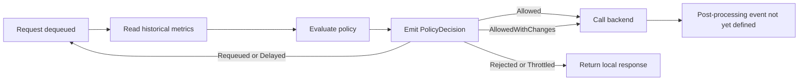

# Tokenomics Policy Decision Event Specification

## A. Document Metadata

| Field | Value |
|---|---|
| Title | Tokenomics Policy Decision Event Specification |
| Version | 1.0 |
| Last Updated | 2026-10-06 |
| Owner | SimpleL7Proxy maintainers |
| Review Cycle | Every schema change |
| Compliance Tags | Tokenomics, Event Hub, PolicyDecision, Schema v1 |

## B. Summary

This document defines the Tokenomics policy-decision event emitted before backend processing.

- The producer MUST emit one event for every policy evaluation.
- Requeued requests MUST emit another event when evaluated again.
- The visualizer MUST NOT interpret this event as a completed request or backend response.

The post-processing event containing response status, tokens, spend, latency, and safety results is not yet defined.

## C. Scope and Applicability

### In Scope

- Policy condition and selected action
- Decision outcome
- Model substitutions
- Priority changes
- Requeue and delay behavior
- Local rejection and throttling
- Bypass decisions
- Correlation across repeated evaluations

### Out of Scope

- Backend response status
- Successful-request counts
- Token usage
- Spend
- Request latency
- Jailbreak and content-filter results
- Completed-request reporting
- Post-processing event schema

## D. Authoritative Specification

### Event Identity

| Property | Required value |
|---|---|
| `Type` | `S7P-Tokenomics` |
| `SchemaVersion` | `"1"` |
| `RecordKind` | `"PolicyDecision"` |
| `MID` | Stable request correlation identifier |
| `DecisionId` | Unique identifier for this evaluation |
| `TimestampUtc` | UTC ISO 8601 timestamp |

All Event Hub payload values are serialized as JSON strings.

Additional common proxy properties such as version, revision, container name, method, and status MAY appear.

### Status Handling

The inherited `Status` property MUST NOT be treated as a backend status for `PolicyDecision` events.

A policy event is emitted before any permitted backend call occurs. The current transport can therefore emit `Status="0"`.

`LocalStatusCode` MUST be used when a policy decision creates a terminal local response.

### Required Fields

| Field | Format | Description |
|---|---|---|
| `SchemaVersion` | String | Event schema version. MUST equal `"1"`. |
| `RecordKind` | String | MUST equal `"PolicyDecision"`. |
| `DecisionId` | String | Unique 32-character GUID without separators. |
| `EvaluationSequence` | Integer string | One-based evaluation number for the request. |
| `TimestampUtc` | ISO 8601 string | Time at which the decision event was created. |
| `UserId` | String | User associated with the request. |
| `Tenant` | String | Tenant associated with the user. |
| `RequestedModel` | String | Model supplied to the event constructor. |
| `ModelBefore` | String | Model value before applying the policy action. |
| `ModelAfter` | String | Model value after applying the policy action. |
| `ModelChanged` | Boolean string | `"true"` when the before and after models differ. |
| `PriorityBefore` | Integer string | Priority before applying the policy action. |
| `PriorityAfter` | Integer string | Priority after applying the policy action. |
| `PriorityChanged` | Boolean string | `"true"` when the priority changed. |
| `PolicyCondition` | String | Name of the matched policy rule. |
| `PolicyAction` | String | Configured action selected by the rule. |
| `Decision` | String | Result of applying the action. |
| `BackendCallAllowed` | Boolean string | Whether processing may continue to a backend. |

### Optional Fields

| Field | Present when | Description |
|---|---|---|
| `RetryAfterMs` | `Delay` action | Delay duration in milliseconds. |
| `LocalStatusCode` | Local terminal response | HTTP status generated by the proxy. |

### Decision Values

| Decision | Meaning |
|---|---|
| `Allowed` | The request may proceed without a model or priority change. |
| `AllowedWithChanges` | The request may proceed after a model or priority change. |
| `Requeued` | The request returns to the queue and will be evaluated again. |
| `Delayed` | The request is delayed before being evaluated again. |
| `Rejected` | The proxy rejects the request locally. |
| `Throttled` | The proxy throttles the request locally. |
| `Pending` | The action was not mapped to a completed decision. This is invalid for reporting. |

### Action Scenarios

| Policy action | Decision | Backend allowed | Required event changes |
|---|---|---:|---|
| `Bypass` | `Allowed` | `"true"` | No model or priority changes |
| `ChangeModel` | `AllowedWithChanges` | `"true"` | Update `ModelAfter` |
| `UpgradeModel` | `AllowedWithChanges` | `"true"` | Update `ModelAfter` |
| `DowngradeModel` | `AllowedWithChanges` | `"true"` | Update `ModelAfter` |
| `IncreasePriority` | `Requeued` | `"false"` | Update `PriorityAfter` |
| `DecreasePriority` | `Requeued` | `"false"` | Update `PriorityAfter` |
| `Requeue` | `Requeued` | `"false"` | No model or priority change required |
| `Delay` | `Delayed` | `"false"` | Include `RetryAfterMs` |
| `WaitForReset` | `Delayed` | `"false"` | No retry duration is currently emitted |
| `Reject` | `Rejected` | `"false"` | Include `LocalStatusCode="429"` |
| `Throttle` | `Throttled` | `"false"` | No local status is currently emitted |

### Unsupported Actions

The current policy handler does not assign a final decision for these actions:

- `None`
- `IncreaseLimit`
- `DecreaseLimit`
- `Cap`

Events for these actions can contain:

```json
{
  "Decision": "Pending",
  "BackendCallAllowed": "false"
}
```

The visualizer MUST classify these records as incomplete policy decisions. It MUST NOT count them as allowed, rejected, or completed requests.

### Policy Conditions

The current producer can emit these `PolicyCondition` values:

| Condition | Meaning |
|---|---|
| `TokenomicsDisabled` | Tokenomics policy processing is disabled. |
| `AbuseDetected` | Abuse detection matched. |
| `MonthlyQuotaExceeded` | Monthly token quota was exceeded. |
| `AdministratorOverride` | An administrator override or approved exception matched. |
| `DailyQuotaGovernance` | Daily quota was exceeded for a governance workload. |
| `DailyQuotaExceeded` | Daily token quota was exceeded. |
| `MonthlyBudgetEntitledTenant` | An entitled tenant exceeded its monthly budget. |
| `MonthlyBudgetExceeded` | Monthly budget was exceeded. |
| `DailyBudgetEntitledTenant` | An entitled tenant exceeded its daily budget. |
| `DailyBudgetExceeded` | Daily budget was exceeded. |
| `CapacityCriticalWorkload` | Capacity was constrained for a critical workload. |
| `CapacityHighPriority` | Capacity was constrained for a high-priority workload. |
| `CapacityConstrained` | Capacity was constrained. |
| `QueueCriticalPriority` | Queue depth was high for a critical-priority request. |
| `QueueDepthHigh` | Queue depth was high. |
| `Default` | No earlier condition matched. |

The action associated with a condition is configuration-dependent. The visualizer MUST use `PolicyAction` and MUST NOT infer the action from `PolicyCondition`.

### Correlation Rules

- `MID` MUST remain unchanged across every evaluation of the same request.
- `DecisionId` MUST be unique for every evaluation.
- `EvaluationSequence` MUST increase for each reevaluation.
- A requeued request MUST generate multiple `PolicyDecision` events.
- A requeued request MUST NOT be counted as multiple completed requests.
- Events MUST be ordered by `MID`, then `EvaluationSequence`.

## E. Reference Implementation

### Event Flow



### Bypass Example

Bypass is the normal allowed scenario. It does not mean the request has completed.

```json
{
  "SchemaVersion": "1",
  "RecordKind": "PolicyDecision",
  "DecisionId": "f370aa9ca2604fa6a32d851fa8445685",
  "EvaluationSequence": "1",
  "TimestampUtc": "2026-10-06T12:00:00.0000000Z",
  "UserId": "sam",
  "Tenant": "Contoso",
  "RequestedModel": "gpt-4o",
  "ModelBefore": "gpt-4o",
  "ModelAfter": "gpt-4o",
  "ModelChanged": "false",
  "PriorityBefore": "2",
  "PriorityAfter": "2",
  "PriorityChanged": "false",
  "PolicyCondition": "AdministratorOverride",
  "PolicyAction": "Bypass",
  "Decision": "Allowed",
  "BackendCallAllowed": "true",
  "Type": "S7P-Tokenomics",
  "MID": "request-123",
  "Status": "0"
}
```

### Model Change Example

```json
{
  "SchemaVersion": "1",
  "RecordKind": "PolicyDecision",
  "DecisionId": "0f10806dad1546869ed0c4f45a914f4a",
  "EvaluationSequence": "1",
  "TimestampUtc": "2026-10-06T12:01:00.0000000Z",
  "UserId": "sam",
  "Tenant": "Contoso",
  "RequestedModel": "gpt-4o",
  "ModelBefore": "gpt-4o",
  "ModelAfter": "gpt-4o-mini",
  "ModelChanged": "true",
  "PriorityBefore": "2",
  "PriorityAfter": "2",
  "PriorityChanged": "false",
  "PolicyCondition": "DailyQuotaExceeded",
  "PolicyAction": "DowngradeModel",
  "Decision": "AllowedWithChanges",
  "BackendCallAllowed": "true",
  "Type": "S7P-Tokenomics",
  "MID": "request-124",
  "Status": "0"
}
```

### Requeue Example

The first evaluation changes priority and requeues the request:

```json
{
  "SchemaVersion": "1",
  "RecordKind": "PolicyDecision",
  "DecisionId": "b89ac790b18e48ae95859a2de4030c88",
  "EvaluationSequence": "1",
  "TimestampUtc": "2026-10-06T12:02:00.0000000Z",
  "UserId": "sam",
  "Tenant": "Contoso",
  "RequestedModel": "gpt-4o",
  "ModelBefore": "gpt-4o",
  "ModelAfter": "gpt-4o",
  "ModelChanged": "false",
  "PriorityBefore": "2",
  "PriorityAfter": "1",
  "PriorityChanged": "true",
  "PolicyCondition": "CapacityHighPriority",
  "PolicyAction": "IncreasePriority",
  "Decision": "Requeued",
  "BackendCallAllowed": "false",
  "Type": "S7P-Tokenomics",
  "MID": "request-125",
  "Status": "0"
}
```

When dequeued again, the same request emits another event with the same `MID`, a new `DecisionId`, and `EvaluationSequence="2"`.

### Visualizer Aggregations

| Report value | Required calculation |
|---|---|
| Policy evaluations | Count distinct `DecisionId` |
| Requests evaluated | Count distinct `MID` |
| Policy actions | Count events grouped by `PolicyAction` |
| Policy conditions | Count events grouped by `PolicyCondition` |
| Bypass rate | `Bypass` events divided by valid policy decisions |
| Model substitutions | Count records where `ModelChanged="true"` |
| Priority changes | Count records where `PriorityChanged="true"` |
| Requeue count | Count records where `Decision="Requeued"` |
| Delay count | Count records where `Decision="Delayed"` |
| Rejection count | Count records where `Decision="Rejected"` |
| Throttle count | Count records where `Decision="Throttled"` |
| Evaluation depth | Maximum `EvaluationSequence` grouped by `MID` |

The visualizer MUST NOT derive request success, token usage, spend, latency, or backend status from this event.

## F. Validation and Compliance

A valid event MUST satisfy all of these checks:

- `SchemaVersion` equals `"1"`.
- `RecordKind` equals `"PolicyDecision"`.
- `MID` is present and non-empty.
- `DecisionId` matches `^[0-9a-f]{32}$`.
- `EvaluationSequence` parses as an integer greater than zero.
- `TimestampUtc` parses as a UTC timestamp.
- `Decision` is not `Pending`.
- `BackendCallAllowed` parses as `"true"` or `"false"`.
- `ModelChanged` matches the comparison of `ModelBefore` and `ModelAfter`.
- `PriorityChanged` matches the comparison of `PriorityBefore` and `PriorityAfter`.
- Allowed decisions have `BackendCallAllowed="true"`.
- Requeued, delayed, rejected, and throttled decisions have `BackendCallAllowed="false"`.
- Unknown fields are ignored for forward compatibility.

Malformed or incomplete events MUST be retained for diagnostics but excluded from normal report totals.

## G. Version History

| Version | Date | Change | Approver |
|---|---|---|---|
| 1.0 | 2026-10-06 | Initial Tokenomics policy-decision event contract | SimpleL7Proxy maintainers |