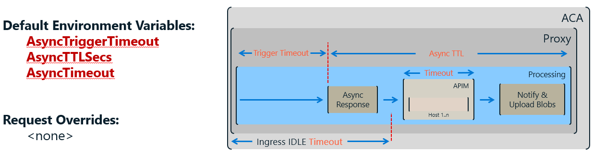

# Timeouts

SimpleL7Proxy keeps requests from running forever by putting three deadlines around every request: a TTL, a per-host Timeout, and an AsyncTimeout. This page walks through how each one works and how they interact.

> **TL;DR**
> - **Earliest expiration wins** — when TTL and Timeout both apply, whichever deadline arrives first is the one that fires.
> - **TTL** (seconds) is the hard wall-clock budget for the whole request: queue wait + every retry attempt.
> - **Timeout** (milliseconds) is the window for a single host attempt, and it resets on every retry.
> - **AsyncTimeout** (milliseconds) takes over from Timeout once a request switches to async mode.

---

> **Heads up on units:** TTL values are in **seconds**; every Timeout value is in **milliseconds**.

## All the Settings at a Glance

| Setting | Default | Unit | Override Header | Config Key | Reload |
|---|---|---|---|---|---|
| **DefaultTTLSecs** | 300 (5 min) | s | `S7PTTL` | `Priority:DefaultTTLSecs` | WARM |
| **Timeout** | 1,200,000 (20 min) | ms | `S7PTimeout` | `Request:DefaultTimeout` | WARM |
| **AsyncTriggerTimeout** | 10,000 (10 s) | ms | — | `Async:TriggerTimeout` | WARM |
| **AsyncTimeout** | 1,800,000 (30 min) | ms | — | `Async:Timeout` | WARM |
| **AsyncTTLSecs** | 86,400 (24 h) | s | — | `Async:TTLSecs` | WARM |

---

## How a Request Flows

Here's the whole picture — both the synchronous and async paths in one diagram. Every clock starts ticking the moment the request is **enqueued**.

```
Client
  │
  ▼  enqueue  ◄─── TTL clock starts (DefaultTTLSecs or S7PTTL)
  │
  ├── AsyncTriggerTimeout elapsed? ──Yes──► Return async response (blob URIs) to client
  │                                         Continue in background under AsyncTimeout
  │                                         Request expiration reset using AsyncTTLSecs
  No (synchronous path)
  │
  ▼
  ┌──────────────┐  fail / timeout   ┌──────────────┐  fail / timeout   ┌──────────────┐
  │   Host 1     │ ─────────────────►│   Host 2     │ ─────────────────►│   Host n     │
  │ [Timeout ms] │                   │ [Timeout ms] │                   │ [Timeout ms] │
  └──────────────┘                   └──────────────┘                   └──────────────┘
       ▲                                                                       │
       └───────── TTL expired anywhere along this chain → 412, no retry ───────┘
  │
  ▼
Response to client
```

**On every host attempt, the effective deadline is whichever is smaller: the remaining TTL or the Timeout.**

---

## Synchronous Requests

Each host attempt gets a fresh Timeout window, but no matter how many attempts you make, the total request life is still capped by TTL.


```
DefaultTTLSecs: 60     → ExpiresAt = enqueue + 60 s
Timeout:        45000  → per-host window = 45 s
First attempt:  min(60 s, 45 s) = 45 s effective
```

> [!NOTE]
> **Defaults:** `DefaultTTLSecs = 300 s` and `Timeout = 1,200,000 ms`. These kick in whenever no override headers are present.

> [!TIP]
> **Requests expiring sooner than you expect?** Check that the client isn't sending a short `S7PTTL` header — it silently overrides `DefaultTTLSecs`.

---

## Async Requests

Once `AsyncTriggerTimeout` elapses, the client is unblocked right away and the proxy keeps working in the background under `AsyncTimeout`.



```
AsyncTriggerTimeout: 10000    → client receives blob URIs after 10 s
AsyncTimeout:        1800000  → backend has up to 30 min to complete
AsyncTTLSecs:        86400    → async request expiration resets to 24 h
```

> [!NOTE]
> **There are no header overrides for async settings** — configure them through environment variables only.

> [!TIP]
> **Background work finishing too early?** Check `AsyncTTLSecs`.

---

## Overriding Timeouts Per Request

Want different limits for a single request? Send an `S7PTTL` (seconds) or `S7PTimeout` (milliseconds) header and it replaces the global default for that one request.

```http
S7PTimeout: 60000   # per-host timeout → 60 s for this request
S7PTTL: 120         # TTL → 120 s for this request
```

> [!NOTE]
> **Leave a header off and you get the default.** If an override header is absent, the proxy falls back to the corresponding global config value.

> [!WARNING]
> **Watch the format:** an `S7PTTL` value the proxy can't parse returns **400 Bad Request** with error code `InvalidTTL`.

The `S7PTTL` header accepts any of these formats:

| Format | Example | Meaning |
|---|---|---|
| Relative integer | `300` | Expires 300 s from enqueue |
| Relative decimal | `2.5` | Expires 2,500 ms from enqueue |
| Absolute Unix timestamp | `+1735689600` | Expires at the given epoch second |
| ISO 8601 datetime | `2024-12-31T23:59:59Z` | Expires at the given UTC time |

---

<details>
<summary>Worked Example</summary>

Let's walk through a concrete case so you can see the two deadlines racing each other.

> **Scenario:** `DefaultTTLSecs = 60`, `Timeout = 45000`. No override headers. The request queues for 5 s, then needs two host attempts.

| Event | Wall clock | TTL remaining | Host window | Effective deadline | Outcome |
|---|---|---|---|---|---|
| Enqueue | 0 s | 60 s | — | — | TTL clock starts |
| Dequeue | 5 s | 55 s | 45 s | **min(55 s, 45 s) = 45 s** | Attempt Host 1 |
| Host 1 timeout | 50 s | 10 s | 45 s elapsed | — | Retry |
| Host 2 attempt | 50 s | 10 s | 45 s window | **min(10 s, 45 s) = 10 s** | Attempt Host 2 |
| TTL expires | 60 s | 0 s | — | — | 503 — no more retries |

**Notice that on the second attempt it was the TTL — not the per-host Timeout — that set the deadline.**

</details>
