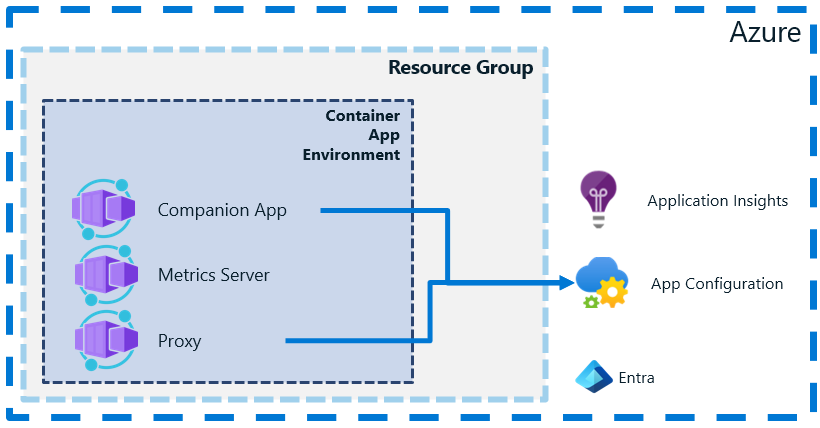
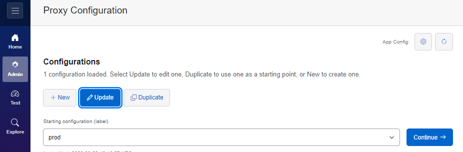
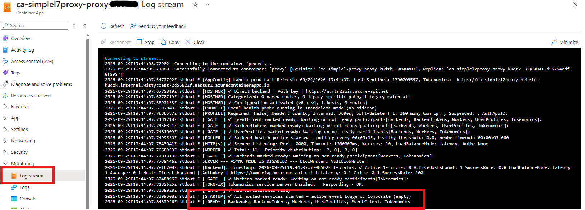

# Deploy SimpleL7Proxy

The Bicep bundle deploys the selected proxy, Metrics Server, and Companion App; it always creates the Azure Container Registry and creates or reuses the selected Container Apps environment.



## Before you begin

You need:

- The complete deployment ZIP from Deployment Setup.
- The target Azure subscription ID.
- Subscription Contributor access plus permission to assign roles, or subscription Owner access.
- Permission to create an Azure Container Registry and import images.

## Deploy from Azure Cloud Shell

1. Open Azure Cloud Shell in Bash mode.
2. Select **Manage files > Upload**.
3. Upload the deployment ZIP.
4. Extract it and open the extracted directory:

```bash
mkdir simplel7proxy-deployment
unzip deploy.zip -d simplel7proxy-deployment
cd simplel7proxy-deployment
```

5. Set the subscription and deploy:

```bash
sub='YOUR_SUBSCRIPTION_ID'
./deploy.sh "$sub" create
```

This creates a unique deployment by appending a unique suffix to the resource names.


The script prints a URL for each selected app and reports unselected apps as `not deployed`.

When the Companion App is selected, the Bicep deployment also creates its Event Hubs namespace, hub, and consumer group in the Companion App resource group. The namespace uses Standard tier with one throughput unit; the hub uses two partitions and one-day retention. Deployment Setup supplies the three names, and `--MakeUniq` also suffixes the namespace name.

The Companion App and its App Configuration store, Event Hubs namespace, hub, and consumer group deploy only when selected. Its managed identity receives App Configuration Data Owner, Event Hubs Data Receiver scoped to the hub, and ACR pull/push access. Other selected apps receive ACR pull access.

The Companion App monitor is disabled in the bootstrap revision. After its managed identity receives **Azure Event Hubs Data Receiver** access scoped to the hub, the final revision enables the monitor and sets `CompanionApp__EventHubMonitor__EventHubNamespace`, `CompanionApp__EventHubMonitor__EventHubName`, and `CompanionApp__EventHubMonitor__ConsumerGroup`.

> [!NOTE]
> Provisioning the hub does not configure the proxy to publish events. Configure the proxy's event destination and grant its publishing identity Event Hubs Data Sender access separately. Verify the Companion App Log stream reports that the Event Hub reader started; an empty monitor does not prove that publishing is configured. Portal ARM and standalone exports do not deploy the Companion App or its Event Hub resources.

> [!WARNING]
> A completed role assignment does not guarantee that Event Hubs authorization has propagated. If a fresh Companion App revision logs an authorization failure followed by `Event Hub reader stopped unexpectedly.`, verify its managed identity has Azure Event Hubs Data Receiver on the selected hub, allow the assignment to propagate, then open **Container App > Revisions and replicas** in the Azure portal and restart the active Companion App revision. Confirm the reader-started message in Log stream; the existing reader does not automatically restart after startup authorization fails.

## Configure the proxy

Open the Companion App URL and select **Proxy Configuration**.

Select **Update**, then choose the deployment label, `prod`.



The deployment seeds the App Configuration store with default values. You can make updates in the Companion App. Most settings become active within 30 seconds, but some require a proxy restart.

## Verify the deployment

Open **Log stream** in the proxy Container App and confirm that it starts without errors.



The proxy does not know about your backend hosts yet. Configure a backend host in the Companion App before sending requests through the proxy.

## Check deployment status

**Do not run `create` again while the deployment is still active.** Azure continues the deployment after Cloud Shell or your terminal disconnects.

Open Cloud Shell and set the original subscription and deployment name:

```bash
sub='YOUR_SUBSCRIPTION_ID'
deployment='YOUR_DEPLOYMENT_NAME'

az deployment sub show \
    --subscription "$sub" \
    --name "$deployment" \
    --query '{State:properties.provisioningState,Timestamp:properties.timestamp}' \
    --output table
```

| State | Next step |
| --- | --- |
| `Accepted` or `Running` | Wait and check again. |
| `Succeeded` | Retrieve the URLs and verify the deployment. |
| `Failed` or `Canceled` | Inspect the error and resolve it before retrying. |

Inspect a failure:

```bash
az deployment sub show \
    --subscription "$sub" \
    --name "$deployment" \
    --query properties.error \
    --output json
```

Retrieve the application URLs:

```bash
az deployment sub show \
    --subscription "$sub" \
    --name "$deployment" \
    --query '{Proxy:properties.outputs.proxyUrl.value,CompanionApp:properties.outputs.companionAppUrl.value,MetricsServer:properties.outputs.metricsServerUrl.value}' \
    --output table
```

If Azure reports `DeploymentNotFound`, confirm the tenant and subscription, then list recent subscription deployments:

```bash
az deployment sub list \
    --subscription "$sub" \
    --query '[].{Name:name,State:properties.provisioningState,Timestamp:properties.timestamp}' \
    --output table
```

A missing deployment record does not mean that no resources were created. In the Azure portal, open **Subscriptions > your subscription > Deployments** and inspect the deployment operations.

## Retry a failed deployment

Retry only after the deployment reaches a terminal state and you resolve the reported error.

Return to the original extracted ZIP directory:

```bash
./deploy.sh "$sub" what-if
./deploy.sh "$sub" create
```

Use the same subscription, resource names, and deployment ZIP. Do not regenerate the setup or delete partially created resources only to retry the deployment.

## Preview changes

Validate the deployment:

```bash
./deploy.sh "$sub" validate
```

Preview the Azure changes:

```bash
./deploy.sh "$sub" what-if
```

These commands contact Azure but do not import images or create the deployment.

If no action is supplied, `deploy.sh` runs `validate`.

## Use unique resource names

Add `--MakeUniq` to generate a new four-digit suffix for deployment-created resource names:

```bash
./deploy.sh "$sub" validate --MakeUniq
```

The script prints the generated parameters-file path. The original `parameters.json` remains unchanged.

## Use an existing Container Apps environment

By default, the deployment creates the Container Apps environment in the proxy resource group.

Set these values to use an existing environment:

```bash
USE_EXISTING_ENVIRONMENT=true
ENVIRONMENT_NAME='YOUR_ENVIRONMENT_NAME'
ENVIRONMENT_RESOURCE_GROUP='YOUR_ENVIRONMENT_RESOURCE_GROUP'
```

The environment must be in the same subscription. It can be in the proxy resource group or another resource group. The deployment does not modify it.

## Deploy from a local terminal

Azure Cloud Shell is the recommended deployment environment.

For local deployment, install:

- Azure CLI with Bicep support
- Bash
- `jq`

Sign in to the target Azure tenant, extract the deployment ZIP, and run:

```bash
sub='YOUR_SUBSCRIPTION_ID'
./deploy.sh "$sub" create
```

The same Azure permissions and recovery steps apply.

## What the deployment creates

The deployment:

- Creates the selected resource groups and Azure Container Registry.
- Creates or reuses the selected Container Apps environment.
- Imports the selected proxy, HealthProbe, Companion App, and Metrics Server images.
- Creates the selected infrastructure.
- Enables system-assigned identities on the Container Apps.
- Grants ACR pull access to each selected app; grants the Companion App ACR push, App Configuration Data Owner, and Event Hubs Data Receiver access when selected.
- Updates the Container Apps to use the imported ACR images.
- Creates the Metrics Server as a single-replica internal Container App when selected.
- Prints the deployment name and available application URLs.

## What the ZIP contains

- `bootstrap.bicep` creates the selected resource groups and Azure Container Registry.
- `main.bicep` creates or updates the selected application infrastructure.
- `modules/*.bicep` contains the Bicep modules used by the entry points.
- `parameters.json` contains the values selected in Deployment Setup.
- `deploy.sh` validates, previews, and creates the deployment.

The script imports released images from `publicnvmacr`. It does not build source code locally.

Regenerate the ZIP when changing resource names, image names, topology, or Deployment Setup selections.

## Troubleshoot

**Image import fails**

Confirm that the deployment identity can import images into the selected Azure Container Registry and reach the public source registry.

**A selected Container App cannot pull its image**

Confirm that the imported image tag exists and the Container App managed identity has `AcrPull` on the registry.

**Role assignment fails**

Confirm that the deployment identity can create role assignments at the required scopes.

**The Companion App receives HTTP 403 from App Configuration**

Confirm that its managed identity has App Configuration Data Owner. Allow time for the role assignment to take effect, then retry.

**An async resource is missing**

Confirm that the configured Service Bus and Cosmos DB resources, resource groups, and data resources already exist.

Deployment generation does not check Azure permissions, quota, resource-name availability, or backend connectivity.
