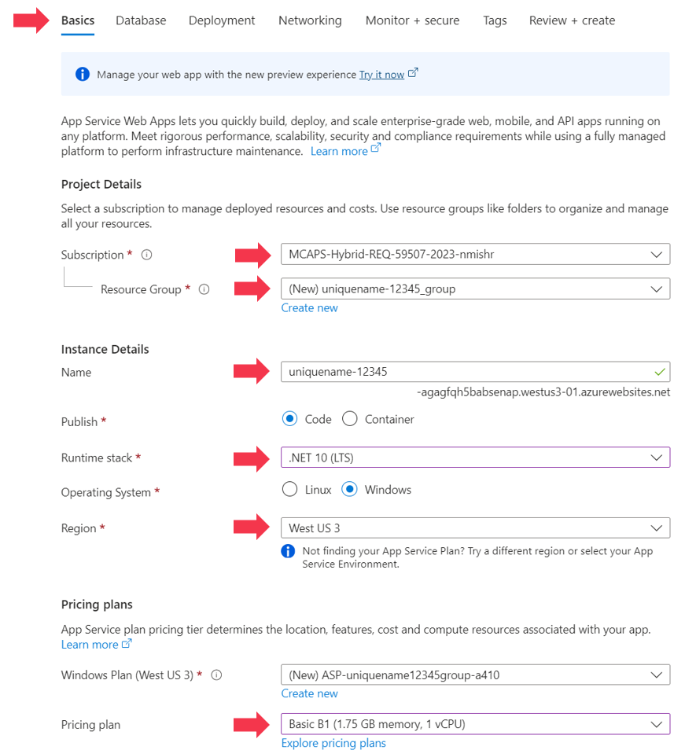
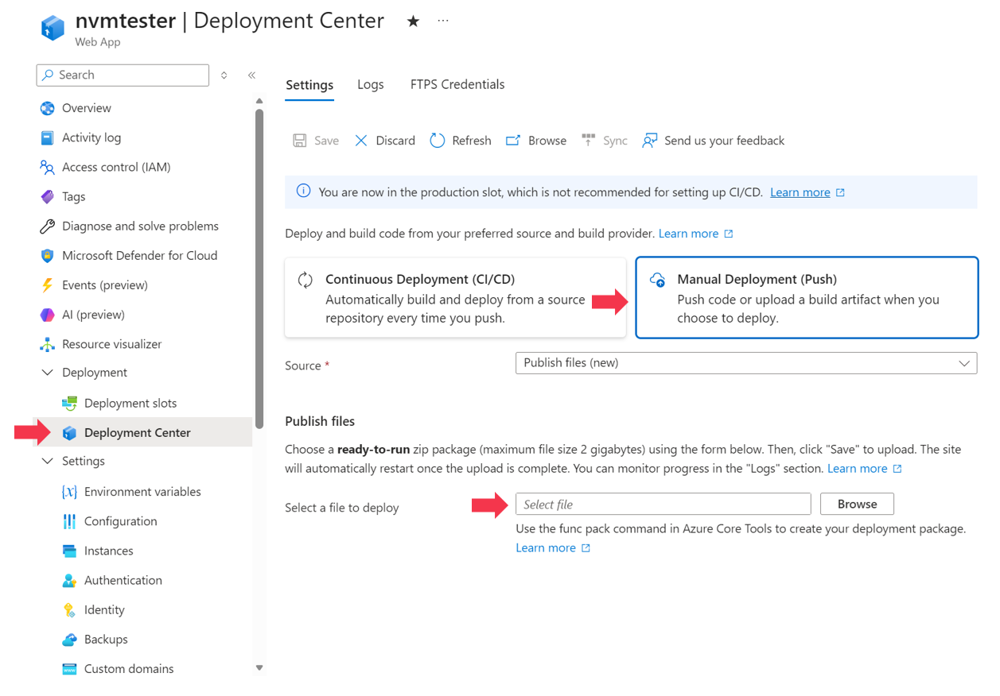
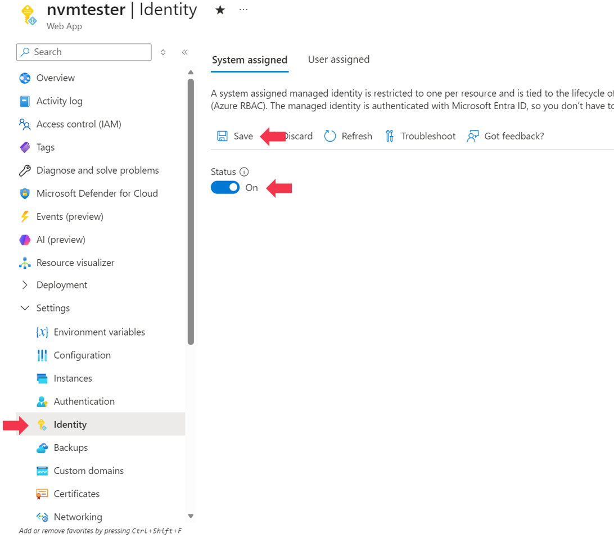

# Deploy CompanionApp to Azure App Service

The app is ready to deploy to an app service using the provided asset zip file using the Azure Portal.  If you modify the source code you will need to rebuild the zip image.

If you prefer the command line or repeatable deployments, skip to [Deploy with Azure CLI](#deploy-with-azure-cli).

> [!IMPORTANT]
> You should configure access restrictions on the appservice to prevent unauthorized access after the deployment.


## Deploy with the Azure portal

[CLI Deployment Instructions](#deploy-with-the-cli)

### Before you begin
- An Azure account with permission to create App Service resources and role assignments.
- The included [CompanionApp package](artifacts/companion-app-appservice.zip).
- A globally unique name for the web app.


### 1. Create the App Service

1. Open the Azure portal and create a website: [https://ms.portal.azure.com/#create/Microsoft.WebSite](https://ms.portal.azure.com/#create/Microsoft.WebSite)
2. On the **Basics** tab, configure:

<table border="0">
<tr>
<td style="vertical-align: top;">

| Setting | Value |
| --- | --- |
| Subscription | Your Azure subscription |
| Resource group | Create or select one |
| Name | Globally unique web app name |
| Publish | Code |
| Runtime stack | .NET 10 |
| Operating system | Linux |
| Region | Target Azure region |
| Linux plan | Create or select |
| Pricing plan | Basic B1 or another suitable SKU |

</td>
<td style="vertical-align: top;">



</td>
</tr>
</table>

1. Select **Review + create**, then select **Create**.
2. Confirm that the deployment finishes, select **Go to resource**.

### 2. Upload CompanionApp Zip Package

<table border="0">
<tr>
<td style="vertical-align: top;">

1. In the App Service, select **Deployment** > **Deployment Center**.
2. Under **Manual Deployment (Push)**, select the **Publish files (new)** source.
3. Select **Browse**, then select [artifacts/companion-app-appservice.zip](artifacts/companion-app-appservice.zip) from your local drive.
4. Select **Save**.

</td>
<td style="vertical-align: top;">



</td>
</tr>
</table>

5. Wait for the upload and deployment to complete. Monitor progress in the **Logs** tab.

### 3. Turn on managed identity

<table border="0">
<tr>
<td style="vertical-align: top;">

1. In the App Service, select **Settings** > **Identity**.
2. On the **System assigned** tab, set **Status** to **On**.
3. Select **Save**.
4. Record the **Object (principal) ID** for optional Cosmos DB access.

</td>
<td style="vertical-align: top;">



</td>
</tr>
</table>

### 4. Assign roles

If the proxy has not been deployed yet, you will need to complete that first and then return here.

CompanionApp requires **App Configuration Data Owner** on every App Configuration store it manages.

1. Open the App Configuration resource.
2. Select **Access control (IAM)**.
3. Select **Add** > **Add role assignment**.
4. On the **Role** tab, select **App Configuration Data Owner**, then select **Next**.
5. On the **Members** tab, select **Managed identity**, then select **Select members**.
6. Select **App Service**, select the CompanionApp web app, then select **Select**.
7. Select **Review + assign**.

Repeat for every managed App Configuration store.

<details>
<summary><strong>Optional roles</strong> (expand to assign additional permissions)</summary>

Assign only the permissions required by enabled features.

| Feature | Role | Scope |
| --- | --- | --- |
| Event Hub monitoring | Azure Event Hubs Data Receiver | Event Hubs namespace or event hub |
| Blob Storage history or conversations | Storage Blob Data Contributor | Storage account |
| Cosmos DB history or conversations | Cosmos DB Built-in Data Contributor | Cosmos DB account, database, or container |

For Event Hubs and Blob Storage, open the target resource and repeat the **Access control (IAM)** role-assignment process above.

Cosmos DB for NoSQL data-plane roles aren't assigned through **Access control (IAM)**. In Azure Cloud Shell, assign the built-in role to the object ID from step 3:

```bash
cosmos_role_id=$(az cosmosdb sql role definition list \
        --account-name '<cosmos-account-name>' \
        --resource-group '<cosmos-resource-group>' \
        --query "[?roleName=='Cosmos DB Built-in Data Contributor'].id | [0]" \
        --output tsv)

az cosmosdb sql role assignment create \
        --account-name '<cosmos-account-name>' \
        --resource-group '<cosmos-resource-group>' \
        --role-definition-id "$cosmos_role_id" \
        --principal-id '<object-principal-id>' \
        --scope '/'
```

> [!NOTE]
> Role assignments can take several minutes to become effective.

</details>

### 5. Configure CompanionApp settings

1. In the App Service, select **Settings** > **Environment variables**.
2. On the **App settings** tab, select **Advanced edit**.
3. Add the following objects to the JSON array and replace the example values:

```json
[
    {
        "name": "CompanionApp__AppConfigurationEndpoint",
        "value": "https://<store-name>.azconfig.io",
        "slotSetting": false
    },
    {
        "name": "CompanionApp__AppConfigurationLabel",
        "value": "prod",
        "slotSetting": false
    },
    {
        "name": "CompanionApp__ServerBaseUrl",
        "value": "https://<proxy-host>",
        "slotSetting": false
    }
]
```

4. Select **OK**, then select **Apply** on the **Environment variables** page.

App Service restarts the web app after you apply the settings.

### Verify the deployment

1. Open the App Service **Overview** page.
2. Launch the site's default hostname.
3. Confirm the Home page loads.
4. Open **Proxy Configuration**.
5. Verify the configured App Configuration store and label load successfully.

## Deploy with the CLI

For automation and repeatable deployments, see [Deploying CompanionApp with Azure CLI](deployment-cli.md).

## Troubleshoot

| Symptom | Check |
| --- | --- |
| The site doesn't start | Confirm the runtime stack is .NET 10, then open **Monitoring** > **Log stream**. |
| ZIP deployment fails | Confirm the App Service exists and the ZIP contains the published files at its root. |
| Proxy Configuration returns `403` | Confirm the App Service identity has **App Configuration Data Owner** on the configured store. |
| Event Hub access fails | Confirm the identity has **Azure Event Hubs Data Receiver** on the namespace or event hub. |
| Blob Storage access fails | Confirm the identity has **Storage Blob Data Contributor** on the storage account. |
| Cosmos DB access fails | Confirm the native Cosmos DB data-plane role assignment uses the App Service identity's object ID. |
| Settings don't change | Confirm the App Service app settings use the `CompanionApp__` prefix. |
| A `false` setting is missing | Add it manually through the portal or Azure CLI. |
| A new role assignment isn't effective | Wait several minutes for Azure RBAC propagation, then retry. |