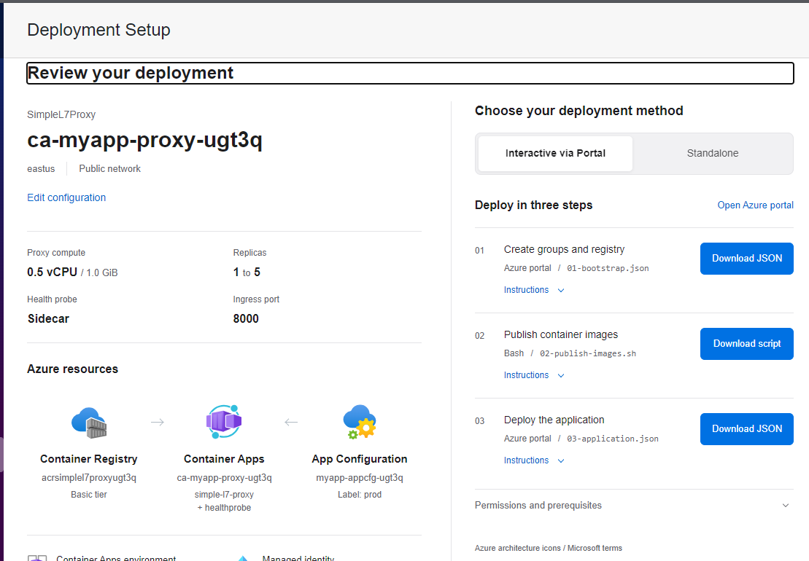
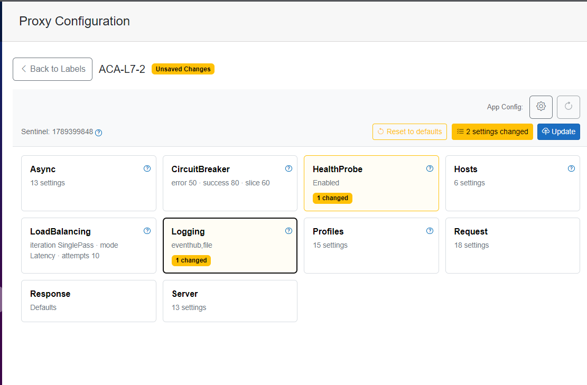
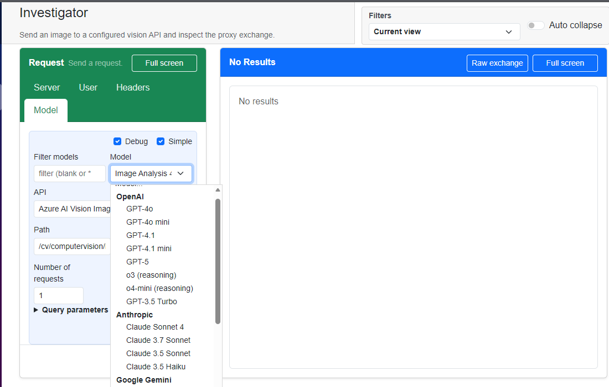

# CompanionApp

CompanionApp is a .NET Blazor application that can be run locally or deployed to Azure. It can be used to deploy SimpleL7Proxy to Azure, manage the proxy settings via Azure App Configuration, and test HTTP and LLM endpoints.

Follow the quick guides below for your scenario.

<table>
<thead>
<tr>
<th width="33%"><a href="delpoyment.md">Deployment</a></th>
<th width="33%"><a href="configuration.md">Configuration updates</a></th>
<th width="33%"><a href="testing.md">Request testing</a></th>
</tr>
</thead>
<tbody>
<tr>
<td valign="top"><a href="image-1.png"></a></td>
<td valign="top"><a href="image-2.png"></a></td>
<td valign="top"><a href="image.png"></a></td>
</tr>
<tr><td><a href="delpoyment.md#deployment-prerequisites">Prepare and deploy SimpleL7Proxy</a></td>
<td><a href="configuration.md#configuration-prerequisites">Change an existing proxy's settings</a></td>
<td><a href="testing.md#request-testing-prerequisites">Send requests and inspect results</a></td>
</tr>
</tbody>
</table>

## Set up CompanionApp

The application configuration file is located in the application root folder at: `src/CompanionApp`.  
You will want to configure the app for your environment so that you don't have to keep editing them in the UI.  These settings are stored in your local `src/CompanionApp/appsettings.json` or `src/CompanionApp/appsettings.Development.json` file.  As a best practice, your local changes should be made to `src/CompanionApp/appsettings.Development.json` as it distingueshes your settings vs the repo settings.  If it doesn't already exist, create a new file and start with a copy of the `CompanionApp` section:

```json
{
	"CompanionApp": {
		"AppConfigurationEndpoint": "https://nvm2-tc26-appcfg.azconfig.io",
		"AppConfigurationLabel": "ACA-L7-2",
		// Copy other sections as needed
	}
}
```

The settings below are all under `CompanionApp`. Each description explains what the setting controls and why you might customize it for your scenario.

### Connection and request defaults

- `AppConfigurationEndpoint`: The HTTPS URL of the Azure App Configuration store you want to edit, ending in `.azconfig.io`. Use your store's endpoint, or leave it empty when you aren't using the configuration editor.
- `AppConfigurationLabel`: The exact, case-sensitive label your proxy reads from that store. Match the proxy's label, or leave it empty for unlabeled settings.
- `ServerBaseUrl`: The base URL of your deployed proxy or backend for request testing. Change it when switching environments, or use a local URL such as `http://localhost:8000` for a local proxy.
- `AuthorizationHeaderName`: The request header used to send your API key or token, such as `S7P-KEY`, `api-key`, or `Authorization`. Match the header your endpoint expects; this is the name, not the credential.
- `AuthorizationHeaderPrefix`: The prefix for token authentication, normally `Bearer`. This is not an API key or access token; choose the authentication mode and supply the credential in the request form.
- `UserHeaderName`: The request header that carries the selected user identity. Use `X-UserID` or the header name your proxy is configured to read.
- `PriorityKeyHeader`: The request header that carries the selected priority key. Use `S7PPriorityKey` or your proxy's configured header name; the proxy determines how that key maps to a priority.

### Saved requests and conversations

`History` controls storage for saved request/response records, while `Conversations` controls storage for multi-turn chat sessions. You can configure them independently; the fields below apply inside either section, for example `History.Mode` and `Conversations.Mode`.

- `Mode`: Where to save the records: `Disk`, `BlobStorage`, or `CosmosDb`. Keep `Disk` for local use without an Azure storage dependency, or choose a cloud backend when you need records stored outside the app's local filesystem.
- `DiskPath`: The directory used in `Disk` mode. Relative paths resolve from the app's content root; keep `data/history` and `data/conversations`, or choose other writable directories.
- `StorageAccountName`: The Azure Storage account used in `BlobStorage` mode. Enter the account name, not its URL or a connection string.
- `BlobContainerName`: The container within that storage account used in `BlobStorage` mode. Use `history` and `conversations`, or set these to your own container names.
- `CosmosAccount`: The Cosmos DB account used in `CosmosDb` mode. Enter the account name or its full endpoint URL, not an account key.
- `CosmosDatabase`: The database within that Cosmos DB account. The supplied value is `chat-tester`; keep your existing database name when you want to continue reading previously saved data.
- `CosmosContainer`: The container within that database used for the records. Use `history` and `conversations`, or set these to your own container names.

Only the fields for the selected backend are used. Blob Storage and Cosmos DB authenticate with CompanionApp's Azure identity, which needs access to the selected storage resources.

### Event Hub monitoring

`EventHubMonitor` configures the shared event feed used by **EventHub Monitor** and **Insights**. The fields below belong inside `CompanionApp.EventHubMonitor`.

- `eventhub_enabled`: Whether CompanionApp connects to the live Event Hub. Set it to `false` to disable live reading; local-file import still runs when `LocalFilePath` is set.
- `LocalFilePath`: An optional JSON event-log file to import at startup. Use an absolute path, or set it to `""` to skip import; relative paths resolve from the running app's output directory, not its content root.
- `ConnectionString`: An Event Hub namespace connection string with receive/listen access, for connection-string authentication. Leave it empty to use an Azure identity instead, and keep credentials out of source control.
- `EventHubName`: The name of the Event Hub your proxy publishes to. This is the hub name, not the namespace name.
- `EventHubNamespace`: The namespace hostname ending in `.servicebus.windows.net`, used for Azure-identity authentication. Set it along with `EventHubName` when `ConnectionString` is empty.
- `ConsumerGroup`: The existing consumer group CompanionApp reads through. Use the built-in `$Default` group or a group created for this reader; this setting does not create a group.
- `CheckpointStorage`: Not used by the current reader. Leave it empty; setting a value does not enable saved checkpoints.
- `StartPosition`: Where reading begins when the reader starts. Use `latest` for new events or `earliest` to also read retained events; the reader does not resume from a saved checkpoint after a restart.
- `RefreshSeconds`: How often the monitoring pages refresh, in seconds. A value of `5` refreshes the views every five seconds; it does not control how often the proxy publishes events.

See [Event Hub setup](testing.md#event-hub-setup-for-eventhub-monitor-and-insights) for the required permissions, authentication choices, and live-telemetry checks.

### Sign in for Azure workflows

If your workflow accesses Azure, sign in locally before you start CompanionApp:

```bash
az login
export AZURE_TOKEN_CREDENTIALS=AzureCliCredential
```

The `export` command tells `DefaultAzureCredential` to use your Azure CLI identity. It doesn't grant any permissions. Check the [deployment guide](delpoyment.md#check-your-azure-permissions), [configuration prerequisites](configuration.md#configuration-prerequisites), or [request-testing prerequisites](testing.md#request-testing-prerequisites) for the roles your workflow needs.

If you host CompanionApp in Azure with a managed identity, do not set `AZURE_TOKEN_CREDENTIALS=AzureCliCredential`.

### Start the app

From the CompanionApp directory, run:

```bash
dotnet restore
dotnet run
```

Open the URL shown in the terminal. The included launch profiles use:

- http://localhost:5259
- https://localhost:7117

The launch profiles set `ASPNETCORE_ENVIRONMENT=Development`. Restart CompanionApp whenever you change your local settings.

> [!TIP]
> If your changes don't appear, check the exact property name, the settings file for the active environment, and any environment-variable overrides. For request defaults, also check your Development model files and saved **User Preferences**.

## Deploy SimpleL7Proxy

The [Deploy SimpleL7Proxy](delpoyment.md#deployment-prerequisites) guide walks you through the prerequisites and Azure roles, then shows you how to deploy, verify, and troubleshoot your setup.

## Update Azure App Configuration

Follow [Update Azure App Configuration](configuration.md#configuration-prerequisites) to connect to your store, edit and publish settings, and check that your proxy has picked up the changes. The guide also covers prerequisites and troubleshooting.

## Test HTTP and LLM endpoints

Follow [Test HTTP and LLM endpoints](testing.md#request-testing-prerequisites) to check what you need, send requests, and inspect the results. The guide also covers saved history, optional telemetry, and troubleshooting.
